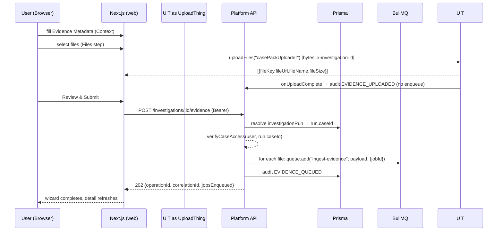

# I-PR2 DEEP ARCHITECTURE AUDIT

**Reconstructed from source.** Every claim below was traced against code, not inferred from comments. Where comments disagree with code, or where current code diverges from the I-PR2-REPORT.md, the discrepancy is called out explicitly.

**Repo state audited:** `HEAD` of `feat/f-pr2-provider-architecture` (commit `5f320d5`), I-PR2 work committed at `edbe2cb` (contracts), `0b5a79e` (platform), `bc5bba6` (web).

---

## 1. Executive Summary

I-PR2 built the production-shaped **evidence submission producer**: `Browser → (UploadThing) → Platform API → ArtifactReference → BullMQ`, while deliberately stopping **before** any ingestion execution.

What actually exists in code today:

| Layer | What exists | Evidence |
|---|---|---|
| Contracts | `EvidenceSubmissionRequestSchema`, `UploadedFileReferenceSchema`, `IngestionJobPayloadSchema`, `UploadEndpoint`, 4 new `AuditAction` values | `packages/contracts/src/intelligence/{evidence-submission,ingestion-job-payload,upload-router}.ts`, `src/domain/audit-event.ts` |
| Platform | Evidence endpoint, auth boundary, UploadThing router, BullMQ producer + worker stub, hash-chained audit log, SSE, `InvestigationRun.caseId` column | `platform/src/api/{routes,auth,uploadthing}.ts`, `src/queue/orchestrator.ts`, `src/audit/logger.ts`, `src/realtime/sse.ts`, `prisma/schema.prisma` |
| Web | 3-step evidence wizard, UploadThing client, server-side `submitEvidence`, SSE proxy + client | `web/src/components/evidence/*`, `src/lib/upload/uploadthing.ts`, `src/lib/api/server.ts`, `src/app/api/sse/[investigationId]/route.ts` |
| Ingestion | Acquisition/classification/parser/extraction pipeline **already built (M-PR1–M-PR3)** but **not wired to the worker** | `packages/intelligence/ingestion/src/{acquisition,classification,parser,extraction,service}` |

Key verified invariants:

- **Exactly ONE producer** of `ingest-evidence`: `platform/src/api/routes.ts:197`. UploadThing `onUploadComplete` does **not** enqueue (`platform/src/api/uploadthing.ts` — verified by git diff: the pre-I-PR2 version *did* enqueue and was removed in `0b5a79e`).
- **Exactly ONE queue schema**: `IngestionJobPayloadSchema` (strict). `EvidenceIngestionJobSchema` has zero remaining references.
- **caseId is server-resolved** from `run.caseId` in the evidence endpoint (`routes.ts:156`), never accepted from the request body.
- **Queue carries references, not bytes** (producer + worker tests assert JSON-safety).
- **artifactId/contentHash/logical source identity are deferred** to the acquisition layer (I-PR3); they are intentionally absent from the queue payload.

Two important gaps to keep in mind for the Obsidian note:

1. **The routed web UI no longer mounts the I-PR2 evidence wizard.** Under the newer F-PR2 provider architecture, `investigations/[id]/page.tsx` renders `InvestigationOverview`; `investigation-detail.tsx` (the component that mounts `EvidenceSubmission`) is not imported by any active route. The I-PR2 flow is fully unit-tested but is currently a **live, unmounted seam** — F-PR3 is planned to refactor evidence submission through the provider layer.
2. **The existing `I-PR2-REPORT.md` is stale in places** — most notably it claims audit logging is "console-only" (§11) when `audit/logger.ts` now persists hash-chained records to Prisma, and its test totals (509) predate the current state (604).

---

## 2. Problem

Before I-PR2 the repo had: a Next.js UI, UploadThing upload capability, the `ArtifactReference` contract, an acquisition/classification/extraction pipeline, and BullMQ infrastructure — but **no clean path from upload to ingestion queue**.

### 2.1 What was missing

- The only `ingest-evidence` enqueue lived in `packages/platform/src/api/uploadthing.ts` `onUploadComplete`, and pushed an **unvalidated, ad-hoc object** `{ investigationId, fileUrl, fileName, fileKey }` (see commit `0b5a79e` diff).
- There was **no canonical queue contract**, so producer shape and (future) consumer expectation could drift.
- There was **no semantic evidence step** — a file reaching UploadThing *was* treated as ingestion trigger.
- There was **no case-scope authorization** on the evidence path, and `caseId` was stored/read via JSON `contextData` rather than a relational column.
- There was **no correlation** — nothing tied the N files of one submission together, and no request-tracing ID.

### 2.2 Why uploading a file ≠ submitting evidence

- An upload is a **byte-transfer event** owned by a third-party provider (UploadThing). Completing bytes is not a decision to ingest: it doesn't describe the *source*, the *case boundary*, the *evidence type*, or the *investigation*.
- Evidence submission is a **user intent + authorization event**: a human says "this material belongs to case X under investigation Y with this provenance". That semantic + the case boundary must be established **after** upload, in a place the provider has no authority over.

### 2.3 Why a semantic evidence-submission step after upload

1. It is the only point where a **signed-in principal** (not UploadThing's secret) attests to the metadata.
2. It is where **case authorization** is re-derived from the canonical `InvestigationRun.caseId`, not from the browser.
3. It is where **one user decision fans out into N queue jobs** with a shared batch identity (operationId/correlationId).

### 2.4 Why the browser should not talk to BullMQ/Redis

- BullMQ/Redis are internal infrastructure; exposing job submission to arbitrary clients would let a browser forge queue payloads with client-chosen `caseId`, `artifactId`, `contentHash`, etc.
- The queue contract (`IngestionJobPayloadSchema`, strict) is a **server-to-server** contract. The browser's vocabulary is `EvidenceSubmissionRequestSchema` — a different object.
- Enforcing the "zero client-supplied system identity" rule is only possible behind a trusted server boundary.

### 2.5 Why ArtifactReference is the handoff

`ArtifactReferenceSchema` (`contracts/src/intelligence/artifact-reference.ts:16`) is the **only object that can travel through the queue**. It contains a URL + provider metadata + declared (untrusted) fields — no bytes, no `artifactId`, no `contentHash`. It is the boundary object between *"provider storage"* (UploadThing) and *"INDAGO acquisition"* (I-PR3 fetcher), because the queue must not hold file bytes.

### 2.6 Why the queue carries references/metadata rather than file bytes

- Redis memory + serialization: multi-MB files should not sit in Redis.
- Idempotent retries: a URL is fetchable again; bytes in a failed job go stale.
- Separation of concerns: bytes acquisition (fetch, hash, verify, store) is I-PR3's job; the producer's job is *describing* the artifact, not *materializing* it.

---

## 3. Final Architecture

```
Browser (Next.js)
  ├─ 1. metadata form ........... EvidenceSubmissionRequest fields (user)
  ├─ 2. UploadThing client ...... bytes → platform /api/uploadthing (provider)
  ├─ 3. review .................. user confirms metadata + upload results
  └─ 4. submit (server action) .. POST /api/v1/investigations/:id/evidence
                                            │  (Bearer demo-token, injected server-side)
                                            ▼
Platform (Express, port 3001 default)
  ├─ requireAuth ──► requireRole ──► resolve run ──► run.caseId ──► verifyCaseAccess ──► validate
  ├─ for each file:
  │     idempotencyKey = `evidence-{investigationId}-{fileKey}`
  │     artifactReference = { url, originalFilename, declared*, sourceType, idempotencyKey, providerMetadata }
  │     investigationQueue.add("ingest-evidence", IngestionJobPayload, { jobId: idempotencyKey })
  ├─ audit EVIDENCE_QUEUED (hash-chained → Prisma AuditEvent)
  └─ SSE emit type:"EVIDENCE_SUBMITTED"
                                │
                                ▼
BullMQ "investigation-pipeline" queue ─► Worker
  ├─ ingest-evidence handler: validate IngestionJobPayload, audit SYSTEM_ACTION receipt, return
  └─ [I-PR3] acquire → hash → verify → classify → parser → OCR → RawExtraction
```

Dependency direction: `web → contracts`, `platform → contracts`, `ingestion → contracts`. `web` never imports `platform` or `ingestion`; `platform` never imports `ingestion` (verified by grep; the ingestion package still documents its own boundary in `ingestion/src/integration/queue-ingestion.ts`, which is a comment-only file).

---

## 4. User Journey

The journey below is the one implemented in the I-PR2 web components. **Current-routing caveat:** it is reachable only through `investigation-detail.tsx` (not mounted at HEAD — see §1 gap 1). The steps, however, exist in code and are unit-tested.

```
Create Investigation        /investigations/new  (web)
  → user enters caseId; client generates investigationId = crypto.randomUUID()  (web/src/app/investigations/new/page.tsx:25)
  → startInvestigation server action → POST /api/v1/investigations/start      (platform/src/api/routes.ts:74-121)
  → creates InvestigationRun { investigationId, caseId, status:QUEUED, state:CREATED, contextData:{caseId} }
  → queue.add("investigation-pipeline", { runId })                            (routes.ts:107)
  → 202 { runId }
  → router.push(/investigations/{id}?caseId=...)

Evidence Context           Step 1: EvidenceMetadataForm     (web/src/components/evidence/evidence-metadata-form.tsx)
  → fields: sourceName*, sourceDescription, evidenceType*, evidenceTitle*, evidenceDescription, observedAt, notes
    (* required: sourceName + evidenceTitle gate "Next: Select Files")

Upload Files               Step 2: FileUpload                (web/src/components/upload/file-upload.tsx)
  → uploadEvidence() via genUploader("casePackUploader", { headers: { x-investigation-id } })
  → bytes go to platform /api/uploadthing (UploadThing-express route handler)
  → returns [{ fileKey, fileUrl, fileName, fileSize }]  (web/src/lib/upload/uploadthing.ts:67-72)
    NOTE: mimeType is NOT propagated into UploadEvidenceResult in the current web helper.
  → onUploadComplete (platform) audits EVIDENCE_UPLOADED; does NOT enqueue

Review                     Step 3: EvidenceReview            (web/src/components/evidence/evidence-review.tsx)
  → shows metadata + uploaded file list + "Submit Evidence"

Submit                     evidence-submission.tsx:61  → submitEvidence(investigationId, {…})
  → server action (web/src/lib/api/server-action.ts) → server.ts:96-118
  → client-side EvidenceSubmissionRequestSchema.safeParse (web/src/lib/api/server.ts:101)
  → POST /api/v1/investigations/:investigationId/evidence (Bearer AUTH_TOKEN)

Platform API               platform/src/api/routes.ts:139-251
Authorization ordering:   requireAuth → requireRole(["INVESTIGATOR","ADMIN"]) → resolve run (404) →
                          caseId = run.caseId (400 if none) → verifyCaseAccess → validate payload →
                          generate operationId+correlationId → one job per file → EVIDENCE_QUEUED audit →
                          SSE EVIDENCE_SUBMITTED → 202 { message, operationId, correlationId, jobsEnqueued, fileCount }

BullMQ                     one ingest-evidence job per file (jobId = idempotencyKey)
```

**Request/response shapes**

- `EvidenceSubmissionRequest` (browser → platform): `{ investigationId: uuid, sourceName, sourceDescription?, evidenceType, evidenceTitle, evidenceDescription?, observedAt?: EventTime, files: UploadedFileReference[1..50], notes? }` — `contracts/src/intelligence/evidence-submission.ts:60-79`.
- `UploadedFileReference`: `{ fileKey, fileUrl, fileName, fileSize, mimeType? }` — same file:31-37.
- `EvidenceSubmissionResponse` (platform → web, local type): `{ message, operationId, correlationId, jobsEnqueued, fileCount }` — `web/src/lib/api/types.ts:75-80`.
- `IngestionJobPayload` (producer → BullMQ): `{ investigationId, caseId, artifactReference, idempotencyKey, correlationId, operationId, sourceName, sourceDescription?, evidenceType, evidenceTitle, evidenceDescription?, observedAt? }` strict — `contracts/src/intelligence/ingestion-job-payload.ts:37-55`.

Mermaid sequence diagram:



System takeover boundary: the user is involved in Context + Files + Review/Submit. From "Submit" onward (auth → case check → enqueue → audit → SSE) everything is server-side.

---

## 5. UploadThing Boundary

1. **Client library:** `genUploader` from `uploadthing/client` (`web/src/lib/upload/uploadthing.ts:14`) — the bare client helper, **not** `@uploadthing/react` components (the package is installed but unused on this path). `UploadEndpoint` from contracts gives type-safe endpoint names (`web/src/lib/upload/uploadthing.ts:52`). Upload URL is `{NEXT_PUBLIC_API_URL}/api/uploadthing`.
2. **Route:** platform mounts `createRouteHandler({ router: uploadRouter })` from `uploadthing/express` at `/api/uploadthing` (`platform/src/api/server.ts:31-36`). The router exports one endpoint, `casePackUploader` (`platform/src/api/uploadthing.ts:23`), with constraints `pdf 16MB/10`, `image 8MB/20`, `text 16MB/10`, `blob 32MB/5` — mirrored in contracts' `CasePackFileTypes`.
3. **File metadata returned:** UploadThing returns per file `key`, `url`, `name`, `size` (contracts `UploadResult`); the web helper projects `results.map(r => ({ fileKey: r.key, fileUrl: r.url, fileName: r.name, fileSize: r.size }))`. **`mimeType` is dropped** in the current web helper (contract schema allows it optionally, so it's almost always `undefined` in practice → `declaredMimeType` ends up undefined → MIME verification in acquisition is skipped and the **detector** becomes the authority).
4. **Trusted vs untrusted:** the browser receives `fileKey`, `fileUrl`, `fileName`, `fileSize` from a **third-party server** (UploadThing), so web treats them as provider-supplied. On the platform side, only `fileKey` + `fileUrl` are structurally trusted; `fileName`/`fileSize`/`mimeType` are carried as **declared/untrusted** fields of `ArtifactReference` (`declaredMimeType`, `declaredSizeBytes` in `artifact-reference.ts:21-24`). UploadThing's `fileHash` (provider MD5) is **not** mapped to `declaredContentHash` — the tests assert exactly this (`platform/tests/upload-producer.test.ts:133-136`).
5. **onUploadComplete** (`platform/src/api/uploadthing.ts:38-62`): reads `x-investigation-id` from middleware metadata → resolves latest `investigationRun` from DB → reads `run.caseId` → throws if either missing → audits `EVIDENCE_UPLOADED` (actor `UPLOAD_CLIENT`, target `FILE`/`file.key`) → returns. `.catch(() => {})` swallows audit failure so a failing audit can't kill the upload callback.
6. **Does UploadThing enqueue anything?** No. Verified: `grep ingest-evidence` finds exactly one `.add("ingest-evidence")` call in the repo — `routes.ts:198`. Git history confirms the old `uploadthing.ts` did `investigationQueue.add("ingest-evidence", {...})` and was removed in `0b5a79e`.
7. **Where UploadThing stops:** after the audit write. The evidence-submission flow — authorization, ArtifactReference construction, enqueue — is entirely in `routes.ts`.

---

## 6. Evidence Submission Contract

`EvidenceSubmissionRequestSchema` — every field's origin and mapping:

| Field | Required | Origin | Maps to (canonical domain concept) |
|---|---|---|---|
| `investigationId` | ✓ | URL param mirrored into body; validated as UUID | `InvestigationRun.investigationId` / `Investigation` |
| `sourceName` | ✓ | **user-entered** | `SourceSchema.name` |
| `sourceDescription` | – | **user-entered** | `SourceSchema.description` |
| `evidenceType` | ✓ | **user-entered** (8-value enum) | `EvidenceTypeSchema` |
| `evidenceTitle` | ✓ | **user-entered** | `EvidenceSchema.title` |
| `evidenceDescription` | – | **user-entered** | `EvidenceSchema.description` |
| `observedAt` | – | **user-entered** (`date` input → `{value, precision:"day"}` in `evidence-submission.tsx:57-59`) | `EvidenceSchema.observedAt` (EventTimeSchema) |
| `notes` | – | **user-entered** free text | none (carried only in the request; **not** part of the queue payload — see below) |
| `files` | ✓ (1..50) | **provider-supplied** (UploadThing results) | `ArtifactReference` per file |

Important mapping detail: the request itself does **not** create `Source` or `Evidence` DB records — there are no such Prisma models yet. The payload carries the *semantic ingredients* that a future layer maps into `SourceSchema`/`EvidenceSchema`/`ArtifactReferenceSchema`. `IngestionJobPayloadSchema` documents this intent explicitly (`ingestion-job-payload.ts:25-32`).

**Field flow through the request lifecycle:** user metadata (`sourceName`, `evidenceType`, title…) + provider refs (`files`) → `POST evidence` → validated → `sourceName/sourceDescription` copied into payload `sourceName/sourceDescription`; `evidenceType/title/description/observedAt` copied into payload fields; each `files[]` entry becomes the root of an `ArtifactReference`. `notes` is dropped at the platform boundary (validated but not transmitted to the queue).

UI metadata component: `EvidenceMetadata` (`web/src/components/evidence/evidence-metadata-form.tsx:18-26`) is a local, loose superset (strings for date); the canonical validation happens once at the server-action boundary (`web/src/lib/api/server.ts:101`).

---

## 7. ArtifactReference

`contracts/src/intelligence/artifact-reference.ts:16-33`. Fields I-PR2 actually populates (from `routes.ts:187-195`):

```ts
{
  url: file.fileUrl,                       // provider CDN URL
  originalFilename: file.fileName,         // provider name
  declaredMimeType: file.mimeType,         // usually undefined (web helper drops it)
  declaredSizeBytes: file.fileSize,
  sourceType: "FILE_UPLOAD",
  idempotencyKey,                          // ← note: duplicated into payload too
  providerMetadata: { fileKey: file.fileKey },
}
```

| Category | Fields | Owned by | Why |
|---|---|---|---|
| Provider metadata | `url`, `originalFilename`, `declaredMimeType`, `declaredSizeBytes`, `providerMetadata.fileKey` | UploadThing → web (passed through) | Describes where/what the provider stored; untrusted until verified |
| System metadata | `sourceType` (set to `FILE_UPLOAD`) | platform producer | Describes how the artifact entered INDAGO |
| Deferred ingestion metadata | `contentHash`, `artifactId`, detected MIME, parserId, parserVersion | I-PR3 acquisition (absent from reference) | Requires fetching bytes and running detection — impossible at upload time |

Chain: `UploadThing metadata → ArtifactReference → BullMQ → I-PR3`.

The reference deliberately contains **no** `artifactId`/`contentHash` (schema has no such fields — strict). `declaredContentHash` exists in the schema (for future providers that can attest hashes) but I-PR2 never sets it; provider's UploadThing `fileHash` (MD5) stays in `providerMetadata` in tests but isn't even included in production construction.

---

## 8. Canonical Queue Contract

`IngestionJobPayloadSchema` (`ingestion-job-payload.ts:37-55`), `.strict()`.

| Field | Required | Why |
|---|---|---|
| `investigationId` | ✓ (uuid) | Root scope of the evidence |
| `caseId` | ✓ (uuid) | Authorization boundary + future record ownership; canonical from run |
| `artifactReference` | ✓ | Queue-safe location of bytes |
| `idempotencyKey` | ✓ | BullMQ `jobId` → dedup |
| `correlationId` | ✓ (uuid) | Groups the N jobs of a submission for tracing |
| `operationId` | ✓ (uuid) | Batch identity of the whole submission |
| `sourceName` | ✓ | maps to `SourceSchema.name` |
| `sourceDescription` | – | richer source context |
| `evidenceType` | ✓ (enum) | evidence classification |
| `evidenceTitle` | ✓ | maps to `EvidenceSchema.title` |
| `evidenceDescription` | – | richer evidence context |
| `observedAt` | – (EventTime) | real-world event time |

Actual serialized JSON produced by `routes.ts` for one file:

```json
{
  "investigationId": "<uuid>",
  "caseId": "<uuid>",
  "artifactReference": {
    "url": "https://utfs.io/f/<key>",
    "originalFilename": "bank-statement.pdf",
    "declaredSizeBytes": 102400,
    "sourceType": "FILE_UPLOAD",
    "idempotencyKey": "evidence-<uuid>-<key>",
    "providerMetadata": { "fileKey": "<key>" }
  },
  "sourceName": "CDR export from Telecom A",
  "evidenceType": "COMMUNICATION",
  "evidenceTitle": "Call records for suspect",
  "operationId": "<uuid>",
  "correlationId": "<uuid>",
  "idempotencyKey": "evidence-<uuid>-<key>"
}
```

Fan-out shape (verified in `routes.ts:182-217`):

```
one evidence submission
   └─ one operationId  (routes.ts:179, shared)
   └─ one correlationId (routes.ts:180, shared)
   └─ N uploaded files
        └─ N BullMQ jobs, one per file, each with the same operationId + correlationId
```

Both `operationId` and `correlationId` are identical across the N jobs of a single submission: operationId = batch; correlationId = request-tracing boundary.

---

## 9. Identity Model

| Identity | Source | Generator | Semantics | Lifetime | Client can supply? | Enters BullMQ? | Persistent? |
|---|---|---|---|---|---|---|---|
| `investigationId` | browser-generated UUID (`web/src/app/investigations/new/page.tsx:25`) or pre-existing | caller / demo | investigation scope | persistent (as long as run exists) | **yes** (by nature — it's route data) | yes | yes (InvestigationRun.investigationId, unique) |
| `caseId` | **platform** from `run.caseId` | server (bootstrap at creation: client supplies the initial caseId to `/start` because no run exists yet) | case boundary for authorization + record creation | persistent | no (on evidence path — never read from body) | yes | yes (Prisma column) |
| `operationId` | **platform** `routes.ts:179` | `randomUUID()` | batch identity (all files of one submission) | per-submission | no | yes | no (responses only) |
| `correlationId` | **platform** `routes.ts:180` | `randomUUID()` | request-traces the whole submission→queue lifecycle | per-submission | no | yes | no (response + worker audit text only; not a DB column) |
| `idempotencyKey` | **platform** `routes.ts:185` | `evidence-{investigationId}-{fileKey}` | per-file job dedup | per file per investigation | no | yes (as payload field AND `jobId`) | no (BullMQ job history is the only trace) |
| UploadThing `fileKey` | UploadThing | provider | provider-side object identity | per-upload | no (it's generated) | yes (inside `providerMetadata`) | provider-side |
| `contentHash` | I-PR3 (absent from payload) | SHA-256 of fetched bytes (`ingestion/src/acquisition/content-hasher.ts:15`) | byte-for-byte content identity | persistent | no | **not yet** | future |
| `artifactId` | I-PR3 (absent from payload) | `deterministicArtifactId(contentHash)` (`content-hasher.ts:33`) | deterministic artifact identity | persistent | no | **not yet** | future |
| `sourceId` | I-PR3 (absent from payload) | slug/uuid at source creation | logical Source record identity | persistent | no | **not yet** | future |

Why the four are distinct:

```
fileKey (provider's ephemeral object key)
   ≠  idempotencyKey (evidence-{investigationId}-{fileKey}) — operationally-scoped retry key
   ≠  contentHash (SHA-256 of bytes) — content identity
   ≠  artifactId (deterministic UUID from contentHash) — content-addressed artifact identity
```

```
file bytes
   → SHA-256
   → contentHash (computeContentHash, content-hasher.ts:15-21)
   → deterministicArtifactId(contentHash)  (content-hasher.ts:33-53)
```

`investigationId + fileKey → idempotencyKey` (`routes.ts:185`). These are different identity **layers**: `fileKey` is a *provider namespace* identity; `idempotencyKey` is an *operational* (retry/dedup) identity; `contentHash` is a *content* identity independent of provider; `artifactId` is the *canonical domain* identity that survives storage. The layering is exactly why `fileKey` can be trusted to dedup but must never be used as `artifactId`.

---

## 10. Authentication & Authorization

### 10.1 Actual chain (evidence endpoint, `routes.ts:139-166`)

`requireAuth` → `requireRole(["INVESTIGATOR","ADMIN"])` → handler: resolve `investigationRun` (404) → `caseId = run.caseId` (400 if missing) → `verifyCaseAccess(req.user, caseId)` (403) → validate payload → enqueue.

This matches the intended architecture **for the evidence endpoint**:
`requireAuth → requireRole → resolve investigation → run.caseId → verifyCaseAccess → continue`.

### 10.2 Auth internals (`platform/src/api/auth.ts`)

- `verifyToken(token)` (auth.ts:32-41): **single** auth boundary. Dev mock: `"demo-token"` → `{ id: "usr_demo_123", role: "INVESTIGATOR", allowedCases: [uuidA, uuidB] }`. `requireAuth` (auth.ts:68-85) uses it.
- `verifyCaseAccess(user, caseId)` (auth.ts:50-56): **single** authorization boundary. **Dev bypass: `NODE_ENV !== "production"` returns `true`.** In production it checks `user.allowedCases`.
- `requireCaseAccess` middleware (auth.ts:98-113): reads caseId from body/query/params (client-supplied). Used by **`/investigations/start` only** — acceptable there because no run exists to canonicalize at bootstrap.

### 10.3 Limitations (do not dress these up)

- Auth is **mock-token based**, not production auth. There is no real TTL, no session, no JWT/verify signature. Any request bearing `Bearer demo-token` is authenticated in dev.
- Case authorization is a **no-op outside production** (dev bypass). In production it depends on `allowedCases` data that currently ships inside the mock.
- **GET `/investigations/:id`** (`routes.ts:28-71`) reads `caseId` from the **query string** (browser-supplied) and authorizes against *that* value — it does **not** cross-check that the query `caseId` equals `run.caseId`. A principal with one allowed case could read any investigation's status by passing their own caseId. This is a deviation from "canonical caseId from InvestigationRun" for read endpoints.
- **SSE stream** `GET /investigations/:id/stream` (`routes.ts:21-25`) is behind `requireAuth` only — **no case-scope check**. Any authenticated principal can subscribe to any investigation's event stream (events also carry no filtering beyond investigationId). The web SSE proxy inherits this.

### 10.4 Tests

`requireAuth`, `requireRole`, `requireCaseAccess` middleware behavior is coverage-verified only indirectly. The unit tests exercise `verifyToken`/`verifyCaseAccess` and produce ordering tests via construction replicas (`platform/tests/upload-producer.test.ts`). The auth boundary is also guarded by web's `auth-boundary.test.ts` (asserts `AUTH_TOKEN` absent from client bundle, `uploadEvidence` has no token).

---

## 11. Idempotency

Exact construction — **one place** (`routes.ts:185`):

```ts
const idempotencyKey = `evidence-${investigationId}-${fileKey}`;
```

Passed to BullMQ as `{ jobId: idempotencyKey }` (`routes.ts:213`). Verified invariants hold:

- same investigationId + same fileKey → same key ✓
- different investigationId + same fileKey → different key ✓
- same investigationId + different fileKey → different key ✓

(the tests `platform/tests/upload-producer.test.ts:305-333` assert all three variants of *this* formula.)

**What BullMQ actually guarantees here — be precise.**

- BullMQ treats `jobId` as a unique key within the queue. Adding a job with an existing `jobId` whose job is still **waiting/active** silently leaves the existing job (no duplicate). This is **producer duplicate suppression** — the spec calls this "at-most-once enqueue per file per investigation".
- It is **not** exactly-once processing, and it does **not** dedup *completed* jobs by content. Once a job with that `jobId` is completed/removed, a later `add` with the same `jobId` can enqueue a new job (BullMQ may re-add after removal or when the completed job is cleaned). So identical submissions spaced in time can re-run.
- It is **not** content dedup: two different `fileKey`s with identical bytes get two different `jobId`s and two jobs. Content-level dedup is the future `contentHash`/`artifactId` identity (I-PR3 acquisition), which is a *separate* mechanism.

**Discrepancy to document:** `contracts/tests/ingestion-job-payload.test.ts:30` and `platform/tests/worker-stub.test.ts:76` build their sample `idempotencyKey` as `sha256(`${investigationId}:${fileKey}`).hex` — a different formula from production's `evidence-{inv}-{key}`. Both satisfy the schema (`string.min(1)`), so nothing breaks, but tests and production disagree on the canonical form. Worth fixing tests to match `routes.ts`.

---

## 12. Correlation

- Prior infrastructure: contracts had typed-event correlation via `BaseEventSchema.correlationId` + `operationId` (`contracts/src/events/base-event.ts:32-35`), but the **platform API had none** — nothing correlated requests or jobs. I-PR2 introduced it at the producer.
- Creation: `routes.ts:180` — `const correlationId = randomUUID()` once per submission, before the file loop.
- Shared across files: **yes** — the same `correlationId` (and `operationId`) is placed in every job of the submission (`routes.ts:210-211`).
- Received by worker: **yes** — worker includes `parsed.data.correlationId` in the receipt audit description (`orchestrator.ts:65`). It is validated by the schema (`CorrelationIdSchema`). Note: it appears in the audit **description string**, not as a structured audit field; the `AuditEvent` Prisma model has no correlation column.
- Audit/realtime: audit = no structured correlationId; SSE `EVIDENCE_SUBMITTED` event carries `operationId` (not correlationId) (`routes.ts:230-236`). The HTTP 202 returns both.
- Semantics: correlationId = the *request-tracing* boundary for the whole ingestion lifecycle (browser response → queue jobs → worker lines → future I-PR3 logs). operationId = the *domain-batch* identity. Both share generation and lifetime; they answer "which request" vs "which batch".

---

## 13. Audit & Realtime

These are two different channels:

- **Audit** (`platform/src/audit/logger.ts`): persistent, DB-oriented, tamper-evident. Each event: previous tip of chain (`previousHash` or `"GENESIS"`) → `sha256(prevHash:actor:action:targetId:timestamp)` → insert into Prisma `AuditEvent` (`logger.ts:15-47`). The same DB event is then also broadcast on SSE (`logger.ts:43`).
- **SSE** (`platform/src/realtime/sse.ts`): `EventEmitter` broadcast; `realtimeEvents.emit("progress", ...)`; `streamEventsHandler` filters by investigationId and pipes to the browser. Non-persistent, best-effort, in-memory.

Current actions/types in play on the I-PR2 path:

| Event | Channel | Emitted where | Meaning |
|---|---|---|---|
| `EVIDENCE_UPLOADED` | Audit | `uploadthing.ts:57` | Bytes accepted by UploadThing. **Not** ingestion, not submission. |
| `EVIDENCE_QUEUED` | Audit | `routes.ts:222` | Submission accepted by platform; N jobs enqueued. |
| `EVIDENCE_SUBMITTED` | SSE only (`type:` field) | `routes.ts:232` | Real-time notice to the UI that the submission landed. Not an AuditAction and not an EventType value. |
| `SYSTEM_ACTION` | Audit | worker valid/malformed receipt, `orchestrator.ts:46,59`; state transitions | System-originated telemetry. |
| `INGESTION_JOB_QUEUED` | — | **defined only** (`audit-event.ts:47`), never emitted in platform code | reserved/telemetry-only today. |
| `INGESTION_JOB_FAILED` | — | **defined only** (`audit-event.ts:48`) | reserved/telemetry-only today (malformed payloads audit `SYSTEM_ACTION`, not `INGESTION_JOB_FAILED` — see `worker-stub.test.ts:112`). |
| `EVIDENCE_INGESTED` | — | **never emitted** by platform; exists in `EventTypeSchema`, `EvidenceIngestedEventSchema`, demo fixtures, and the web realtime-normalizer test | I-PR3 target action. |

Epistemic ladder (be careful in the note):
- **uploaded** = provider accepted bytes (no INDAGO semantic commitment).
- **submitted** = user intent expressed via platform API.
- **queued** = platform accepted + BullMQ jobs exist (durable).
- **ingested/acquired/extracted/processed** = future I-PR3 worker outcomes. `EVIDENCE_INGESTED` must only be emitted by the worker **after** acquisition+classification+extraction — currently nothing emits it.

**History item:** the old code emitted an ingestion-style event before ingestion existed (the pre-I-PR2 `uploadthing.ts` enqueued `ingest-evidence` at upload time — the producer-level antecedent of this problem). The current design removes any ingestion-time signal from the upload/producer path entirely.

---

## 14. Worker Boundary

The worker (`platform/src/queue/orchestrator.ts`) is a BullMQ worker on queue name **`"investigation-pipeline"`** (shared by both job types). Separate connections: `connection` for the Queue, `workerConnection` (with `maxRetriesPerRequest: null`) for the Worker — ioredis consumer-stall fix from `0b5a79e`.

`ingest-evidence` branch (`orchestrator.ts:30-68`) currently:
1. `IngestionJobPayloadSchema.safeParse(job.data)` — schema validation (the queue's only consumer-side guard).
2. On failure: extracts `investigationId` via typeof-guard (no casts), audits `SYSTEM_ACTION` ("Malformed ingest-evidence payload"), **throws** → job fails → BullMQ default retry policy **attempts: 3, exponential backoff 2s** (`orchestrator.ts:20-23`) applies at the Job level (defaultJobOptions queue-wide).
3. On success: audits `SYSTEM_ACTION` receipt containing the correlationId → **returns without touching acquisition/classification/parsing**.

It does **not** (verified — no imports of ingestion package anywhere in platform): acquire, hash, classify, parse, OCR, store, or build `RawExtraction`.

Handoff to I-PR3:

```
I-PR2  Producer (routes.ts) → BullMQ ("investigation-pipeline") → validated IngestionJobPayload
---------------------------------------------------------------------
I-PR3  Worker (same file, orchestrator.ts) replaces the "return" at :67 with:
         ArtifactReference (payload.artifactReference)
           → ArtifactAcquisitionService.acquire(ref, {sourceId, investigationId, operationId})
             → computeContentHash → deterministicArtifactId → detectMimeType → verify → store
             → VerifiedArtifact
           → artifact-classifier → parser-router → built-in parsers / OCR
           → RawExtraction (%)  [M-PR1/M-PR2/M-PR3 already implemented in ingestion package]
```

The ingestion-side machinery is already built and tested (280 tests) — I-PR3 is an *integration* task inside the worker, not a new subsystem.

---

## 15. Package Ownership

```
WEB                    presentation, user metadata, upload UX, SSE UI
     ↓ (server actions / public HTTP)
PUBLIC PLATFORM API    auth, authorization, UploadThing, BullMQ producer,
CONTRACTS              Prisma, audit, realtime, worker (stub)
     ↓
PLATFORM               imports @indago/contracts only
     ↓
CONTRACTS              shared vocabulary (schemas for all packages)
     ↓
INGESTION              acquisition, classification, parsing, OCR, RawExtraction (imports contracts)
```

- `web → contracts` ✓, `platform → contracts` ✓, `ingestion → contracts` ✓.
- **No** `web → platform` import in source (only HTTP + UploadThing endpoint). `platform-tests` access ingestion only via... nothing. Verified clean.
- Contract duplication risks: `web/src/lib/contracts/types.ts` re-exports contracts plus **local** `EVIDENCE_TYPE_LABELS`/`STATE_LABELS`/colors (presentation labels — legitimate). `web/src/lib/contracts/validation.ts` defines *local* schemas for **response shapes that have no contracts equivalents** (`InvestigationStatusResponseSchema`, `StartInvestigationResponseSchema`, `SseAuditEventSchema`) — legitimate but a "response contract" gap worth noting for future contracts work.

---

## 16. Bugs & Fixes

Ground truth comes from commit `0b5a79e` (message + diff) and current tests. For each: original problem → why it mattered → fix → lesson.

1. **Initial UI only asked for Case ID.** The web wizard was added with only case bootstrap (`/investigations/new` single `caseId` field; still true at HEAD). Evidence context wasn't collectable. → I-PR2 added the 3-step wizard. **Lesson:** provisioning an investigation and describing evidence are different user intents; the UI must separate them.
2. **Upload existed but wasn't connected to semantic evidence submission.** UploadThing completion was the ingest trigger. → Explicit evidence-submission step. **Lesson:** byte arrival ≠ semantic commitment.
3. **Upload completion vs evidence submission distinction.** Muddy until I-PR2 → made explicit: `EVIDENCE_UPLOADED` (provider receipt) vs `EVIDENCE_QUEUED`/`EVIDENCE_SUBMITTED` (platform acceptance). **Lesson:** name events after the *state change*, not the mechanism.
4. **Duplicate BullMQ producer path.** Pre-I-PR2 `uploadthing.ts` called `queue.add("ingest-evidence", {investigationId, fileUrl, fileName, fileKey})` with an ad-hoc payload. → Removed; single producer in `routes.ts`. Verified in diff. **Lesson:** exactly one authority may create a queue's jobs; anything else becomes drift.
5. **Dual queue schemas.** `EvidenceIngestionJobSchema` existed alongside `IngestionJobPayloadSchema`. → Removed; zero references today (grep). **Lesson:** one queue = one strict schema.
6. **Incorrect case authorization ordering.** Old `requireCaseAccess` trusted `caseId` from request body/query/params. → Evidence endpoint resolves the run and derives case from `run.caseId`, then verifies. **Lesson:** authorization must bind to persisted, server-derived scopes.
7. **caseId in contextData instead of a canonical field.** Legacy mechanism: `contextData.caseId` JSON. → Added Prisma `InvestigationRun.caseId` column (`schema.prisma:17`). **Duplication remains**: `/start` still writes `contextData: { caseId }` (`routes.ts:94`) and the orchestrator's `INGESTING` branch still reads `context.caseId` for the mock ingestion HTTP call (`orchestrator.ts:113`). `I-PR2-REPORT.md` claims "contextData.caseId eliminated" — **stale; not fully eliminated** in the legacy pipeline branch.
8. **EVIDENCE_INGESTED emitted before actual ingestion.** The old upload path produced an ingestion-signal without ingestion. → Current producer emits only `EVIDENCE_UPLOADED`/`EVIDENCE_QUEUED`/`EVIDENCE_SUBMITTED`; `EVIDENCE_INGESTED` is reserved for the worker. **Lesson:** never emit an outcome you can't fulfill.
9. **Strictness test incorrectly treated caseId as unknown.** Old test fixtures used non-UUID case ids (`case-042`). → Reworked to real UUIDs (`upload-producer.test.ts:20-22`). **Lesson:** schema strictness tests must use schema-correct values or they validate nothing.
10. **Stale contracts dist broke platform tests.** Platform consumes `@indago/contracts` from `dist`; a fresh schema wasn't rebuilt. → `pnpm --filter @indago/contracts build` before platform work; runs clean now. **Lesson:** in a workspace with emitted artifacts, rebuild upstream before downstream validate.
11. **Auth logic duplication.** `requireAuth` had an inline token mock; UploadThing had its own logic. → Centralized `verifyToken` + `verifyCaseAccess` in `auth.ts`. **Lesson:** one auth function = one place to swap mocks for real auth.
12. **Role reconstruction issue.** Pre-refactor `req.user` was an inline anonymous type and `requireRole` was easy to bypass/duplicate; roles were implied by mock rather than a typed principal. → `AuthenticatedUser` typed interface + `requireRole` gate re-verified against it (`auth.ts:18-22`, `88-95`). **Lesson:** typing the principal makes the RBAC gate checkable.
13. **Correlation ID absence in platform.** No request-tracing ID existed on HTTP/queue. → `correlationId`/`operationId` generated per submission and carried in every job. **Lesson:** a distributed pipeline needs explicit traceable identity at creation time.
14. **Provider fileHash vs canonical contentHash.** UploadThing reports an MD5-style `fileHash`. → Treated as **provider metadata only**; canonical `contentHash` must be SHA-256 computed from fetched bytes by the acquisition layer. Tests assert the mapping (`upload-producer.test.ts:133-136`). **Lesson:** provider attestation ≠ INDAGO canonical verification; keep them separate and untrusted until recomputed.

---

## 17. Design Alternatives / Why Not

1. **Browser → BullMQ directly?** Rejected: would expose queue internals, let clients forge `caseId`/job identities, bypass auth+RBA+case-scope. Architecture separates client vocabulary (`EvidenceSubmissionRequest`) from queue vocabulary (`IngestionJobPayload`).
2. **UploadThing → BullMQ immediately?** Rejected (this was the actual pre-I-PR2 behavior and was removed): no semantic metadata, no case authorization, no correlation/idempotency, no canonical schema. Upload completion = `EVIDENCE_UPLOADED` only.
3. **caseId from browser?** Rejected for evidence submission: browser-supplied caseId is untrusted. Canonical boundary comes from `run.caseId`. (Bootstrap at `/start` is the only place a client caseId is accepted because no run exists.)
4. **contextData.caseId?** Rejected as canonical: JSON is untyped, unqueryable, and not relational. Prisma column is typed/unique/queryable. (Legacy JSON copy still written — see §16.7.)
5. **artifactId generated during upload?** Rejected: artifact identity must be content-derived (`deterministicArtifactId(contentHash)`), and at upload time no bytes have been verified. Generating it upfront would fabricate identity.
6. **Provider fileHash as canonical contentHash?** Rejected: MD5 vs SHA-256, different trust domain, provider could lie/change. Canonical hash must be recomputed from bytes (`computeContentHash`).
7. **One queue job containing all files?** Rejected: a single job would couple the fate of N files — one failure blocks all; per-file jobs give independent retries, independent acquisition, file-level idempotency, per-file failure isolation, and per-parser routing.
8. **One giant submission object instead of per-file jobs?** Same reasoning; also the fan-out is *one* submission (shared `operationId`/`correlationId`) → *N* jobs. Batch identity is preserved separately.
9. **Queue bytes directly?** Rejected: Redis memory/durability concerns; retries re-fetch from URL; acquisition owns materialization.
10. **All semantics inside ArtifactReference?** Rejected: `ArtifactReference` is a *file-shaped* object (URL + provider metadata). Source/evidence semantics are submission-level and belong in the job payload alongside it, not crammed into a per-file reference.

---

## 18. Architecture Diagrams

### A. User Journey
```
Create Investigation → Evidence Context → Upload Files → Review → Submit Evidence → (system takes over)
```
### B. Producer Sequence
```
Browser → Next.js server action → Platform API → Prisma (resolve run/caseId) → BullMQ (one job/file)
Browser ─UploadThing SDK─→ UploadThing ─onUploadComplete─→ Platform (audit only)
```
### C. Queue Boundary
```
EvidenceSubmission  →  ArtifactReference (per file)  →  IngestionJobPayload  →  BullMQ(add)
```
### D. Identity Flow
```
file bytes → SHA-256 → contentHash → deterministicArtifactId → artifactId      (I-PR3)
investigationId + fileKey → idempotencyKey → BullMQ jobId                       (I-PR2)
```
### E. Package Boundary
```
web → platform API / contracts;  platform → contracts;  ingestion → contracts
```
### F. I-PR2 → I-PR3 Handoff
```
Producer → BullMQ → validated job → [I-PR3] ArtifactReference → acquisition → classification → parser → RawExtraction
```
### G. Security Boundary
```
Browser → server-side AUTH_TOKEN (next/server) → platform requireAuth → requireRole → run.caseId → verifyCaseAccess → enqueue
```
### H. Event Lifecycle
```
uploaded (provider receipt) → submitted (user intent) → queued (durable job) → [I-PR3] acquired → extracted → ingested
```

Mermaid versions of A/B/F are included in §§3-4; full mermaid set can be generated from the ASCII above.

---

## 19. Tests & Verification (run on HEAD, all green)

| Package | Test files | Tests | Typecheck | Build | Notes |
|---|---|---|---|---|---|
| `@indago/contracts` | 7 | **111** | ✅ clean | ✅ tsc | incl. evidence-submission (15), ingestion-job-payload (18) |
| `@indago/platform` | 3 | **49** | ✅ clean | ✅ (prisma generate + tsc) | upload-producer (39), worker-stub (7), recovery (3) |
| `@indago/web` | 24 | **164** | ✅ clean | ✅ `next build` (env: NEXT_PUBLIC_API_URL, AUTH_TOKEN, demo mode) | I-PR2-relevant: evidence-metadata-form 6, evidence-review 7, uploadthing-sdk 5, api-client 6, auth-boundary 9, sse-client 7, validation 11 |
| `@indago/ingestion` | 24 | **280** | ✅ clean | ✅ tsc | M-PR1/2/3 incl. real OCR/PDF |
| **Total** | **58** | **604** | ✅ | ✅ | |

- Pre-existing failures: none found — everything passes at HEAD.
- Newly introduced failures: none.
- Stale-dist issue: real and recurring (§16.10); resolved by rebuilding contracts first. This audit itself rebuilt contracts before running platform/web.
- Environment issues: web tests are slow (~60s, jsdom setup); ingestion OCR tests heavy (~35s). No CI workflow exists in `.github/workflows` (matching report).
- Note: `I-PR2-REPORT.md`'s numbers (509 tests, 9 web test files) reflect the I-PR2 moment; the web package gained the F-PR2 suite afterwards (now 24 files/164).

---

## 20. Consistency Audit

| Concept | Canonical definition | Duplicates | Status |
|---|---|---|---|
| ArtifactReference | `contracts/src/intelligence/artifact-reference.ts` | `web/lib/api/types.ts` re-exports `UploadedFileRef` only; platform constructs a plain object validated by the schema | **No duplicate abstraction** — one canonical schema |
| IngestionJobPayload | `contracts/src/intelligence/ingestion-job-payload.ts` | none (`EvidenceIngestionJobSchema` removed; grep = 0) | **Canonical, single** |
| EvidenceSubmissionRequest | `contracts/src/intelligence/evidence-submission.ts` | web `types.ts` re-exports the type (type-only, same source) | single source |
| Source metadata | `SourceSchema` (domain) | payload `sourceName/sourceDescription` are *projections*, not schemas | ⚠️ projection-only, no duplicate schema |
| Evidence metadata | `EvidenceSchema` + `EvidenceTypeSchema` | payload `evidenceType/title/description/observedAt` projections | ⚠️ projection-only |
| Upload file metadata | `UploadedFileReferenceSchema` + contracts `UploadResult` | web helper's `UploadEvidenceResult` duplicates the shape as its own literal interface (`web/src/lib/upload/uploadthing.ts:32-37`) | **Local duplicate interface** (small) |
| Idempotency | `routes.ts:185` `evidence-{inv}-{key}` | **tests build `sha256(inv:key)`** — documented mismatch | ⚠️ tests vs production mismatch |
| Correlation | `CorrelationIdSchema`, generated `routes.ts:180` | `BaseEventSchema.correlationId` (rules for *event* envelopes) separate | two valid contexts, no clash |
| caseId | Prisma `InvestigationRun.caseId` | `contextData.caseId` still written by `/start` and read by orchestrator legacy branch | **Remaining duplication** (report claims eliminated) |
| operationId | `routes.ts:179`, `OperationIdSchema` | `BaseEventSchema.operationId` | consistent |
| SSE vs Audit actions | audit via `AuditActionSchema`; SSE via ad-hoc `type` strings | `EVIDENCE_SUBMITTED` is SSE-only and not in `AuditActionSchema` or `EventTypeSchema` | **Naming drift**: one untyped SSE topic string |

**Bottom line:** no remaining duplicate *abstract schemas*; the residual duplications are (a) `contextData.caseId` legacy JSON, (b) web `UploadEvidenceResult` literal interface, (c) test idempotency formula vs production, (d) the untyped `EVIDENCE_SUBMITTED` SSE topic.

---

## 21. I-PR2 → I-PR3 Handoff

Producer side (I-PR2) — done: auth/RBAC/case-scope, EvidenceSubmissionRequest→ArtifactReference→IngestionJobPayload, per-file enqueue with jobId dedup, audit+SSE.

Consumer requirements for I-PR3 (what the worker must consume — all present in the payload):
- `investigationId`, `caseId` — scoping for any DB records.
- `artifactReference` — URL to fetch; declared fields for fast-reject/fast-fail; `sourceType` for routing.
- `sourceName`/`sourceDescription`, `evidenceType`/`evidenceTitle`/`evidenceDescription`/`observedAt` — the semantic ingredients to construct Source/Evidence records (once models exist).
- `operationId`, `correlationId`, `idempotencyKey` — batch grouping, tracing, and dedup continuity. `idempotencyKey` (payload + jobId) is the primitive BullMQ uses for producer-suppression; worker-side idempotency should key off `contentHash`/`artifactId` (content-level), distinct from `idempotencyKey`.

The worker's `ingest-evidence` branch (`orchestrator.ts:30-68`) is the single point where I-PR3 replaces the receipt-and-return with: `ArtifactAcquisitionService.acquire` → classifier (`artifact-classifier.ts`) → parser-router (`parser-router.ts`) → built-in parsers / OCR → store → emit `RawExtraction` → audit `EVIDENCE_INGESTED`. Emitting `EVIDENCE_INGESTED` (audit) and eventually a typed `EvidenceIngestedEvent` (event envelope) is the *only* legitimate place for that signal.

---

## 22. Remaining Technical Debt

1. **UI seam not routed** — `InvestigationDetail`/`EvidenceSubmission` live code is not mounted under F-PR2 routing; F-PR3 must wire evidence submission through the provider seam (tracked in `docs/frontend-phase-tracker.md` F2-04).
2. **Auth is mock-token** — production auth is a single-function swap (`verifyToken`) but not implemented; case-scope dev-bypass.
3. **SSE stream has no case-scope authorization**; GET `/investigations/:id` trusts query `caseId` and never cross-checks `run.caseId`.
4. **`contextData.caseId` not fully eliminated** (legacy write + read in orchestrator).
5. **No Prisma models for Source/Evidence/Artifact** — payload semantics can't be persisted yet.
6. **`notes` field is dropped** before the queue (accepted, validated, never transmitted) — document or flow it.
7. **Test idempotency formula mismatch** (§11).
8. **`INGESTION_JOB_QUEUED` / `INGESTION_JOB_FAILED` unused** (defined only); `EVIDENCE_QUEUED` is the actual "queued" signal.
9. **`mimeType` dropped in web UploadEvidenceResult** → declared MIME usually absent → acquisition relies purely on detection.
10. **No response contracts** for platform API shapes (`InvestigationStatusResponse` etc. exist only as web-local schemas).
11. **No CI workflow**.
12. **Single shared BullMQ queue** (`investigation-pipeline`) hosts both job types; **defaultJobOptions (attempts/backoff) applies to ingest-evidence jobs too** — deliberate but worth stating as a decision.

---

## 23. Interview Questions & Answers

1. **Why isn't UploadThing completion itself the ingestion trigger?** Because completion is a provider byte-transfer event: no user attestation of source/evidence semantics, no case authorization, no correlation/idempotency, and no canonical payload. The old code did exactly this, produced an ad-hoc unvalidated job, and was replaced by the evidence endpoint.
2. **Why does the browser collect semantic metadata?** The user is the only entity that knows the source origin, evidence classification, and relevant dates. That knowledge cannot be inferred from bytes. The UI collects presentation-appropriate metadata; the server re-validates it against canonical contracts.
3. **Why does ArtifactReference contain URL rather than bytes?** Queue-safety (Redis memory), retry semantics (bytes in a failed job are stale; a URL re-fetches), ownership (acquisition owns materialization + verification), and Decoupling from provider SDKs.
4. **Why is caseId server-resolved?** Browser-supplied caseId is untrusted and forgeable; the canonical boundary is `InvestigationRun.caseId` (persisted). Server resolution closes the authorization hole and keeps the client out of the security decision.
5. **Why is operationId separate from idempotencyKey?** Different layers: operationId names the *batch* (N files, one submission); idempotencyKey names a *specific operation* (one file) for retry dedup. A batch has one operationId and N idempotencyKeys; conflating them would break per-file retries.
6. **Why is correlationId shared across a submission?** It is the tracing boundary for one user request fanned out to N jobs — one correlationId lets you reconstruct the whole queue+worker life of a single submission. Shorter-lived than the domain batch id, aimed at operability.
7. **Why is one BullMQ job created per file?** Independent retries (one bad PDF doesn't block a good CSV), independent acquisition (separate fetch/hash/verify), file-level idempotency (`jobId` per file), failure isolation, per-parser routing differences, and future parallel scaling.
8. **Why isn't provider fileHash the canonical contentHash?** Different algorithm (MD5 vs SHA-256), different trust domain, provider-attested vs INDAGO-verified. Canonical `contentHash` must be recomputed from fetched bytes; provider hash rides along as metadata only.
9. **Why can't artifactId be generated at upload time?** artifactId is content-derived (`deterministicArtifactId(contentHash)`); the content hasn't been fetched or verified at upload time. Generating it earlier would fabricate identity and break content-addressing invariants.
10. **What exactly does BullMQ guarantee here?** With `jobId = idempotencyKey`, BullMQ suppresses a duplicate add while an identical job is waiting/active (producer duplicate suppression / at-most-once enqueue per file per investigation). It does **not** give exactly-once processing and does **not** dedup by content across lifetimes.
11. **Why must the queue schema be strict?** `.strict()` rejects unknown keys at validation time — it is the consumer's only structural contract, and it makes malicious/accidental payload drift a loud validation failure for both producer and worker instead of silent field loss.
12. **Why does the UI use Review & Submit?** Because upload ≠ submission. Review is the point where a human confirms "these provider bytes + this metadata = the evidence for this case" before the platform starts producing durable jobs. It converts a mechanical upload into an intentional, auditable event.
13. **Why do we need both audit and SSE?** They serve different consumers and have different durability. Audit is a persistent, hash-chained, replayable record for accountability/recovery; SSE is a volatile real-time UI notification. (One writes DB + broadcasts; the other is in-memory only.)
14. **What happens if queueing fails after UploadThing succeeds?** The files exist in provider storage and an `EVIDENCE_UPLOADED` audit exists; no job was created. The user can resubmit (idempotency keys are deterministic, so a later successful submit produces consistent jobIds). There is no automatic compensation — this is an explicit failure semantic: *uploaded ≠ ingested*, and nothing pretends otherwise.
15. **What happens if the UploadThing callback is retried?** `onUploadComplete` is idempotent at the audit level (it calls `logAuditEvent` then returns; no queue write, no DB record mutation beyond the append-only audit). Duplicate callbacks produce duplicate audit rows (accepted), but never duplicate jobs — the producer is solely the evidence endpoint.
16. **What does I-PR3 need to consume?** The validated `IngestionJobPayload`: `artifactReference` (fetch target + declared fields), `investigationId`/`caseId` (scope), semantic metadata (Source/Evidence seeds), and `operationId`/`correlationId`/`idempotencyKey`. It must not re-derive these.
17. **Which layer owns source/evidence semantics?** Contracts define the vocabulary (shared), the producer collects/carries it, I-PR3 materializes it into Source/Evidence records. No single layer owns both definition and materialization.
18. **Which layer owns artifact identity?** Ingestion (I-PR3) — via `computeContentHash` + `deterministicArtifactId` inside acquisition. The producer explicitly does not carry artifact identity.
19. **Which layer owns authorization?** Platform (`auth.ts` + `routes.ts` ordering). Never web, never ingestion, never the browser.
20. **How would JWT replace the demo token without redesigning the producer?** Replace `verifyToken(token)` internals (auth.ts:32) with real JWT verification returning the same `AuthenticatedUser` shape; `requireAuth`, `requireRole`, `requireCaseAccess`, the evidence endpoint, and UploadThing keep working unchanged because all flows go through that single function. Web would stop injecting `AUTH_TOKEN` and instead send a session cookie/JWT obtained from a login flow — only `web/src/lib/api/server.ts` + the SSE proxy would change.

---

## 24. Final Truth Table

| Claim | Actually true? | Evidence |
|---|---|---|
| Web never touches BullMQ | ✅ Yes | web `lib` has no redis/bullmq imports; only server actions + UploadThing client |
| UploadThing doesn't enqueue ingestion | ✅ Yes | `grep ingest-evidence` → single `.add` at `routes.ts:198`; `uploadthing.ts` removed producer in `0b5a79e` |
| Exactly one producer exists | ✅ Yes | `routes.ts:197-214` is the only call site |
| Exactly one queue schema exists | ✅ Yes | `IngestionJobPayloadSchema` canonical; `EvidenceIngestionJobSchema` absent (grep = 0) |
| caseId is server-derived | ✅ Yes (evidence path) | `routes.ts:156` `run.caseId`; never from body |
| caseId comes from run.caseId | ✅ Yes (evidence path) | `routes.ts:156-159`. ⚠️ GET `/investigations/:id` uses query caseId and doesn't cross-check — read path is an exception |
| Queue contains no bytes | ✅ Yes | payload shape + tests `upload-producer.test.ts:252-259` JSON-safe assertions |
| artifactId is deferred | ✅ Yes | absent from payload schema + producer; generated in `content-hasher.ts:33` only in ingestion |
| contentHash is deferred | ✅ Yes | absent from I-PR2 payload; `computeContentHash` lives in ingestion acquisition |
| worker does not ingest yet | ✅ Yes | `orchestrator.ts:57-67` audits receipt and returns; no ingestion import in platform |
| metadata is user-supplied | ✅ Yes (semantic) | `EvidenceSubmissionRequestSchema` docs + metadata form mapping |
| provider metadata is preserved | ✅ Yes | `providerMetadata.fileKey` (+ declared fields) in ArtifactReference; UploadThing hash as metadata in tests |
| idempotency is deterministic | ✅ Yes | `routes.ts:185` pure function of (investigationId, fileKey); invariants tested (`upload-producer.test.ts:305-333`) |
| audit and SSE are distinct | ✅ Yes | DB `AuditEvent` (hash chain, persistent) vs `EventEmitter` broadcast (volatile) |

---

## 25. NOT VERIFIED IN CURRENT SOURCE

- The exact behavior of UploadThing's own retry/dedup cadence for `onUploadComplete` (SDK-internal; not observable in source).
- Any claim that a second identical submission *always* results in a silently skipped job after the first job is **completed/removed** — BullMQ dedup only holds while the original job is waiting/active in the current implementation; completed-job handling is Redis/BullMQ-internal.
- Whether `mimeType` is ever present in production upload results — the web helper currently drops it, so this is expected-undefined but not runtime-verified.
- The `strictness test / role reconstruction / initial UI caseId` bug items (#1, #9, #12 in section 16) are reconstructed from commit history, commit messages, `I-PR2-REPORT.md`, and current code wherever possible; where the original failing code no longer exists in the tree, the "fix" is evidenced by the surviving artifact (tests + report), not by the deleted code.