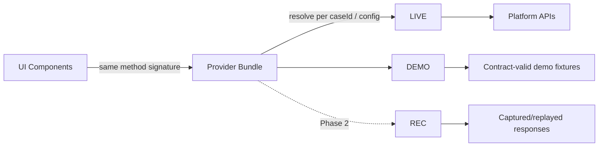
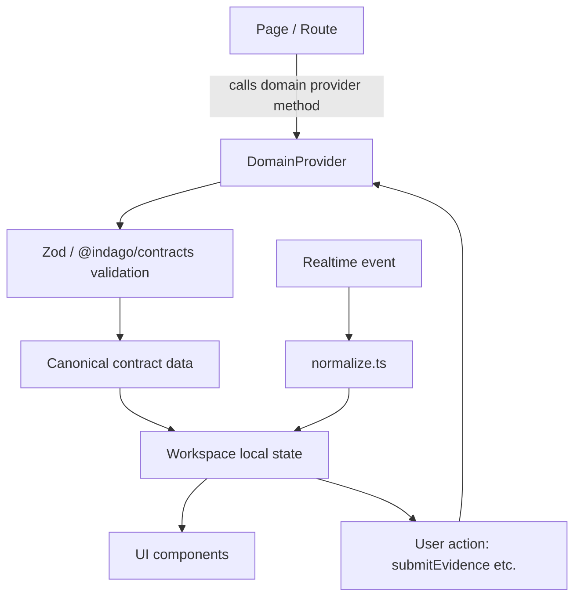
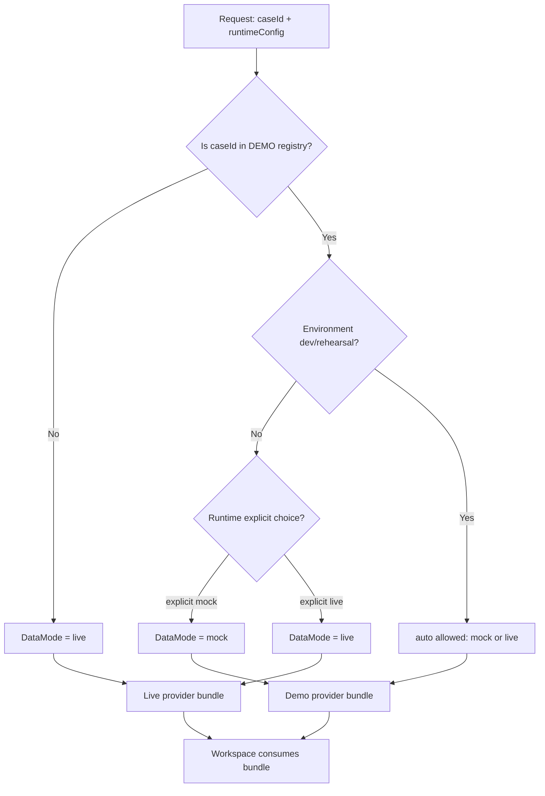
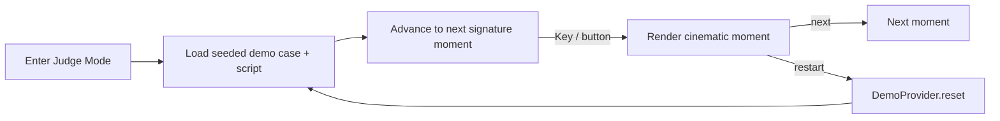
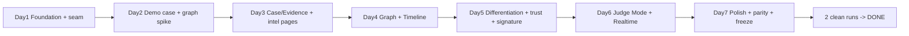
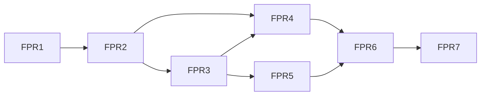

# INDAGO Frontend-First Development Plan

**PS 26189 — Mayur x Gurashish**

> This document is a **track-specific** plan that runs **in parallel with** the system-level roadmap in `docs/development-plan.md`. It does not replace it. The main V7 plan remains the authoritative source of truth for overall subsystem ownership, phases, and the demo narrative.
>
> Scope of this document: build the **production-shaped Investigator frontend now**, ahead of the finished intelligence/backend services, using **deterministic contract-valid implementations behind stable provider interfaces**, so the frontend is demo-ready within ~7 days. When the real backend services arrive, replace the provider implementation **endpoint-by-endpoint** — do not rebuild the UI.

---

## 1. Purpose

Build the real Investigator product frontend, not a fake animation.

The UI must be indistinguishable in behavior from a fully implemented product while it temporarily runs against a **demo provider** that returns the same contract shape the real backend will return.

The architecture this track delivers:

```
UI
 ↓
stable provider interface
 ↓
Live / Mock / Recorded implementations
```

The UI **must not know** which implementation it is running against. When the backend becomes real, only the provider bundle's wiring changes.

---

## 2. Relationship to Main V7 Plan

| Aspect | Main V7 Plan (`docs/development-plan.md`) | Frontend-first track (this document) |
|---|---|---|
| Role | System-level roadmap for the whole product | Parallel, short (7-day) sprint for the UI |
| Authority | Remains authoritative | Subordinate; cannot override V7 |
| Ownership model | Mayur = intelligence; Gurashish = execution/platform/UI | Track-local: both contribute UI code within that boundary |
| Demo narrative | Defined (§16, MESSY CASE PACK sequence) | Reused verbatim — do not invent a different story |
| Backend services | Defined (M-PR1–3 done; rest pending) | Not built here; simulated via demo provider |

**Ownership note (Section 50 of the task brief):** the frontend task brief explicitly changes frontend coding ownership **for one week**. This is a **track-local allocation**, not a change to the system-level ownership model. The main principle stands:

- **Mayur = WHAT INDAGO KNOWS** (intelligence semantics, design/content, fixture content, narrative)
- **Gurashish = HOW INDAGO RUNS** (execution platform, shell, routing, plumbing, graph, realtime, performance)

Within this frontend sprint, **both** contribute frontend implementation inside that boundary. This is documented as a deliberate TRACK-SPECIFIC decision.

---

## 3. Principles

1. **Contract-valid first** — every demo fixture and provider output must pass the canonical `@indago/contracts` schemas before it reaches the UI.
2. **The UI does not know the source** — no branching on provider type inside components.
3. **Mock is a real product implementation** — a temporary backend, not a separate fake UI (see §10/Mock).
4. **Non-demo cases are live-only** — mock intelligence must never silently reach an arbitrary real case.
5. **Extend the existing design system — do not create a second one.**
6. **Do not invent intelligence semantics** — labels/meaning come from Mayur.
7. **Do not depend on accidental platform behavior** (auto-pipeline, duplicate emissions) — treat them as integration dependencies.
8. **Preserve the main V7 demo narrative.**
9. **The graph is the biggest risk** — cut secondary visual features before compromising the graph.
10. **No source, package, schema, route, or component files are modified by this documentation effort.**

---

## 4. Current Repository Baseline

Forensic, read-only audit (verified at HEAD, branch `docs/update-readme`).

### 4.1 Web package (`packages/web`)

- **Framework:** Next.js 15.5.x, App Router, Turbopack
- **React:** 19.x
- **Language:** TypeScript
- **Styling:** Tailwind CSS v4.3.3, CSS-first, `@theme` tokens in `src/app/globals.css`. **No `tailwind.config.ts`** — do not invent one.
- **Components:** hand-written UI primitives; no shadcn/radix.
- **Animation:** no Framer Motion, no GSAP installed; CSS keyframes only (`fade-in`, `slow-pulse`, `grain`).
- **Graph:** no graph library in `packages/web`.
- **State:** no Redux/Zustand/Jotai; mostly local state.
- **API:** server-side `platformFetch` + Server Actions.
- **Upload:** UploadThing client (`src/lib/upload/uploadthing.ts`).
- **Realtime:** hand-rolled SSE client (`src/lib/realtime/sse-client.ts`) + Next.js SSE proxy route.
- **Validation:** Zod + `@indago/contracts` (`src/lib/contracts/`).
- **Testing:** Vitest + Testing Library + jsdom.
- **Fonts:** Inter + JetBrains Mono declared via `@theme`; `next/font` is **not currently wired**.

### 4.2 Existing routes

| Route | Purpose |
|---|---|
| `/` | Dashboard / Recent Investigations (mock list) |
| `/investigations/new` | New Investigation flow |
| `/investigations/[id]?caseId=` | Investigation Detail |
| `/api/sse/[investigationId]` | SSE proxy to platform stream |
| `/error`, `/not-found` | Error surfaces |

### 4.3 Existing reusable components

`components/ui/`: `Button`, `Card`, `Badge`, `Input`, `Textarea`, `Select`, `EmptyState`, `ErrorDisplay`, `LoadingSpinner`
`components/layout/`: `sidebar.tsx`
`components/status/`: `StateBadge`, `InvestigationStatus`
`components/evidence/`: `EvidenceSubmission`, `EvidenceMetadataForm`, `EvidenceReview`
`components/upload/`: `file-upload.tsx`

### 4.4 Existing design infrastructure (`globals.css`)

- brand color tokens (`--color-brand-*`, warm neutral ramp)
- surface tokens (`--color-surface-0` … `--color-surface-900`)
- status tokens (`--color-success/warning/danger/info`)
- grain overlay via SVG `feTurbulence` (`.grain::after`, opacity 0.04 SVG + `opacity: 0.5` wrapper, `mix-blend-mode: overlay`, 8s steps animation)
- `fade-in` keyframe (`.animate-fade-in`), `slow-pulse` keyframe (`.animate-slow-pulse`)
- focus/selection styles (`:focus-visible`, `::selection`)
- restrained borders/shadows

### 4.5 Backend / intelligence status

**Done:** M-PR1 Artifact Acquisition, M-PR2 Classification/Parser Routing, M-PR3 Raw Extraction/OCR.

**Not implemented / not exposed as web APIs:** normalization, observation extraction, entity resolution, relation resolution, graph projection, temporal reasoning, graph analytics, cross-case, lead generation, graph holes, gap classification, evidence planning, counter-evidence, robustness.

**Contracts already exist** for most of these concepts (see §11).

### 4.6 API endpoints (real)

Present: investigation status, investigation creation, evidence submission (worker stub), UploadThing, SSE, health.
**Missing:** Case, Graph, Lead, Gap, Observation, Entity, Robustness, Timeline APIs.

The web currently has **no provider abstraction**. This track introduces that seam.

### 4.7 Known platform discrepancies (do not silently fix)

These are verified in the platform at HEAD. They are **integration dependencies** the frontend must accommodate/document, **not** bugs to silently rewrite from the frontend track.

1. **Auto-pipeline on creation** — creating an investigation immediately enqueues `investigation-pipeline`; the mock worker self-requeues `CREATED → INGESTING → NORMALIZING → ANALYZING → DISCOVERING` (dead-end). Frontend must not depend on this. Intended UX: `Create → CREATED → wait for evidence`, then `Submit Evidence → real worker → INGESTING`.
2. **Duplicate SSE emission + refresh-on-every-event** — the detail page does a full REST refresh on every event. Frontend should update local state from state-bearing events, avoid per-event full refresh, and deduplicate by stable event ID once IDs exist.
3. **Loose/ad-hoc SSE event objects** — platform emits ad-hoc events; `@indago/contracts` has canonical `InvestigationEvent`. Introduce a thin normalizer (see §12).

---

## 5. Tech Stack

Keep the audited stack. Do not replace it without a demonstrated technical reason.

| Concern | Choice | Why |
|---|---|---|
| Framework | Next.js 15.5 (App Router) | existing |
| Language | TypeScript | existing |
| Styling | Tailwind CSS v4 (CSS-first `@theme`) | existing, no config file |
| Components | hand-written primitives | existing |
| Fonts | wire existing Inter + JetBrains Mono through `next/font` | currently declared only; optional serif for select headings only |
| Validation | Zod + `@indago/contracts` | existing; never duplicate schemas |
| API transport | `platformFetch` + Server Actions | existing |
| Upload | UploadThing client | existing |
| Realtime | reuse SSE client + proxy | existing |
| Testing | Vitest + Testing Library | existing |
| Motion | CSS + SVG (default); **GSAP optional** for complex sequences | no dependency added unless spike approves |
| Graph | SVG renderer + lightweight deterministic layout (evaluate first) | see §21; no WebGL without demonstrated need |

**Not adding:** a state-management library (avoid multiple competing systems), a graph library before the Day-2 spike, Three.js/WebGL, or a second design system.

---

## 6. Architecture

### 6.1 High-level architecture

```mermaid
flowchart LR
  subgraph UI[Next.js Web App]
    P[Pages & Workspace Tabs]
    D[Drawers / Overlays]
    C[Reusable Components]
  end

  subgraph PROVIDERS[Provider Layer]
    B[Provider Bundle / Factory]
    subgraph DOMAIN[Domain Providers]
      IP[InvestigationProvider]
      EP[EvidenceProvider]
      OP[ObservationProvider]
      NP[EntityProvider]
      GP[GraphProvider]
      TP[TimelineProvider]
      LP[LeadProvider]
      GAP[GapProvider]
      RP[ReviewProvider]
      RB[RobustnessProvider]
      RT[RealtimeProvider]
    end
  end

  subgraph IMPL[Implementations]
    LIVE[providers/live]
    DEMO[providers/demo]
    REC[providers/recorded - Phase 2]
  end

  subgraph CTX[Canonical Contracts]
    CS[@indago/contracts schemas]
  end

  P --> B
  B --> DOMAIN
  DOMAIN --> LIVE
  DOMAIN --> DEMO
  LIVE --> CS
  DEMO --> CS
```

### 6.2 Provider replacement



When the backend endpoint arrives, swap `Demo<Domain>Provider` for `Live<Domain>Provider` for that domain. No component change.

### 6.3 Data flow



> Chain: page → provider → canonical validation → local state → UI; realtime events update the same local state. Both live and mock producers feed this identical path.

---

## 7. Provider Architecture

**Decision:** domain-specific providers composed into a **provider bundle** — not one giant god-interface containing every domain.

### 7.1 Structure (new paths)

```
packages/web/src/lib/providers/
  types.ts                 # shared provider-facing types, DataMode
  factory.ts               # buildProviderBundle(config) → ProviderBundle
  DataMode.ts              # resolveDataMode(caseId, runtimeConfig)
  InvestigationProvider.ts
  EvidenceProvider.ts
  ObservationProvider.ts
  EntityProvider.ts
  GraphProvider.ts
  TimelineProvider.ts
  LeadProvider.ts
  GapProvider.ts
  ReviewProvider.ts
  RobustnessProvider.ts
  RealtimeProvider.ts
  live/
    LiveInvestigationProvider.ts
    LiveGraphProvider.ts
    ...
  demo/
    DemoInvestigationProvider.ts
    DemoGraphProvider.ts
    ...
    demo-fixtures/         # JSON fixtures, contract-validated
  recorded/                # Phase 2 only — NOT built in week 1
```

### 7.2 Example decomposition

```
GraphProvider
  ├── LiveGraphProvider
  └── DemoGraphProvider

LeadProvider
  ├── LiveLeadProvider
  └── DemoLeadProvider
```

Each provider exposes a domain-specific method set. Example (also the parity contract, §34):

```
getGraph()
getLeads()
getGaps()
getObservations()
getEvidenceRequests()
getRobustness()
getInvestigation()
submitEvidence()
```

The **provider bundle** exposes a composed `investigation` API the workspace consumes. The bundle is constructed once per request/app bootstrap by the **factory** based on resolved DataMode.

### 7.3 Design rules

- Domain-specific interfaces → endpoint-by-endpoint backend replacement.
- Demo and Live implementations share the **same interface** (parity).
- No provider caches domain intelligence; providers return canonical-shaped data.
- Factories never leak implementation type to the UI.

---

## 8. Mock / Live / Recorded Strategy

| Mode | Meaning | Allowed |
|---|---|---|
| `live` | Always use real backend | production, demo day (explicit) |
| `mock` | Always use deterministic demo implementation | demo case, rehearsal (explicit) |
| `auto` | Dev/rehearsal only: demo case → mock, other cases → live | development, rehearsal |
| `recorded` | Future Phase-2 replay of captured real responses | Phase 2 only |

**Demo day:** no silent fallback. A demo operator deliberately chooses **LIVE** or **MOCK**. The system must never silently switch live → mock during a judged run.

**Non-demo cases:** must never receive mock intelligence.

### 8.1 The mock is NOT a fake UI

> "The mock backend is a temporary implementation of the same frontend-facing contract, not a separate fake UI."

The mock provider:
- returns canonical contract-shaped data
- validates with Zod schemas before returning
- preserves real semantic relationships
- simulates realistic latency
- emits realistic state/event sequences
- provides deterministic results
- supports repeatable demo runs
- behaves like the future backend contract

**BAD:** click → instant graph → instant lead → instant result
**GOOD:** submit evidence → processing state → observations → resolution → graph update → temporal signal → lead → graph hole → evidence request → verification → graph update → reassessment

The UI responds to these domain events exactly as it will against the real backend.

### 8.2 Live provider usage

Where a live endpoint exists (investigation status, evidence submission, SSE), the Live provider wraps `platformFetch`/SSE. Where no backend exists, Live provider for that domain returns a proper "not available in live mode" typed error, so the product is honest rather than silently mock.

---

## 9. DataMode Safety

Enforced centrally via **case-scoped mode resolution**, not scattered conditionals.

```
resolveDataMode(caseId, runtimeConfig) → DataMode
```

Invariant:

```
DEMO CASE      → mock/live according to explicit configuration
NON-DEMO CASE  → live
```

- `demo` is a **whitelist of known case IDs** (registry), not a flag applied to everything.
- Non-whitelisted cases resolve to `live`, unconditionally.
- `auto` is permitted **only** in development/rehearsal environments (enforced by env check), and only resolves demo cases to mock.
- **No silent fallback** — a `live`-resolved case that hits an error shows a real error, not a mock.

**DB field decision:** do **not** store a `dataMode` database field yet — the repository has no suitable case API/persistence model for this frontend track. Case membership is a frontend whitelist until a real case model exists.

### Demo mode safety flow



---

## 10. Demo Case

The repository has **no coherent demo case**. Contract fixtures (`packages/contracts/fixtures/*.ts`) contain **fragments** of an "Operation Financial Shadow" scenario: case, investigation, sources, observations, entities, entity/relation hypotheses, graph nodes/edges, leads, gap, robustness. Missing: complete timeline, cross-case scenario, judging sequence, raw evidence corpus, seeded DB demo case.

**Track decision:** assemble ONE coherent deterministic demo case from existing fixtures and extend with the missing pieces, as **JSON fixtures in the web package** validated through canonical contracts.

### 10.1 Recommended fixture structure (new paths, not created now)

```
packages/web/src/lib/providers/demo/demo-fixtures/
  case.json
  investigation.json
  evidence.json
  observations.json
  entities.json
  relations.json
  graph.json
  timeline.json
  leads.json
  gaps.json
  evidence-requests.json
  cross-case.json
  robustness.json
  review.json
  events.json
```

### 10.2 Rule

Every fixture is validated through canonical `@indago/contracts` schemas. **Do not invent duplicate Zod schemas.** Where an existing TS fixture fragment covers a concept (`packages/contracts/fixtures/`), reuse/copy-from it; only extend where the canonical contract already supports the concept (see KPP warning, §12 of the brief → §17 here).

---

## 11. Contract Strategy

Use **canonical contract names** from `@indago/contracts`. Never invent replacement frontend types.

| Use | Do NOT invent |
|---|---|
| `Source` | `EvidenceSource` (unless contracts change) |
| `Lead` | `InvestigativeLead` frontend type |
| `Checkpoint` | `AgentCheckpoint` frontend type |
| `GraphNode` / `GraphEdge` | bespoke graph types |
| `Observation` / `Evidence` / `EvidenceRequest` | — |
| `InvestigativeGap` | — |
| `Hypothesis` / `RobustnessResult` / `ClaimGrounding` | — |
| `InvestigationEvent` | ad-hoc typed events |

The UI may use friendly labels ("Investigative Lead"), but the underlying implementation must use canonical types.

---

## 12. Realtime

**Reuse** the existing SSE client (`src/lib/realtime/sse-client.ts`) and the Next.js SSE proxy (`src/app/api/sse/[investigationId]/route.ts`). Do **not** build a new realtime transport.

### 12.1 Normalizer (thin)

Current problem: platform SSE emits **loose/ad-hoc** event objects; `@indago/contracts` has canonical `InvestigationEvent`. Introduce a thin normalizer:

```
loose platform SSE (SseEvent)
    ↓ normalize()
canonical InvestigationEvent
    ↓
UI
```

Proposed new path: `packages/web/src/lib/realtime/normalize.ts`.

### 12.2 Realtime flow

```mermaid
flowchart LR
  PLATFORM[Platform / Demo realtime source] -->|loose events| PROXY[Next SSE proxy /api/sse/[id]]
  PROXY --> CLIENT[reuse sse-client.ts]
  CLIENT --> NORM[normalize.ts]
  NORM -->|canonical InvestigationEvent| STORE[Workspace local state]
  STORE --> UI[UI panels]
  NORM -. dedupe by stable event id --> CACHE[(dedupe cache)]
```

### 12.3 Frontend realtime rules

- Avoid per-event full REST refresh.
- Update local state from state-bearing events where possible.
- Use throttled/smart refresh only when necessary.
- Deduplicate by stable event ID **once IDs exist**.
- Support a **mock realtime provider** for demo mode.
- **Document, do not silently fix:** duplicate emission + refresh-on-every-event are platform integration dependencies owned by Gurashish's platform lane.

---

## 13. Investigation Workspace

The workspace is the hub.

```
/investigations/[id]   (shared layout/shell)
```

Inside the workspace:

- **Graph**
- **Timeline**
- **Observations**
- **Leads**
- **Gaps**
- **Evidence**
- **Cross-Case**
- **Ledger** (Reasoning Ledger)
- **Trust / Robustness**
- **Review**

Entity Detail / Lead Detail / Gap Detail are **drawers/slideovers**. **Judge Mode** is a fullscreen presentation overlay. **Admin** is a separate route group.

Avoid 21 independent application shells — group into routes / workspace tabs / drawers / overlays / admin.

### 13.1 Workspace architecture

```mermaid
flowchart TD
  W[Workspace Shell /investigations/[id]] --> NAV[Workspace Nav tabs]
  W --> GR[Graph panel]
  W --> TL[Timeline panel]
  W --> TAB[Tab surfaces: Observations / Leads / Gaps / Evidence / Cross-Case / Ledger / Robustness / Review]
  W --> PROVIDERS[Providers bundle - one per workspace]
  W --> RT[Realtime connection]
  GR -->|Entity click| ED[Entity Detail drawer]
  TAB -->|Lead click| LD[Lead Detail drawer]
  TAB -->|Gap click| GD[Gap Detail drawer]
  W -->|present| JM[Judge Mode overlay]
```

---

## 14. Page/View Architecture

### 14.1 Product inventory

Intended product inventory (from the brief) is 22 items — **do not treat as 22 shells**:

1. Login / Access
2. Case List
3. New Case Intake
4. Investigation Workspace
5. Observations Feed
6. Entity Resolution Review Queue
7. Entity Detail
8. Graph View
9. Timeline View
10. Leads List
11. Lead Detail
12. Graph-Hole / Gaps List
13. Gap Detail
14. Evidence Request Queue
15. Cross-Case Signals
16. Reasoning Ledger
17. Discovery Mode
18. Boundary Expansion
19. Trust & Robustness Report
20. Unified Review & Approval Center
21. Admin / RBAC Settings
22. Judge Mode

Grouped into: **app routes**, **workspace tabs**, **drawers**, **overlays**, **admin**.

### 14.2 Routing

```
/                              # Case List (extends current dashboard)
/login                         # Access (optional this sprint)
/investigations/new            # New Case Intake
/investigations/[id]           # Workspace (hub)
/investigations/[id]/graph     # optional deep-linkable
/investigations/[id]/timeline  # optional deep-linkable
/investigations/[id]/leads     # optional deep-linkable
/investigations/[id]/gaps      # optional deep-linkable
/investigations/[id]/judge/*   # Judge Mode (new route group)
/admin/*                       # Admin (new route group)
```

Nested routes render through the **same Workspace layout** — no duplicated layout/state. Optional deep-links may be cut if scope slips.

### 14.3 Page priority

**MUST:** Login/access, Case List, New Case, Workspace Shell, Observations, Entity Resolution/Entity Detail, Graph, Timeline, Leads/Lead Detail, Gaps/Gap Detail, Evidence Requests, Counter-Evidence, Robustness, Reasoning Ledger, Judge Mode.

**SHOULD:** Cross-Case, Unified Review, Discovery Mode, Boundary Expansion.

**CUT IF TIME SLIPS:** advanced admin/RBAC polish, advanced discovery controls, unnecessary visual polish, anything outside the core demo story.

> The tracker protects the **core story** over page-count completeness.

---

## 15. Design System

**EXTEND EXISTING DESIGN SYSTEM. DO NOT CREATE A SECOND DESIGN SYSTEM.**

- Extend the Tailwind v4 `@theme` block in `src/app/globals.css`.
- Keep the existing brand/surface/status tokens and grain.
- Add any new tokens (accents, motion durations/easings) **inside the same `@theme`** or as CSS custom properties in the same file.

### Aesthetic direction

Hazy, warm-dark, intimate, unhurried, restrained, cinematic. "Cigarettes After Sex"-inspired **mood** — not literal branding, not copying artwork.

Avoid: pure black, neon, high-saturation gradients, generic purple "AI dashboard" aesthetic.

---

## 16. Typography

| Property | Choice |
|---|---|
| Sans | Inter (existing) — wire through `next/font` if practical |
| Mono | JetBrains Mono (existing) — `font-mono` for IDs, timestamps, data |
| Display (optional) | one serif font considered for selected major headings only |
| Font budget | do not load five fonts |

Extend the `@theme` `--font-*` variables. Ensure text hierarchy uses the existing surface gray ramp for soft hierarchy.

---

## 17. Color System

Extend existing `@theme`. Concrete additions (CSS custom properties in `globals.css`):

```
--color-accent-rose: a muted dusty rose       # restrained accent
--color-accent-amber: a de-saturated amber    # secondary accent
```

Keep:
- warm charcoal near-black base (`--color-surface-0`)
- elevated dark surfaces (existing `--color-surface-*`)
- muted semantic states (existing `--color-success/warning/danger/info`)
- soft text hierarchy (existing gray ramp)
- subtle borders

**KPP / fragmentation-impact warning:** the design proposal wants graph node size tied to a KPP / fragmentation-impact score. The forensic audit found this concept is **not** a canonical contract field. Therefore:

> Treat it as a clearly documented **DEMO PRESENTATION FIELD** (fixture-only) until the real intelligence contract defines it. Do not invent a permanent frontend model. Add a **future contract addition** note.

---

## 18. Film Grain

Existing SVG `feTurbulence` grain already exists (`.grain::after`). **Reuse it. Do not add a new grain engine.**

Concrete implementation guidance:

| What | How | Where | Why |
|---|---|---|---|
| Film grain | root `::after` pseudo-element, SVG `feTurbulence` data URI, `pointer-events:none`, low opacity, existing overlay blend | `src/app/globals.css` `.grain` / `body.grain` in `layout.tsx` | atmosphere/texture, already present |
| Reduced motion | gate the `grain` keyframe animation under `prefers-reduced-motion` | `globals.css` `@media` | accessibility |

Keep grain lightweight — it is already a fixed full-viewport layer; verify it does not conflict with panels, and consider reducing its z-index involvement if it interferes with focus.

---

## 19. Motion System

Do not animate everything. Philosophy:

```
Mostly still → important event → deliberate cinematic motion → settle → stillness
```

### Durations

| Token | Value | Use |
|---|---|---|
| fast | ~200ms | button/panel hovers, small transitions |
| normal | ~400ms | drawer open, tab fade, list transitions |
| slow | ~900–1400ms | lead reveal, graph bloom, evidence arrival |

Define centralized duration/easing tokens (CSS custom properties in `@theme` or a `:root` rule).

### Easing

Smooth deceleration / restrained. No bounce-heavy UI.

**Default:** CSS + SVG for ordinary UI transitions and simple signature effects.

---

## 20. GSAP Strategy

Explicit choice: the app today has neither Framer Motion nor GSAP.

- **CSS + SVG** for ordinary motion and simple signature effects.
- **GSAP optional** for complex coordinated cinematic sequences only — pending the Day-2 graph/animation spike.

Candidate GSAP uses (complex sequences):
- graph bloom sequence
- entity-resolution convergence
- lead reveal (dim graph → reveal)
- evidence arrival sequence
- Judge Mode choreography
- multi-step timeline sequencing

**Do NOT use GSAP for:** every button hover, simple fade, loading dots, basic cards.

> Keep the stack intentional. If the spike does not support GSAP, fall back to CSS+SVG coordination; the plan does not require GSAP for any component.

---

## 21. Graph Architecture

**Highest technical risk.** Current web app: no graph library, no graph component. The old vis-network shell in `packages/platform/public/index.html` is **NOT reusable** by the Next.js graph.

### 21.1 Day-2 spike (required)

Evaluate minimum viable options against:

- seeded demo ~10–30 nodes
- interactive
- nodes clickable
- edges confidence-aware
- bridge visual
- communities
- timeline filtering
- cinematic motion
- demo performance
- no unnecessary WebGL complexity

**Preferred direction to evaluate first:**

> SVG-based renderer + lightweight deterministic layout (or lightweight force layout) + GSAP/CSS animation.

Do **not** automatically install Three.js/WebGL. WebGL only if the spike demonstrates a concrete requirement.

### 21.2 Data rule

The graph is **provider-driven**. **No hardcoded graph data inside Graph components.** Graph components consume `GraphProvider.getGraph()` (canonical `GraphNode`/`GraphEdge`).

### 21.3 Graph visual semantics (PRESENTATION rules)

| Element | Presentation | Status |
|---|---|---|
| node size | fragmentation-impact / KPP | **demo presentation field only** (see §17) |
| edge thickness | relation / support confidence | presentation scaling of canonical confidence |
| low-confidence edge | dashed + more transparent | presentation |
| bridge candidate | subtle halo | presentation |
| communities | soft background washes / fog-like regions | presentation |
| node click | Entity Detail drawer, graph context preserved | interaction |

Document these as **presentation rules**, not backend semantics, unless canonical contracts support them.

### 21.4 Graph performance guardrails

- node/edge cap for the demo (e.g. ~30 nodes)
- pause force simulation once settled
- avoid full-screen backdrop-filter
- use sparse SVG blur
- keep grain lightweight
- do not animate hundreds of nodes simultaneously

---

## 22. Timeline

A timeline **coupled to graph state** — graph and timeline behave as one instrument.

Requirements:

- case-wide date range
- scrubber
- activity density strip
- date selection filters graph visibility
- timeline data comes from provider (no hardcoded temporal behavior)

```mermaid
flowchart LR
  TL[TimelineProvider.getTimeline()] --> BR[case-wide range + density]
  TL --> SCR[Scrubber]
  SCR -->|date window| GR[Graph visibility filter]
  GR --> GV[Visible graph]
```

---

## 23. Signature Animations

Concrete implementation guidance (What / How / Where / Why):

### Film grain
- What: grain overlay; How: root `::after`, SVG `feTurbulence`, `pointer-events:none`, low opacity, reduced-motion handling; Where: `globals.css`/`layout.tsx`; Why: atmosphere.

### Graph-hole pulse
- How: CSS/SVG opacity + stroke animation; GSAP **only** if part of a larger sequence.

### Cross-case thread
- How: SVG path, `stroke-dasharray` + `stroke-dashoffset`, GSAP timeline to draw the thread connecting cases.

### Lead reveal
- How: dim graph overlay, `translateY` + `opacity`, GSAP orchestration of dim → reveal → emphasis.

### Evidence arrival
- How: opacity/translate entrance on the arriving evidence row + graph connection draw, coordinated (CSS or GSAP depending on sequence).

### Reasoning ledger
- How: staggered row entrance; CSS first, GSAP if sequencing a larger moment.

### Judge Mode choreography
- How: fullscreen overlay, keyboard advancement, GSAP timeline coordinating signature moments.

---

## 24. Loading / Empty / Error / Recovery

Reuse existing `LoadingSpinner`, `EmptyState`, `ErrorDisplay`.

- **Loading:** provider-level loading states; skeleton/per-panel where valuable; avoid loading-dot animations everywhere.
- **Empty:** canonical empty states per surface (no observations yet, no leads yet, etc.).
- **Error:** panel-specific error for single intelligence endpoint failure — never take down the whole investigation UI; `ErrorDisplay` for structural failures.
- **Recovery:** SSE reconnect with backoff + calm "recovery ring"; never destroy already-loaded state.

See §33 Failure Safety.

---

## 25. Accessibility

Minimum baseline (reasonable for a one-week sprint, not overbuilt):

- keyboard focus + `:focus-visible`
- `prefers-reduced-motion` handling (grain, animations)
- text contrast ≥ 4.5:1 for body text
- icon-only buttons have `aria-label`
- `Escape` closes drawers/modals
- keyboard-accessible Judge Mode
- graph has a non-mouse representation / node list where practical

---

## 26. Performance

Concrete guardrails:

- graph node/edge cap for demo
- pause force simulation once settled
- avoid full-screen backdrop-filter
- sparse SVG blur
- lightweight grain
- cap the activity feed (recent events only)
- memoize event rows (`React.memo`/`useMemo`)
- throttle refresh
- avoid unnecessary re-renders (domain-local state)
- provider-level caching/invalidation
- do not animate hundreds of nodes simultaneously

The graph is the biggest technical performance risk.

---

## 27. Demo Narrative

The frontend must support the exact main-V7 story — **do not invent a different one**:

```
MESSY CASE PACK
  > OBSERVATIONS
    > ENTITY / RELATION RESOLUTION
      > TEMPORAL GRAPH
        > CROSS-CASE SIGNAL
          > INVESTIGATIVE LEAD
            > GRAPH HOLE
              > GAP CLASSIFICATION
                > BEST NEXT EVIDENCE
                  > COUNTER-EVIDENCE
                    > ROBUSTNESS
                      > VERIFIED EVIDENCE ARRIVES
                        > GRAPH UPDATES
                          > LEAD REASSESSMENT
                            > REASONING LEDGER
```

Source: `docs/development-plan.md` §16 Demo Sequence. The demo provider above emits these as a scripted realtime sequence (§12).

---

## 28. Judge Mode

A **first-class frontend feature** (`/investigations/[id]/judge/*` route group).

Requirements:

- uses the exact seeded demo case
- predetermined sequence (from §27)
- no navigation chrome
- keyboard advancement
- deterministic
- restart/reset support
- individual signature moments can be rehearsed alone
- independent of backend latency in mock mode

Judged runs should not depend on backend latency; in mock mode Judge Mode is self-contained.

### 28.1 Judge Mode flow



**Do not over-generalize Judge Mode** — it is specialized to the demo case.

---

## 29. Seven-Day Development Plan

### Day 1 — Foundation + provider seam + design system baseline

- **Mayur:** design tokens (color/typography/motion constants), visual primitives polish, semantic naming, demo case data model.
- **Gurashish:** workspace shell, route structure, provider interfaces/factory, DataMode skeleton.
- **Gate:** bare workspace renders using the provider abstraction.

### Day 2 — Demo case + graph spike

- **Mayur:** assemble coherent demo fixtures, canonical schema validation, intelligence semantics.
- **Gurashish:** graph renderer spike, graph technology decision, realtime normalizer.
- **Gate:** one contract-valid demo case + graph spike.

### Day 3 — Case/Evidence + static intelligence pages

- **Mayur:** Observations, Entity, Leads, Gaps semantic content.
- **Gurashish:** Case List, Intake, Workspace provider integration, evidence flow refactor.
- **Gate:** case → evidence → provider → visible intelligence.

### Day 4 — Graph + Timeline

- **Gurashish:** graph implementation, timeline, node interaction, entity drawer.
- **Mayur:** graph semantic validation, timeline semantics, presentation copy.
- **Gate:** graph/timeline work against provider only.

### Day 5 — Differentiation + trust + signature animation

- **Mayur:** lead/gap/evidence/counter-evidence/robustness semantics.
- **Gurashish:** signature animations, graph-hole visualization, evidence-arrival visualization, realtime shell.
- **Gate:** Lead → Gap → Next Evidence narrative.

### Day 6 — Judge Mode + Realtime

- **Both:** Judge Mode.
- **Gurashish:** realtime/error/recovery/performance.
- **Mayur:** demo narration, semantic QA.
- **Gate:** complete guided demo.

### Day 7 — Polish + parity + freeze

- **Mayur:** fixture determinism, semantic audit, demo content.
- **Gurashish:** final integration, accessibility, performance, mock/live routing, demo reset.
- **Both:** two clean timed rehearsals.

### 29.1 Seven-day flow



---

## 30. F-PR1–F-PR7

### F-PR1 — Foundation + Design System

- **Goal:** design baseline + workspace shell foundation.
- **Scope:** token extension, typography, motion constants, primitives polish, shell, routes.
- **Primary owner:** Mayur (design) / Gurashish (shell).
- **Reviewer:** the other.
- **Dependencies:** none.
- **Likely files:** `packages/web/src/app/globals.css`, `packages/web/src/app/layout.tsx`, `packages/web/src/components/layout/*`, new `packages/web/src/components/layout/workspace-nav.tsx`, route scaffolds.
- **Implementation notes:** extend `@theme`, no second design system.
- **Tests:** design-token smoke, shell render.
- **Acceptance:** workspace shell renders using provider abstraction.
- **Demo checkpoint:** shell only.
- **Risk:** scope creep into visual polish; guard to tokens + shell.

### F-PR2 — Provider Seam + Demo Case

- **Goal:** provider interfaces/factory + contract-valid demo fixtures.
- **Scope:** `packages/web/src/lib/providers/*`, `DataMode.ts`, `demo-fixtures/*.json`.
- **Primary owner:** Gurashish (seam) / Mayur (fixtures).
- **Reviewer:** other.
- **Dependencies:** F-PR1.
- **Likely files:** new `packages/web/src/lib/providers/**`, `demo-fixtures/**`.
- **Implementation notes:** fixtures validated via canonical contracts; no duplicate schemas.
- **Tests:** DemoProvider fixture validation, DataMode resolution.
- **Acceptance:** DemoProvider returns a contract-valid coherent case.
- **Demo checkpoint:** one coherent case.
- **Risk:** fixture completeness/canonical gaps.

### F-PR3 — Core Workspace + Case/Evidence

- **Goal:** case list, intake, workspace provider integration, evidence flow refactor.
- **Scope:** surfaces + refactor `investigation-detail`.
- **Primary owner:** Gurashish.
- **Reviewer:** Mayur (semantics).
- **Dependencies:** F-PR1, F-PR2.
- **Likely files:** `packages/web/src/app/page.tsx`, `investigations/new/*`, `investigations/[id]/*`, `investigation-detail.tsx`, `components/evidence/*`, `components/upload/file-upload.tsx`.
- **Tests:** evidence flow via provider, live/mock parity for evidence.
- **Acceptance:** case → evidence → provider → visible intelligence.
- **Demo checkpoint:** intake → evidence → observations.
- **Risk:** refactor churn on existing detail page.

### F-PR4 — Graph + Timeline

- **Goal:** graph implementation + timeline; node interaction + entity drawer.
- **Primary owner:** Gurashish.
- **Reviewer:** Mayur (semantics).
- **Dependencies:** F-PR2, F-PR3.
- **Likely files:** new `packages/web/src/components/graph/*`, `components/timeline/*`, `components/layout/workspace-nav.tsx`.
- **Implementation notes:** SVG-first; provider-driven; no hardcoded graph data in components.
- **Tests:** graph rendering/purity, timeline filtering.
- **Acceptance:** graph/timeline work against provider only.
- **Demo checkpoint:** temporal graph + entity drawer.
- **Risk:** graph is the highest technical risk; spike gated at Day 2.

### F-PR5 — Intelligence Surfaces

- **Goal:** observations, entity, leads, gaps presentation.
- **Primary owner:** Mayur (content) / Gurashish (surfaces).
- **Reviewer:** other.
- **Dependencies:** F-PR3.
- **Likely files:** `packages/web/src/components/intel/*`, `components/status/*`, `components/ui/*`.
- **Tests:** provider-driven rendering, empty/loading states.
- **Acceptance:** lead/entity/observation presentation works.
- **Demo checkpoint:** leads + gaps lists/details.
- **Risk:** wording/semantics drift from canonical meaning.

### F-PR6 — Signature Motion + Realtime

- **Goal:** signature animations + realtime shell.
- **Primary owner:** Gurashish.
- **Reviewer:** Mayur.
- **Dependencies:** F-PR2, F-PR4.
- **Likely files:** `packages/web/src/lib/realtime/normalize.ts`, `components/feedback/*`, `components/graph/*` (motion).
- **Implementation notes:** reuse SSE client/proxy; GSAP only if approved by spike; CSS+SVG default.
- **Tests:** realtime normalization, event deduplication.
- **Acceptance:** realtime + signature moments work.
- **Demo checkpoint:** Lead → Gap → Next Evidence story.
- **Risk:** animation performance; SSE dedupe.

### F-PR7 — Judge Mode + Polish

- **Goal:** Judge Mode + parity + accessibility + reset + freeze.
- **Owners:** Both.
- **Reviewer:** both.
- **Dependencies:** all prior.
- **Likely files:** new `packages/web/src/app/investigations/[id]/judge/*`.
- **Tests:** Judge Mode sequence, demo reset, failure states.
- **Acceptance:** two clean timed rehearsal runs.
- **Demo checkpoint:** complete guided demo.
- **Risk:** scope; protect core story.

### 30.1 Dependency graph



---

## 31. Mayur / Gurashish Ownership

**Overarching rule (V7):**
- **Mayur:** WHAT INDAGO KNOWS
- **Gurashish:** HOW INDAGO RUNS

**Within this frontend sprint (track-local):**

**Mayur:**
- design token / aesthetic implementation
- static / data-dense views
- intelligence presentation
- semantic labels
- fixture content
- demo case narrative
- confidence / lead / gap / evidence wording
- judge narration

**Gurashish:**
- shell
- routing
- provider plumbing
- mock/live routing
- graph
- timeline
- realtime
- SSE integration
- performance

**Both:**
- signature animations
- Judge Mode
- final integration
- final demo rehearsal

---

## 32. Testing

Reuse **Vitest + Testing Library**.

Create tests for:

- provider interfaces
- DataMode resolution
- DemoProvider fixture validation (fixture → `schema.parse()` → provider → component)
- Live/Demo parity
- provider factory
- realtime normalization
- event deduplication
- graph rendering/purity where practical
- timeline filtering
- Judge Mode sequence
- demo reset
- failure states

Do **not** create duplicate contract tests.

### 32.1 Fixture pipeline

```
fixture
  → canonical schema.parse()
  → provider
  → component
```

---

## 33. Failure Safety

Rules:

- **Demo case:** explicitly mock or live.
- **Non-demo:** live only.
- **Development:** `auto` allowed.
- **Demo day:** NO silent fallback.

Failures:

- **Live API down:** show actual error state, manual retry. User may manually switch demo case to mock if appropriate.
- **SSE failure:** reconnect with backoff, show calm recovery ring, do not destroy already-loaded state.
- **Graph API failure:** graph-specific degraded state; other workspace panels remain available.
- **One intelligence endpoint fails:** panel-specific error; do not take down the whole investigation UI.

---

## 34. Reset Strategy

No reset mechanism currently exists. Document a deterministic mock reset:

```
reset()
  → restore initial fixture snapshot
  → clear provider runtime state
  → clear scripted realtime timeline
  → restore initial workspace state
```

- Judge Mode has **Restart**.
- **Live mode reset must never mutate arbitrary real cases.** For live, "reset" means route/provider refresh or a freshly created demo run only.

---

## 35. Risk Register

| ID | Risk | Probability | Impact | Mitigation | Owner |
|---|---|---|---|---|---|
| R1 | Graph implementation | High | High | Day-2 spike; SVG-first; cut secondary visuals before graph; provider-driven | Gurashish |
| R2 | Demo case completeness | Medium | High | assemble from existing fixtures early (Day 2); validate via contracts | Mayur |
| R3 | Realtime event normalization | Medium | Medium | thin normalizer + canonical events; dedupe | Gurashish |
| R4 | Existing platform auto-pipeline | High | Low | document as dependency; demo UX does not depend on it | Gurashish |
| R5 | Existing SSE duplicate emission | Medium | Medium | dedupe + smart refresh; document, don't silently fix | Gurashish |
| R6 | Contract naming gaps (e.g. KPP) | Medium | Medium | fixture-only presentation fields; future contract note | Mayur |
| R7 | Seven-day scope | High | High | priority MUST/SHOULD/CUT; protect core story | Both |
| R8 | Animation performance | Medium | Medium | CSS+SVG default; guardrails; no hundreds of nodes | Gurashish |
| R9 | Mock/live leakage | Medium | High | central resolveDataMode; non-demo → live invariant | Gurashish |
| R10 | Backend replacement parity | Medium | High | parity acceptance test per provider; same method signatures | Gurashish |

---

## 36. Stop Rules

1. Do not build a second design system.
2. Do not introduce multiple competing state-management systems.
3. Do not implement real intelligence inside the frontend.
4. Do not invent intelligence semantics.
5. Do not make mock fallback global.
6. Do not use mock on arbitrary real cases.
7. Do not make DemoProvider a special rendering path.
8. Do not build RecordedProvider in week 1.
9. Do not over-generalize Judge Mode.
10. Do not spend time on Admin before the core story.
11. If graph slips, cut secondary visual features before compromising graph.
12. Do not silently modify platform SSE/worker behavior in this frontend track.
13. Do not introduce WebGL/Three.js without a demonstrated requirement.
14. Do not sacrifice the core demo narrative for page-count completion.

---

## 37. Definition of Done

The frontend-first track is **DONE** only when:

- core Investigator UI exists
- demo case is coherent
- fixtures are contract-valid
- providers exist
- mock/live modes exist
- non-demo cases cannot silently receive mock
- graph exists
- timeline exists
- lead/gap/evidence story exists
- realtime works
- signature animations exist
- Judge Mode works
- loading / empty / error / recovery states exist
- accessibility baseline passes
- demo reset works
- two clean timed rehearsals pass
- live provider can replace demo provider without rewriting UI components

---

## 38. Final Architecture

```mermaid
flowchart TB
  subgraph UI[Next.js App - Workspace]
    SH[Workspace Shell + Nav]
    GR[Graph panel]
    TL[Timeline panel]
    SR[Tab surfaces: Obs/Entity/Leads/Gaps/Evidence/Ledger/Robustness/Review]
    DR[Drawers: Entity/Lead/Gap Detail]
    JM[Judge Mode overlay]
  end

  subgraph BUNDLE[Provider Bundle / factory]
    DS[DataMode resolver]
    DOM[Domain providers]
  end

  subgraph LIVE[Live impl]
    LI[Live providers]
  end
  subgraph DEMO[Demo impl]
    DM[Demo providers + validated fixtures]
  end

  subgraph RT[Realtime]
    SSE[reuse SSE client/proxy]
    NORM[normalize.ts]
  end

  subgraph CTS[Canonical Contracts]
    CTX[@indago/contracts]
  end

  UI --> BUNDLE
  BUNDLE --> DS
  BUNDLE --> DOM
  DOM --> LIVE
  DOM --> DM
  RT --> NORM
  NORM --> UI
  LIVE --> CTS
  DM --> CTS
  NORM --> CTS
```

### 38.1 Reuse vs Build

| Artifact | Status | Note |
|---|---|---|
| `globals.css` tokens/grain | **Reuse** | extend, don't duplicate |
| `layout.tsx` shell + Sidebar + pl-60 | **Reuse** | add workspace nav alongside |
| `Sidebar` | **Reuse** | |
| UI primitives (`Button`, `Card`, `Badge`, …) | **Reuse** | |
| Evidence wizard (`evidence/*`) | **Reuse/refactor** | consume via provider |
| UploadThing (`upload/*`) | **Reuse** | |
| `platformFetch` + Server Actions | **Reuse** | wrap in Live providers |
| SSE client (`sse-client.ts`) | **Reuse** | |
| SSE proxy route | **Reuse** | |
| contracts validation | **Reuse** | canonical schemas |
| contract fixtures | **Reuse** | fragments for "Operation Financial Shadow" |
| `USE_MOCK_INGESTION` env | **Backend-only** | NOT a frontend dependency |
| platform vis-network test shell | **NOT reusable** | not the Next.js graph |
| RecordedProvider | Phase 2 | do not build in week 1 |

---

## Appendix — File inventory (paths referenced, verified and proposed)

Verified existing paths:
- `packages/web/src/app/globals.css`
- `packages/web/src/app/layout.tsx`
- `packages/web/src/app/page.tsx`
- `packages/web/src/app/investigations/new/page.tsx`
- `packages/web/src/app/investigations/[id]/page.tsx`
- `packages/web/src/app/investigations/[id]/investigation-detail.tsx`
- `packages/web/src/app/api/sse/[investigationId]/route.ts`
- `packages/web/src/components/ui/*`
- `packages/web/src/components/layout/sidebar.tsx`
- `packages/web/src/components/status/*`
- `packages/web/src/components/evidence/*`
- `packages/web/src/components/upload/file-upload.tsx`
- `packages/web/src/lib/api/*`
- `packages/web/src/lib/realtime/sse-client.ts`
- `packages/web/src/lib/contracts/*`
- `packages/web/src/lib/upload/*`

Proposed new paths (documented only — not created by this documentation effort):
- `packages/web/src/lib/providers/**`
- `packages/web/src/lib/realtime/normalize.ts`
- `packages/web/src/components/layout/workspace-nav.tsx`
- `packages/web/src/components/graph/*`
- `packages/web/src/components/timeline/*`
- `packages/web/src/components/intel/*`
- `packages/web/src/components/feedback/*`
- `packages/web/src/app/investigations/[id]/judge/*`
- `packages/web/src/app/admin/*`

---

*This document is documentation-only. No source code, package.json, lockfiles, Prisma schema, contracts, routes, components, or configuration were modified.*
