# INDAGO Frontend-First Development Plan

**PS 26189 — Mayur x Gurashish**

> This document is a **track-specific, implementation-grade** plan that runs **in parallel with** the system-level roadmap in `docs/roadmap/development-plan.md`. It does not replace it. The main V7 plan remains authoritative for subsystem ownership, phases, and the demo narrative.
>
> This build is **frontend-first**: build the production-shaped Investigator frontend **now**, ahead of the finished intelligence/backend services, using deterministic contract-valid implementations behind stable provider interfaces, so the frontend is demo-ready within ~7 days. When the real backend services arrive, replace the provider implementation **endpoint-by-endpoint** — do not rebuild the UI.
>
> It is **documentation only**. No source code, package.json, lockfiles, Prisma, contracts, routes, components, or configuration are modified by producing it.
>
> How to use this document:
> - **§15** is the page-by-page implementation spec — the exact visual and behavioral contract for each of the 22 views. Build each view from its owned section.
> - **§16–§24** define the design system, motion, and graph/timeline mechanisms that every page references.
> - **§30–§31** are the PR plan and seven-day plan.
> - Mirror execution status in `docs/frontend/frontend-phase-tracker.md`.

---

# Table of Contents

1. Executive Summary
2. Relationship to the Main V7 Plan
3. Sprint Objective
4. Principles
5. Repository Baseline
6. Tech Stack
7. Architecture
8. Provider Architecture
9. DataMode Safety
10. Demo Case
11. Contract Strategy
12. Realtime
13. Investigation Workspace
14. Page / View Architecture
15. Page-by-Page Implementation Specifications (22 views)
16. Design System Implementation
17. Typography
18. Color System
19. Film Grain
20. Motion System
21. GSAP Strategy
22. Graph Architecture
23. Timeline
24. Signature Animations
25. Loading / Empty / Error / Recovery
26. Accessibility
27. Performance
28. Demo Narrative
29. Judge Mode
30. PR Plan (F-PR1..F-PR7)
31. Seven-Day Development Plan
32. Mayur / Gurashish Ownership
33. Testing
34. Failure Safety
35. Reset Strategy
36. Platform Dependencies
37. Implementation Order
38. Risks
39. Stop Rules
40. Definition of Done
41. Final Application Architecture
42. Screen-by-Screen Summary
43. Appendix: File Map

---

---

## 1. Executive Summary

Build the **real Investigator product frontend now** — not a fake animation — so it is demo-ready within ~7 days against a deterministic, contract-valid **demo provider**, and is later pointed at the real backend by swapping provider implementations endpoint-by-endpoint **without rewriting the UI**.

The deliverable is a production-shaped frontend that is **indistinguishable in behavior from a fully implemented product** while it temporarily runs against a demo provider returning exactly the same canonical `@indago/contracts` shapes the real backend will return.

```
UI
 ↓
stable provider interface
 ↓
Live / Mock / Recorded implementations
```

**Guardrail:** this documentation defines the architecture and every screen. It does **not** modify source. The UI must never know which provider it is running against.

---

## 2. Relationship to the Main V7 Plan

| Aspect | Main V7 Plan (`docs/roadmap/development-plan.md`) | Frontend-first track (this document) |
|---|---|---|
| Role | System-level roadmap for the whole product | Parallel, short (7-day) sprint for the UI |
| Authority | Remains authoritative | Subordinate; cannot override V7 |
| Ownership model | Mayur = WHAT INDAGO KNOWS; Gurashish = HOW INDAGO RUNS | Track-local: both contribute UI code within that boundary |
| Demo narrative | Defined (§16, MESSY CASE PACK sequence) | Reused verbatim — do not invent a different story |
| Backend services | Defined (M-PR1–3 done; rest pending) | Not built here; simulated via demo provider |

**Track-local ownership change (Section 50 of the brief):** the frontend task brief explicitly changes frontend coding ownership **for one week only**. This is a track-local allocation, not a change to the system-level model. Within this sprint, **both** contribute frontend implementation within the system boundary:

- **Mayur = WHAT INDAGO KNOWS** (intelligence semantics, design/content, fixture content, narrative, confidence wording, judge narration)
- **Gurashish = HOW INDAGO RUNS** (shell, routing, provider plumbing, DataMode, graph, timeline, realtime, SSE, performance, integration)

---

## 3. Sprint Objective

1. Stand up the production-shaped frontend for all **MUST** views behind stable provider interfaces.
2. Ship one coherent, deterministic demo case ("Operation Financial Shadow") that passes canonical schema validation.
3. Make the graph + timeline + lead + gap + evidence + robustness story re-runnable for a judged demo.
4. Keep Judge Mode **deterministic and backend-independent in mock mode**.
5. Guarantee backend replacement requires **no UI rewrites**.

Every day ends with a **runnable demo checkpoint** (see §31).

---

## 4. Principles (contract-valid first)

1. **Contract-valid first** — every demo fixture and provider output passes canonical `@indago/contracts` schemas before reaching the UI.
2. **The UI does not know the source** — no branching on provider type inside components.
3. **Mock is a real product implementation** — a temporary backend, never a separate fake UI.
4. **Non-demo cases are live-only** — mock intelligence must never silently reach an arbitrary real case.
5. **Extend the existing design system — do not create a second one.**
6. **Do not invent intelligence semantics** — labels/meaning come from Mayur; re-use the canonical score types and their documented semantics (`contracts/docs/uncertainty-model.md`, `scoring-semantics.md`).
7. **Do not depend on accidental platform behavior** (auto-pipeline, duplicate emissions) — treat as documented integration dependencies (§36).
8. **Preserve the main V7 demo narrative** (§28).
9. **The graph is the biggest risk** — cut secondary visual features before compromising the graph.
10. **Do not invent features, APIs, contracts, or scoring systems** — when something is unavailable, mark it **Demo-only fixture** or **Future backend dependency** (§56–57 of the brief).

---

## 5. Repository Baseline (verified at HEAD)

### 5.1 Web package (`packages/web`)

- **Framework:** Next.js 15.x, App Router, Turbopack. **React 19**, TypeScript.
- **Styling:** Tailwind CSS v4 (`tailwindcss ^4.3.3`), CSS-first `@theme` in `src/app/globals.css`. **No `tailwind.config.ts`.**
- **Components:** hand-written primitives; no shadcn/radix.
- **Animation:** no Framer Motion, no GSAP installed; CSS keyframes only (`fade-in`, `slow-pulse`, `grain`).
- **Graph:** no graph library in `packages/web`.
- **State:** no Redux/Zustand/Jotai; mostly local state.
- **API:** server-side `platformFetch` + Server Actions (`lib/api/*`).
- **Upload:** UploadThing client (`lib/upload/uploadthing.ts`, `lib/upload/types.ts`).
- **Realtime:** hand-rolled fetch-based SSE client (`lib/realtime/sse-client.ts`) + Next.js SSE proxy route `app/api/sse/[investigationId]/route.ts`.
- **Validation:** Zod + `@indago/contracts` (`lib/contracts/validation.ts`, `lib/contracts/types.ts`).
- **Testing:** Vitest `^3` + Testing Library + jsdom (`vitest run`).
- **Fonts:** Inter + JetBrains Mono declared via `@theme`; `next/font` not wired.

### 5.2 Existing routes

| Route | Purpose |
|---|---|
| `/` | Dashboard / Recent Investigations (static mock list) |
| `/investigations/new` | New Investigation flow (single caseId field) |
| `/investigations/[id]?caseId=` | Investigation Detail (SSE + activity feed) |
| `/api/sse/[investigationId]` | SSE proxy to platform stream |
| `/error`, `/not-found` | Error surfaces |

### 5.3 Existing reusable components

`components/ui/`: `Button`, `Card` (+`CardHeader/Title/Description/Content`), `Badge`, `Input`, `Textarea`, `Select`, `EmptyState`, `ErrorDisplay`, `LoadingSpinner`
`components/layout/`: `sidebar.tsx`
`components/status/`: `StateBadge`, `InvestigationStatus`
`components/evidence/`: `EvidenceSubmission`, `EvidenceMetadataForm`, `EvidenceReview`
`components/upload/`: `file-upload.tsx`

### 5.4 Existing design infrastructure (`globals.css`)

- `--color-brand-50..900` (warm brown ramp) — used as the warm charcoal/accent base.
- `--color-surface-0..900` — dark elevated surfaces (`surface-0` #0a0a0a base; `surface-50/100/200` elevated panels; `surface-700/800/900` text ramp).
- `--color-success/warning/danger/info` (muted).
- Grain overlay via SVG `feTurbulence` (`.grain::after`: `inset:-50%`, 200% size, `mix-blend-mode: overlay`, opacity 0.04 SVG + 0.5 wrapper, `z-index:9999`, `pointer-events:none`, `grain 8s steps(10) infinite`).
- `fade-in` (opacity + translateY 4px, 0.6s ease-out) and `slow-pulse` (opacity 0.4↔0.7, 4s) keyframes.
- `:focus-visible` outline (1px `brand-500`), custom 4px scrollbar.

### 5.5 Backend / intelligence status (verified)

**Done:** M-PR1 Artifact Acquisition, M-PR2 Classification/Parser Routing, M-PR3 Raw Extraction/OCR (library form in `packages/intelligence/ingestion`).

**Present as live HTTP endpoints:** investigation create (`POST /api/v1/investigations/start`), investigation status (`GET /api/v1/investigations/:id`), evidence submission (`POST /api/v1/investigations/:id/evidence`), SSE stream (`GET /api/v1/investigations/:id/stream`), uploadthing, health.

**Missing at the integration layer (only contracts exist):** Graph query (only pushed as `GRAPH_READY` SSE string), Timeline, Lead, Gap, Observation, Entity, Robustness, Cross-case, Review, Evidence-request. These are **demo-only / future backend dependency** for this track.

**Contracts exist for all of these** — see §11.

### 5.6 Known platform discrepancies (do not silently fix)

Documented as integration dependencies in §36:
1. **Auto-pipeline on creation** — `POST /start` immediately enqueues `investigation-pipeline`; mock worker self-requeues `CREATED → INGESTING → NORMALIZING → ANALYZING` (terminates at DISCOVERING / WAITING_FOR_EVIDENCE). Frontend must not depend on this.
2. **Duplicate SSE emission** — `transitionState` emits a state event **and** `audit/logger.ts` emits the full `AuditEvent` record to the same `progress` emitter; a single transition can yield two events (different shapes). Plus `GRAPH_READY` is emitted separately.
3. **Ad-hoc SSE event shapes** — platform events are `{investigationId, state/type, message, timestamp}` with no named SSE `event:` field; `@indago/contracts` has canonical `InvestigationEvent`. Introduce a thin normalizer (§12).

---

## 6. Tech Stack

Keep the audited stack. Do not replace it without a demonstrated technical reason.

| Concern | Choice | Why |
|---|---|---|
| Framework | Next.js 15.x (App Router) | existing |
| Language | TypeScript | existing |
| Styling | Tailwind CSS v4 (CSS-first `@theme`) | existing, no config file |
| Components | hand-written primitives | existing |
| Fonts | wire existing Inter + JetBrains Mono through `next/font`; optional ONE serif for select headings | currently declared only |
| Validation | Zod + `@indago/contracts` | existing; never duplicate schemas |
| API transport | `platformFetch` + Server Actions | existing |
| Upload | UploadThing client | existing |
| Realtime | reuse SSE client + proxy | existing |
| Testing | Vitest + Testing Library | existing |
| Motion | CSS + SVG (default); **GSAP optional** for complex sequences | no dependency added unless spike approves |
| Graph | SVG renderer + lightweight deterministic layout (evaluate first) | see §22; no WebGL without demonstrated need |

**Not adding:** a state-management library, a graph library before the Day-2 spike, Three.js/WebGL, recorded-provider in week 1, or a second design system.

---

## 7. Architecture

### 7.1 High-level architecture

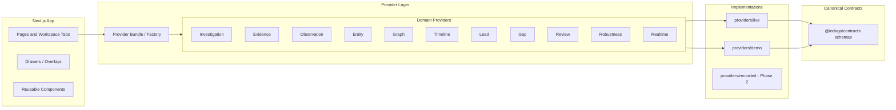

ASCII fallback:

```
                  UI
                   |
                   v
           Provider Bundle / Factory
                   |
     +-------------+-------------+
     |             |             |
   LIVE          MOCK        RECORDED
     |             |         (phase 2)
     v             v
 Platform   Demo Fixtures
   APIs            |
     +------+------+
            v
    @indago/contracts  (canonical Zod schemas)
```

### 7.2 Provider replacement

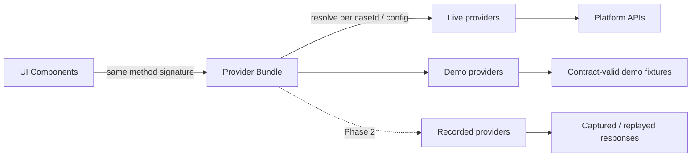

When a backend endpoint arrives, swap `Demo<Domain>Provider` for `Live<Domain>Provider` for that domain. No component change.

### 7.3 Data flow

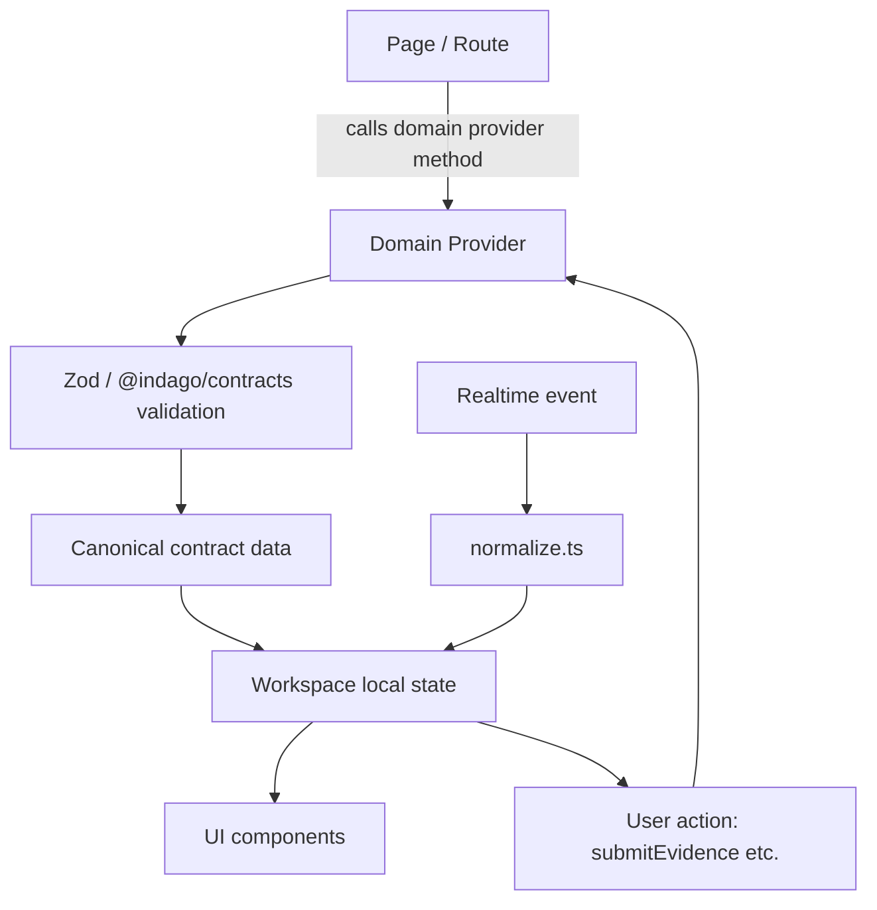

Chain: page → provider → canonical validation → local state → UI; realtime events update the same local state. Both live and mock producers feed this identical path.

---

## 8. Provider Architecture

**Decision:** domain-specific providers composed into a **provider bundle** — not one giant god-interface.

### 8.1 Domain providers

| Provider | Responsibility |
|---|---|
| `InvestigationProvider` | case/investigation metadata, status, lifecycle actions |
| `EvidenceProvider` | evidence list, submit, metadata, upload refs |
| `ObservationProvider` | observation feed, filtering, source expansion |
| `EntityProvider` | entities, entity hypotheses, resolution queue |
| `GraphProvider` | canonical `getGraph()` — nodes/edges/communities/bridges |
| `TimelineProvider` | case-wide range, density strip, events |
| `LeadProvider` | leads list + lead detail (evidence for/against, alternatives) |
| `GapProvider` | graph-holes + investigative gaps + gap detail |
| `ReviewProvider` | review tasks, approvals, audit trace |
| `RobustnessProvider` | robustness report + methodology |
| `RealtimeProvider` | **stream lifecycle**, not CRUD (see 8.3) |

**Provider bundle / factory:** `buildProviderBundle(config)` resolves the concrete implementations for the current investigation/case from the resolved `DataMode`. The bundle is constructed once per request/app bootstrap.

### 8.2 RealtimeProvider is a stream lifecycle abstraction

Separate responsibilities:

| Concern | Owner |
|---|---|
| fetch / query / mutate domain data | Domain providers |
| `connect` / `subscribe` / `unsubscribe` / `disconnect` | RealtimeProvider |
| `normalize` (loose SSE → canonical `InvestigationEvent`) | normalize.ts |
| `dedupe` (by stable event id when available) | RealtimeProvider |
| `reconnect` (with backoff, calm recovery ring) | RealtimeProvider |

### 8.3 Caching rule

Provider caching may exist for transport efficiency, **but**:
- provider cache is **not** domain authority;
- no provider becomes a second database;
- returned values remain canonical (validated with Zod).

### 8.4 Structure (new paths, documented only)

```
packages/web/src/lib/providers/
  types.ts                 # provider-facing types, DataMode
  factory.ts               # buildProviderBundle(config) -> ProviderBundle
  DataMode.ts              # resolveDataMode(caseId, runtimeConfig)
  InvestigationProvider.ts
  EvidenceProvider.ts
  ObservationProvider.ts
  EntityProvider.ts
  GraphProvider.ts
  TimelineProvider.ts
  LeadProvider.ts
  GapProvider.ts
  ReviewProvider.ts
  RobustnessProvider.ts
  RealtimeProvider.ts
  live/
    LiveInvestigationProvider.ts
    LiveGraphProvider.ts
    ...
  demo/
    DemoInvestigationProvider.ts
    DemoGraphProvider.ts
    ...
    demo-fixtures/         # JSON fixtures, contract-validated
  recorded/                # Phase 2 only — NOT built in week 1
```

### 8.5 Example decomposition

```
GraphProvider
  ├── LiveGraphProvider
  └── DemoGraphProvider

LeadProvider
  ├── LiveLeadProvider
  └── DemoLeadProvider
```

Each provider exposes a domain-specific method set (also the parity contract, §33/§38):

```
getGraph()
getLeads()
getGaps()
getObservations()
getEvidenceRequests()
getRobustness()
getInvestigation()
submitEvidence()
```

Rules:
- Domain-specific interfaces → endpoint-by-endpoint backend replacement.
- Demo and Live share the **same interface** (parity).
- No provider caches domain intelligence; providers return canonical-shaped data.
- Factories never leak implementation type to the UI.

### 8.6 Provider lifecycle

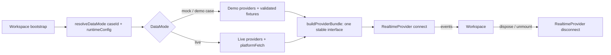

ASCII fallback:

```
Workspace bootstrap -> resolveDataMode(caseId, runtime)
  -> mock ? Demo providers : Live providers
  -> buildProviderBundle (stable interface)
  -> RealtimeProvider.connect -> UI
  -> RealtimeProvider.disconnect on unmount
```

---

## 9. DataMode Safety

Enforced centrally via **case-scoped mode resolution**, not scattered conditionals.

```
resolveDataMode(caseId, runtimeConfig) -> DataMode
```

Invariant:

```
DEMO CASE      -> mock/live according to explicit configuration
NON-DEMO CASE  -> live
```

Four modes:

| Mode | Meaning | Allowed |
|---|---|---|
| `live` | Always use real backend | production, demo day (explicit) |
| `mock` | Always use deterministic demo implementation | demo case, rehearsal (explicit) |
| `auto` | Dev/rehearsal only: demo case → mock, other cases → live | development, rehearsal |
| `recorded` | Future Phase-2 replay of captured responses | Phase 2 only |

Rules:
- The demo is a **whitelist of known case ids** (registry), not a global flag.
- Non-whitelisted cases resolve to `live`, unconditionally.
- `auto` is permitted **only** in dev/rehearsal (enforced by env check).
- **No silent fallback** — a `live`-resolved case that errors shows a real error, never a mock.
- **Demo day:** no silent live→mock switching during a judged run. Operator chooses LIVE or MOCK deliberately.
- **DB field decision:** do **not** store a `dataMode` DB field yet; case membership is a frontend whitelist until a real case model exists.

### Demo-mode safety flow

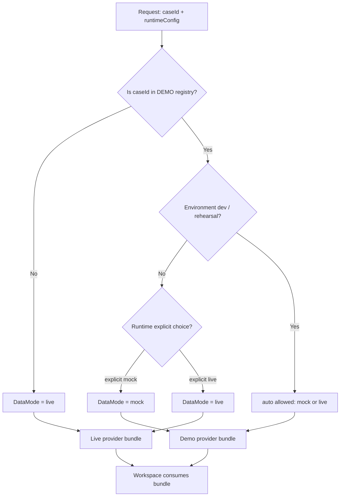

ASCII fallback:

```
request (caseId, config)
        |
        v
  in demo registry? ---- No --->  LIVE
        |Yes
        v
  dev/rehearsal? ---- Yes --->  AUTO (demo->mock, other->live)
        |No
        v
  explicit choice?
     mock -->  MOCK bundle
     live -->  LIVE bundle
```

### The mock is NOT a fake UI

The mock provider:
- returns canonical contract-shaped data,
- validates with Zod schemas before returning,
- preserves real semantic relationships,
- simulates realistic latency,
- emits realistic state/event sequences,
- is deterministic and repeatable.

**BAD:** click → instant graph → instant lead → instant result.
**GOOD:** submit evidence → processing state → observations → resolution → graph update → temporal signal → lead → graph hole → evidence request → verification → graph update → reassessment.

### Live provider usage

Where a live endpoint exists (investigation status, evidence submission, SSE), the Live provider wraps `platformFetch`/SSE. Where no backend exists, the Live provider for that domain returns a **typed "not available in live mode" error**, so the product is honest rather than silently mock.

---

## 10. Demo Case

The repository has **no coherent demo case** — only `contracts/fixtures/*.ts` fragments of "Operation Financial Shadow" (case, investigation, entities, entity hypothesis, graph node/edge, lead, sources, observations, gaps, robustness, events). **Spanning documents do not yet exist** for timeline, cross-case, judging sequence, and raw evidence corpus.

**Track decision:** assemble ONE coherent deterministic demo case from existing fixtures and extend the missing pieces, as **JSON fixtures in the web package** validated through canonical contracts.

### 10.1 Fixture structure (new paths, documented only)

```
packages/web/src/lib/providers/demo/demo-fixtures/
  case.json
  investigation.json
  evidence.json
  observations.json
  entities.json
  relations.json
  graph.json
  timeline.json
  leads.json
  gaps.json
  evidence-requests.json
  cross-case.json
  robustness.json
  review.json
  events.json
```

### 10.2 Rule

Every fixture: `fixture → canonical Zod schema → provider → UI`. **Do not invent duplicate Zod schemas.** Where a contract fixture fragment covers a concept, reuse/copy from it; extend only where the canonical contract supports the concept (see KPP warning, §18/§22). The fixture represents **one coherent causal/investigative narrative**, not disconnected fake screens.

---

## 11. Contract Strategy

Use **canonical contract names** from `@indago/contracts`. Never invent replacement frontend types.

| Use (canonical) | Do NOT invent |
|---|---|
| `Source`, `Evidence`, `Observation` | bespoke duplicates |
| `Lead` (LeadStatus/Priority), `Hypothesis` | `InvestigativeLead` frontend type |
| `Case`, `Investigation` | — |
| `Entity`, `EntityHypothesis`, `EntityRoleHypothesis` | — |
| `RelationHypothesis` (RelationType) | — |
| `GraphNode` / `GraphEdge` / `GraphAnalysisResult` | bespoke graph types |
| `InvestigativeGap` (GapType) + `GraphHole` (GraphHoleType) | — (keep the two distinct) |
| `EvidenceRequest` + `EvidenceUtility` | arbitrary scores |
| `ReviewTask` | — |
| `RobustnessResult`, `CounterEvidenceReport` | — |
| `CrossCaseMatch` | — |
| `InvestigationEvent` (canonical) | ad-hoc typed events |

The UI may use friendly labels ("Investigative Lead"), but the underlying implementation uses canonical types.

**Score semantics (from `contracts/docs/scoring-semantics.md` & `uncertainty-model.md`)** — these are authoritative for all presentation:

| Score | Range | Meaning | Presentation warning |
|---|---|---|---|
| `AnalyticalConfidence` | 0–1 | model output confidence | NOT a probability |
| `ResolutionScore` | 0–1 | identity-match support | ranking signal, not certainty |
| `StructuralSignal` | 0–1 | graph-theoretic importance | NOT criminal relevance |
| `EvidenceStrength` | 0–1 | quality of supporting observations | — |
| `RobustnessScore` | 0–100 | perturbation stability count | NOT truth probability |
| `RoleSignal` | 0–1 | role classification strength | NOT legal status |
| `RelationSupport` | 0–1 | relationship support | — |
| `ExpectedInformationGain` | 0–1 | expected uncertainty reduction | heuristic, not calibrated |

**KPP warning (§15 of the brief):** the design wants node size tied to a KPP / fragmentation-impact score. **This is NOT a canonical contract field.** Treat it as a clearly documented **demo presentation field** (fixture-only) until the real intelligence contract defines it. Add a **future contract addition** note. Never invent a permanent frontend model for it.

---

## 12. Realtime

**Reuse** the existing SSE client (`lib/realtime/sse-client.ts`, fetch-based with exponential backoff) and the Next.js SSE proxy (`app/api/sse/[investigationId]/route.ts`). Do **not** build a new transport.

### 12.1 Normalizer (thin)

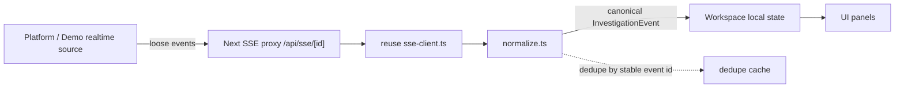

Proposed new path: `packages/web/src/lib/realtime/normalize.ts`.

### 12.2 Frontend realtime rules

- Avoid per-event full REST refresh (current `investigation-detail.tsx` does a refresh on every event — refactor to update local state from state-bearing events).
- Update local state from state-bearing events where possible.
- Use throttled/smart refresh only when necessary.
- Deduplicate by stable event ID **once IDs exist** (the bundled SSE client keeps a dedupe cache).
- Support a **mock realtime provider** for demo mode.
- **Document, do not silently fix:** duplicate emission + refresh-on-every-event are platform integration dependencies owned by Gurashish's platform lane (§36).

---

## 13. Investigation Workspace

The workspace is the hub — a single coherent instrument.

```
/investigations/[id]   (shared layout/shell)
```

Inside the workspace:

- **Graph**
- **Timeline**
- **Observations**
- **Leads**
- **Gaps**
- **Evidence**
- **Cross-Case**
- **Ledger** (Reasoning Ledger)
- **Trust / Robustness**
- **Review**

Entity Detail / Lead Detail / Gap Detail are **drawers/slideovers**. **Judge Mode** is a fullscreen presentation overlay. **Admin** is a separate route group.

`/investigations/[id]` is a shared workspace layout that persists across workspace tabs — the shell, top shell (case identity, processing status), provider bundle, and realtime connection all live once at the workspace scope, not per tab.

### Workspace architecture

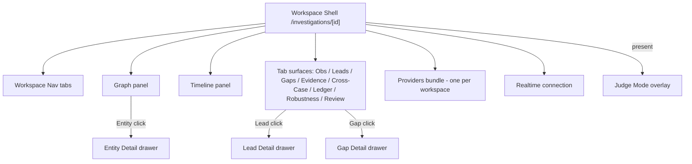

ASCII fallback:

```
   /investigations/[id]  (Workspace Shell)
        |   |     |      |      |
        |   |     |      |      +--- Realtime connection
        |   |     |      +---------- Providers bundle (one per workspace)
        |   |     +----------------- Tab surfaces (Obs/Leads/Gaps/Evidence/...)
        |   +----------------------- Timeline panel
        +--------------------------- Graph panel  --> Entity Detail drawer
        (Click lead -> Lead Detail drawer, click gap -> Gap Detail drawer)
   Workspace Nav persists across tabs; Judge Mode = fullscreen overlay.
```

### Evidence flow

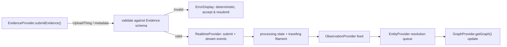

ASCII fallback:

```
submitEvidence -> validate(Evidence schema)
  -> invalid ? ErrorDisplay (accept & resubmit) : Realtime stream
  -> processing state -> Observations -> Entity queue -> Graph update
```

---

## 14. Page / View Architecture

### 14.1 Product inventory (22 views, NOT 22 shells)

Classified by surface type:

| # | View | Type |
|---|---|---|
| 01 | Login / Access | App route (optional this sprint) |
| 02 | Case List | App route `/` |
| 03 | New Case Intake | App route `/investigations/new` |
| 04 | Investigation Workspace | App route `/investigations/[id]` (shared shell) |
| 05 | Observations Feed | Workspace tab |
| 06 | Entity Resolution Review Queue | Workspace tab |
| 07 | Entity Detail | Drawer |
| 08 | Graph View | Workspace panel (tab) |
| 09 | Timeline View | Workspace panel (below graph / linked) |
| 10 | Leads List | Workspace tab |
| 11 | Lead Detail | Drawer |
| 12 | Graph-Hole / Gaps List | Workspace tab |
| 13 | Gap Detail | Drawer |
| 14 | Evidence Request Queue | Workspace tab |
| 15 | Cross-Case Signals | Workspace tab |
| 16 | Reasoning Ledger | Workspace tab |
| 17 | Discovery Mode | Workspace interaction mode (overlay on graph) |
| 18 | Boundary Expansion | Workspace interaction mode (overlay on graph) |
| 19 | Trust & Robustness Report | Workspace tab |
| 20 | Unified Review & Approval Center | Workspace tab |
| 21 | Admin / RBAC Settings | Admin route group `/admin/*` |
| 22 | Judge Mode | Fullscreen overlay `/investigations/[id]/judge/*` |

### 14.2 Routing

```
/                              # Case List (extends current dashboard)
/login                         # Access (optional this sprint)
/investigations/new            # New Case Intake
/investigations/[id]           # Workspace (hub, shared shell)
/investigations/[id]/judge/*   # Judge Mode (new route group)
/admin/*                       # Admin (new route group)
```

Nested routes render through the **same Workspace layout**. Optional deep-links (`/graph`, `/timeline`, `/leads`, `/gaps`) may be cut if scope slips.

### 14.3 Page priority

**MUST:** 01, 02, 03, 04, 05, 06, 07, 08, 09, 10, 11, 12, 13, 14, 16, 19, 22.
**SHOULD:** 15 (Cross-Case), 20 (Unified Review), 17 (Discovery), 18 (Boundary).
**CUT IF TIME:** 21 (Admin depth), advanced discovery controls, visual polish outside the demo story.

---

## 15. Page-by-Page Implementation Specifications

Each view follows this exact 28-point template:

1. Purpose · 2. User goal · 3. Route/workspace location · 4. Layout structure · 5. Desktop layout · 6. Tablet/mobile · 7. Component tree · 8. Visual hierarchy · 9. Typography · 10. Colors/tokens · 11. Spacing/density · 12. Primary interaction · 13. Secondary interactions · 14. Hover · 15. Focus · 16. Motion · 17. Data consumed · 18. Provider method(s) · 19. Demo fixture data · 20. Live backend expectation · 21. Loading · 22. Empty · 23. Error · 24. Recovery · 25. Accessibility · 26. Performance · 27. Acceptance criteria · 28. "Do not" rules.

> Token names below refer to the existing `--color-*` / `--font-*` / `--duration-*` / `--ease-*` set in `globals.css` (and the additions in §16). `surface-0` = base charcoal, `surface-100/200` = elevated panels, `surface-700/800/900` = text ramp, `brand-*` = warm accent, `success/warning/danger/info` = muted semantic states.

---

### View 01 — Login / Access

1. **Purpose:** gate access with a calm, branded entry; establish identity context for later reviewer/audit attribution.
2. **User goal:** authenticate quickly and land in the Case List.
3. **Route:** `/login` (optional this sprint; mark P2 if not needed for the demo).
4. **Layout:** centered single-column card (max-w-sm) on the charcoal base; grain overlay applies.
5. **Desktop:** vertical centering, one card, brand mark above the form.
6. **Tablet/mobile:** same card, full-width padding, keyboard input remains usable.
7. **Component tree:** `LoginCard` → `Card` → `Input`(email) → `Input`(password) → `Button`(submit) → inline `ErrorDisplay`.
8. **Visual hierarchy:** brand lockup first, then inputs, then primary action; nothing else competes.
9. **Typography:** `font-sans` labels (text-xs uppercase tracking), `text-sm` body, `font-mono` for any access identifier if shown.
10. **Colors:** `surface-50` card, `surface-200/60` border, `brand-500` primary.
11. **Spacing:** card `p-8`; field stack `gap-4`; restrained.
12. **Primary interaction:** submit credentials.
13. **Secondary:** none this sprint (no signup/forgot in demo).
14. **Hover:** standard `Button` hover (already tokenized).
15. **Focus:** `:focus-visible` outline (1px `brand-500`); inputs get visible focus ring.
16. **Motion:** `animate-fade-in` on mount (0.6s ease-out). No bounce.
17. **Data consumed:** none (mock auth), or optional access-context from `@indago/contracts` `AccessContext`.
18. **Provider:** none (or an `AuthProvider` if wired).
19. **Demo fixture:** a recognized demo operator identity.
20. **Live backend:** real auth + RBAC (future platform dependency).
21. **Loading:** `Button loading` state on submit.
22. **Empty:** n/a.
23. **Error:** `ErrorDisplay` inside card (invalid credentials), stays calm.
24. **Recovery:** allow re-submit; no state destruction.
25. **Accessibility:** labels on inputs, `type="password"`, submit via Enter, contrast ≥4.5:1.
26. **Performance:** negligible.
27. **Acceptance criteria:** submit → create an access context → redirect to `/`; error path shows calm message.
28. **Do not:** add background video, neon gradients, or a second design system.

---

### View 02 — Case List

1. **Purpose:** the home surface — a calm ledger of cases with **vertical case cards**, each with a faint blurred graph thumbnail.
2. **User goal:** scan cases, choose one to open, or start a new case.
3. **Route:** `/` (evolves current dashboard).
4. **Layout:** vertical stack of case cards; header row with page title + `New Case` action.
5. **Desktop:** single column of full-width cards; each card is a horizontal row: thumbnail (left), case identity (center), state badge + timestamp + chevron (right).
6. **Tablet/mobile:** cards stack vertically; thumbnail shrinks; badge wraps; still one column (mobile is not multi-column).
7. **Component tree:** `CaseListPage` → header(`h1`, `NewCaseButton`) → `CaseCard[]` → `CaseThumbnail` · `CaseIdentity` · `CaseStateBadge` · `CaseMeta`.
8. **Visual hierarchy:** case title/identity first; state second; timestamps tertiary; thumbnail subordinate.
9. **Typography:** case id/name `text-sm text-surface-700`; id mono `text-[11px] font-mono text-surface-500`; state via `Badge`.
10. **Colors/tokens:** card `surface-50`; border `surface-200/60`; warm `brand-500` accent on the New Case action.
11. **Spacing/density:** card `p-5`, list `gap-3`, restrained spacing.
12. **Primary interaction:** click card → navigate to `/investigations/[id]`.
13. **Secondary:** New Case action; keyboard Enter/select.
14. **Hover behavior:** card **dims at rest, warms slightly on hover** — background eases toward `surface-100`, thumbnail opacity rises slightly; border warms to `surface-200`/`brand-500/20`. Subtle.
15. **Focus behavior:** `:focus-visible` outline; card is focusable as a link (or a button with proper semantics).
16. **Motion/animation:** restrained entrance — cards `animate-fade-in` staggered by index (`animation-delay: index * 40ms`, cap at ~400ms); hover transitions `duration-500 ease-out` (already the codebase default `duration-500`).
17. **Data consumed:** `Case[]` / `InvestigationSummary[]` from contracts.
18. **Provider:** `InvestigationProvider.getCases()` / `getRecentInvestigations()`.
19. **Demo fixture:** `case.json` + `investigation.json` → 3–4 cases, one of which is the demo card (with a real mini-graph thumbnail).
20. **Live backend:** `GET /cases` (future platform dependency).
21. **Loading:** two or three skeleton cards (shimmer with `surface-200`), not a spinner wall.
22. **Empty:** `EmptyState` — "No cases yet" with a New Case action (existing component).
23. **Error:** panel-specific `ErrorDisplay` with Retry; list area only.
24. **Recovery:** keep loaded cards; retry refreshes only failed region.
25. **Accessibility:** cards keyboard-activatable; thumbnail `aria-hidden`; heading hierarchy correct; contrast ≥4.5:1.
26. **Performance:** memoize card rows; thumbnail is a lightweight SVG blur (not a full-screen backdrop-filter).
27. **Acceptance criteria:** cards use existing surface tokens; thumbnail visible but subordinate; hover warmth subtle; no layout shift on load; keyboard focus visible.
28. **Do not:** make it a generic SaaS KPI dashboard; do not use large full-screen backdrop-filters; avoid heavy per-card animation.

---

### View 03 — New Case Intake

1. **Purpose:** create a case and, in one flow, drop a messy case pack (evidence pack) into ingestion.
2. **User goal:** establish the case identity and submit the first raw evidence so processing begins.
3. **Route:** `/investigations/new`.
4. **Layout:** centered column (max-w-xl) with a step flow: **Context → Files (drop zone) → Review → Ingest**.
5. **Desktop:** single centered column; the drop zone is a **subdued** large target with a soft radial lighting treatment.
6. **Tablet/mobile:** drop zone becomes a full-width touch target; tap-to-browse still works.
7. **Component tree:** `NewCaseIntake` → `StepIndicator` (reuse pattern from `EvidenceSubmission`) → `CaseContextForm` → `CaseDropZone` → `EvidenceReview` → `Ingest actions`.
8. **Visual hierarchy:** step indicator secondary; the drop zone is the visual anchor; Begin Ingestion is the terminating action.
9. **Typography:** `font-sans` body; mono for file names; step labels `text-xs uppercase`.
10. **Colors:** drop zone `bg-surface-100/40`, dashed `surface-300/40` border, subtle radial highlight using `brand-500/5` wash.
11. **Spacing:** drop zone `min-h-[220px] p-10`; field `gap-4`.
12. **Primary interaction:** drag-and-drop files (and click-to-browse).
13. **Secondary:** remove/reorder uploaded tiles; metadata entry; review step.
14. **Hover/drag state:** drop zone border brightens to `brand-500/40` + background warms when dragging over; exit restores.
15. **Focus:** drop zone keyboard-focusable (opens file picker); tiles focusable for remove/order.
16. **Motion/animation:** **actual UI behavior, not a fake video sequence** — on add, each uploaded document **tile enters with a slight rotation** (`rotate(-2deg)` → 0) and **translateY**, stagger ~60ms, then **pile-settles**: tiles overlap subtly (negative margin / translate) to feel like a settled pile; constrained, low-amplitude.
17. **Data consumed:** local `File[]` + metadata; eventually `EvidenceSubmissionRequest`.
18. **Provider:** `EvidenceProvider.submitEvidence()` / `InvestigationProvider.createCase()` (will call `POST /start` via Live provider).
19. **Demo fixture:** a "messy case pack" set of raw documents mapped to `evidence.*` fixture.
20. **Live backend:** `POST /api/v1/investigations/start` + `POST /api/v1/investigations/:id/evidence`; UploadThing for bytes.
21. **Loading:** per-tile upload progress bar (reuse `file-upload.tsx` progress); submit `Button loading`.
22. **Empty:** drop zone empty message "Drop case documents here"; Begin Ingestion disabled until a valid source exists.
23. **Error:** per-file upload error inline with Retry; submit error via `ErrorDisplay`.
24. **Recovery:** retry failed upload; keep already-uploaded tiles.
25. **Accessibility:** tile remove/order via keyboard; drop zone announces file count on change (aria-live); label for metadata fields.
26. **Performance:** tile rotation uses transform only; no layout thrash; cap pile overlap transforms.
27. **Acceptance criteria:** **Begin Ingestion is disabled until ≥1 valid source exists**; tile entrance/rotation/pile-settle works; same component works with DemoProvider AND LiveProvider (no provider branching); errors show retry.
28. **Do not:** auto-start ingestion on creation; do not fabricate a "cover flow" that hides upload progress.

---

### View 04 — Investigation Workspace

1. **Purpose:** the hub — one coherent instrument combining graph, timeline, and intelligence surfaces with a persistent shell.
2. **User goal:** investigate the case: see the knowledge graph, timeline, leads, gaps, evidence, cross-case signals, ledger, robustness, and review — without leaving a stable shell.
3. **Route:** `/investigations/[id]` (shared workspace layout).
4. **Layout structure:** top shell (case identity + processing status + workspace nav) above a body split into: **left rail (workspace nav)**, **graph panel**, **timeline panel** (linked below graph), and **right/context** surfaces selected by tab.
5. **Desktop:** top shell full-width; left rail fixed; main region reserves a large graph/timeline area; tab surfaces (Observations, Leads, Gaps, Evidence, Cross-Case, Ledger, Robustness, Review) render in a content pane.
6. **Tablet/mobile:** left rail collapses to an icon rail (or top scrollable tab bar); graph controls collapse; drawers become full-screen (§35).
7. **Component tree:** `WorkspaceShell` → `WorkspaceTopShell` (case identity, processing status, nav) · `WorkspaceNav` (tabs) · `GraphPanel` · `TimelinePanel` · `TabSurface` (rendered per active tab) · `ProvidersProvider` (bundle) · `RealtimeProvider` · `DrawerRoot` · `JudgeModeOverlay`.
8. **Visual hierarchy:** case identity + processing status are top-anchored; the graph is the dominant visual; tab surfaces subordinate.
9. **Typography:** case title `text-lg font-medium tracking-wide`; mono ids; status via `Badge`.
10. **Colors:** shell `surface-0`; top shell `surface-50`; ambient borders `surface-200/40`.
11. **Spacing:** top shell `h-14 px-4`; workspace nav `gap-1`; panels padded `p-4`.
12. **Primary interaction:** workspace tab navigation; graph node selection; timeline scrubber.
13. **Secondary:** opening drawers, Judge Mode, evidence submission.
14. **Hover:** nav items warm `surface-100`; graph nodes lift slightly.
15. **Focus:** visible focus-visible outlines on nav/tabs/scrubber.
16. **Motion:** **traveling processing filament** along the top shell when the case is processing (a thin `1px` light segment animating across `surface-0 → brand-500` at low opacity, `slow-pulse`-like); **recovery ring** appears in the top shell when the realtime/backend connection is recovering (a calm SVG loop pulse); quiet empty-state behavior in the graph area.
17. **Data consumed:** `Investigation`, `Case`, graph, timeline, and per-tab domain data.
18. **Provider:** provider bundle resolved once at workspace scope; `RealtimeProvider`.
19. **Demo fixture:** all demo fixtures exposed through the bundle.
20. **Live backend:** whatever is live; panels show honest "not available in live mode" where missing.
21. **Loading:** calm localized skeletons per panel; don't block the whole workspace.
22. **Empty:** graph area shows a quiet empty state ("No graph yet") while still keeping shell/nav functional.
23. **Error:** **lower-right parser/backend error card** — a compact non-blocking card in the bottom-right corner of the shell for backend/parser errors; does not take down the workspace.
24. **Recovery:** reconnect with backoff; recovery ring; loaded state preserved.
25. **Accessibility:** semantic `<nav>`; proper heading order; drawers close on Escape; keyboard shortcut support.
26. **Performance:** shell persists; avoid re-rendering graph on tab switches; lazy-load non-active tab surfaces.
27. **Acceptance criteria:** shell persists across tabs; traveling filament + recovery ring work; lower-right error card shows backend issues without killing the workspace; responsive collapse works.
28. **Do not:** build 21 independent shells; do not destroy loaded state on tab switch or reconnect.

---

### View 05 — Observations Feed

1. **Purpose:** a quiet, **text-heavy** feed of extracted assertions — the raw cognitive substrate of the case.
2. **User goal:** read the assertions derived from evidence, with clear provenance and strength.
3. **Location:** Workspace tab (`Observations`).
4. **Layout:** dense single-column scroll feed; headers for filter/sort controls at top; each row = one observation.
5. **Desktop:** full-content-width text rows, high information density; no dashboard-card overload.
6. **Tablet/mobile:** rows stack; timestamps may collapse under the statement on narrow widths.
7. **Component tree:** `ObservationsFeed` → filter bar (`FilterSelect`, `SortSelect`) → `ObservationRow[]` → `ObservationStatement` · `SourceLabel` · `ConfidenceChip` · `ProvenanceAffordance`.
8. **Visual hierarchy:** the **observation statement** dominates; source second; confidence/provenance third.
9. **Typography:** `font-sans` statement `text-sm text-surface-800`; timestamp + source `text-[11px] font-mono text-surface-500`; type label `text-[10px] uppercase`.
10. **Colors:** flat `surface-0` rows with hairline `divide-y divide-surface-200/30`; confidence chip uses `brand-500` (muted), not neon.
11. **Spacing/density:** row `px-4 py-3` (dense); statement `leading-relaxed`.
12. **Primary interaction:** click row → open source expansion / provenance.
13. **Secondary:** filter by type, sort by time/strength; confidence treatment.
14. **Hover:** row background `hover:bg-surface-100/50`; no lift.
15. **Focus:** `:focus-visible` on filter controls and clickable rows.
16. **Motion:** new observation rows enter with a soft `animate-fade-in` (0.6s), restrained; no persistent animation.
17. **Data consumed:** `Observation[]`, `Source`, `Evidence` refs.
18. **Provider:** `ObservationProvider.getObservations()`, `SourceProvider.getSource()` (via related source).
19. **Demo fixture:** `observations.json` + `sources.json` — ~15–25 observations forming the narrative.
20. **Live backend:** `GET /observations` (future platform dependency).
21. **Loading:** skeleton rows (3) aligned to text; not a spinner.
22. **Empty:** "No observations extracted yet" — with a note that they appear as evidence is processed.
23. **Error:** panel-specific `ErrorDisplay` with Retry.
24. **Recovery:** keep loaded rows; append reconciled state on reconnect.
25. **Accessibility:** rows readable at contrast ≥4.5:1; provenance expandable via keyboard; aria-live for newly arriving rows (polite).
26. **Performance:** memoize rows (`React.memo`); cap list; avoid re-rendering the whole feed on single-row events.
27. **Acceptance criteria:** statement-first hierarchy; timestamp formatting consistent (mono, `HH:mm:ss` + date); source labels clear; confidence shown but subordinate; provenance affordance visible; no dashboard-card overload.
28. **Do not:** wrap every row in a "card"; do not animate confidence-like numbers; do not render evidence as separate KPI tiles.

---

### View 06 — Entity Resolution Review Queue

1. **Purpose:** a review surface where candidate identities are presented for **merge** or **keep separate** decisions.
2. **User goal:** resolve whether two (or more) candidate identities refer to the same canonical entity, with **equal visual weight** on Confirm Merge vs Keep Separate.
3. **Location:** Workspace tab (`Entity Resolution`).
4. **Layout:** queue list on the left; resolution detail/animation in the main area.
5. **Desktop:** two-pane: queue list (thin) + selection detail (merge convergence view).
6. **Tablet/mobile:** single pane; selecting a queue item switches to detail; "back" returns to queue.
7. **Component tree:** `EntityResolutionQueue` → `ErQueueItem[]` (candidate identities, merge confidence, evidence support, source count) → `ResolutionView` → `CandidateA` · `CandidateB` · `ConfirmMergeButton` · `KeepSeparateButton` · `DecisionReview`.
8. **Visual hierarchy:** the two candidates + the resolution action are dominant; evidence support secondary.
9. **Typography:** candidate names `text-base font-medium`; merge confidence mono `font-mono`.
10. **Colors:** candidates on `surface-100`; convergence region `brand-500` at low opacity; warning/danger not used for the neutral decision.
11. **Spacing:** candidates `p-6`, gap-8 between; decision row `gap-4`.
12. **Primary interaction:** Confirm Merge / Keep Separate — **both equal visual weight** (same size, same `Button` style, symmetric placement).
13. **Secondary:** expand a candidate's evidence; view source count; skip decision.
14. **Hover:** candidate cards warm slightly; decision buttons use standard hover.
15. **Focus:** clear focus-visible on both decision buttons and queue items.
16. **Motion (the resolution animation):**
   - initial: Candidate A (left), Candidate B (right), separated.
   - convergence: both cards translate toward a shared center **RESOLVED ENTITY** slot; evidence highlight (`EvidenceStrength` chips brighten) as they close.
   - settle: they settle into the resolved node; a brief `brand-500` ring confirms.
   - Exact motion: translateX toward center, `normal` (~400ms) each, easing `ease-out`; evidence chips fade in staggered.
   - **Confirm Merge and Keep Separate inputs must remain equally weighted visually even though Merge triggers the convergence.**
   - reduced-motion: skip convergence; show resolved node + static overlay (respects `prefers-reduced-motion`).
17. **Data consumed:** `EntityHypothesis[]`, `EntityCandidate[]`, `EntityResolutionResult`, `Observation` refs.
18. **Provider:** `EntityProvider.getResolutionQueue()`, `EntityProvider.resolveEntity()`.
19. **Demo fixture:** `entities.json` + `relations.json` → 2–3 pending merges in the story.
20. **Live backend:** `GET/SET /entity-resolution` (future platform dependency).
21. **Loading:** skeleton queue rows.
22. **Empty:** "No pending resolutions" — with note.
23. **Error:** panel ErrorDisplay with Retry.
24. **Recovery:** keep queue; reconcile on reconnect.
25. **Accessibility:** decision buttons are real buttons with labels "Confirm Merge" / "Keep Separate"; keyboard navigable; convergence is presentational (`aria-hidden` on animated wrappers, status via text).
26. **Performance:** animate only the two active candidates; not the whole queue.
27. **Acceptance criteria:** Confirm Merge and Keep Separate have equal visual weight; convergence animation works; evidence highlight appears; settle state stable; reduced-motion respected.
28. **Do not:** bias toward merge with a larger/brighter button; do not animate dozens of queue items simultaneously.

---

### View 07 — Entity Detail

1. **Purpose:** a drawer revealing a canonical entity: name, aliases, timeline, provenance, resolution decision, mini-graph, relationships, PII reveal, sources.
2. **User goal:** inspect everything INDAGO believes about a person/thing, with source traceability.
3. **Location:** Drawer (opened from Graph node click or Entity queue).
4. **Layout:** right-side drawer (`w-full max-w-md sm:max-w-lg`), scrollable.
5. **Desktop:** right slide-over preserving graph context (graph stays visible/dimmed behind).
6. **Tablet/mobile:** drawer becomes **full-screen** (§35).
7. **Component tree:** `EntityDrawer` → header(canonicalName, status) → `AliasList` → `EntityTimelineMini` → `ProvenanceBlock` → `MergeDecision` (original resolution + confidence) → `MiniGraph` → `RelationshipList` → `SourceReferences` → `PiiRevealControl`.
8. **Visual hierarchy:** canonical name + status first; resolution decision + confidence next; relationships/timeline/icons after.
9. **Typography:** name `text-lg font-medium`; aliases `text-sm mono`; relationship rows `text-sm`.
10. **Colors:** drawer `surface-100`; borders `surface-200/40`; confidence via `brand-500`.
11. **Spacing:** drawer `p-6`, sections `divide-y divide-surface-200/30`.
12. **Primary interaction:** close (Escape or X); PII reveal toggle.
13. **Secondary:** expand a relationship; open source reference.
14. **Hover:** relationship rows warm; PII reveal control hover.
15. **Focus:** Escape closes; focus trapped in drawer while open; focus-visible outlines.
16. **Motion:** slide-in from right `translate-x` + fade, `normal` (~400ms) `ease-out`; PII reveal is a soft text switch (no dramatic burst).
17. **Data consumed:** `Entity`, `EntityHypothesis`, `Observation`/`Evidence` refs, mini-graph node/edges.
18. **Provider:** `EntityProvider.getEntity(id)`, `GraphProvider.getSubgraph(entityId)`.
19. **Demo fixture:** entity + related relations + entities.
20. **Live backend:** `GET /entities/:id`, `GET /entities/:id/graph` (future).
21. **Loading:** localized skeleton within drawer.
22. **Empty:** "No aliases / no relationships yet."
23. **Error:** drawer-local ErrorDisplay with Retry.
24. **Recovery:** drawer persists; retry region only.
25. **Accessibility:** dialog semantics (`role="dialog"`, `aria-modal`), focus trap, Escape close, PII revealed on explicit toggle.
26. **Performance:** mini-graph is small (≤8 nodes); no full-screen backdrop-filter.
27. **Acceptance criteria:** canonical name, aliases, timeline, provenance, merge confidence, original resolution decision, mini graph, relationships, PII reveal, source references all present in a right drawer; Escape closes; mobile = full-screen.
28. **Do not:** auto-reveal PII; do not render a giant graph inside the drawer; avoid shimmer everywhere.

---

### View 08 — Graph View

**This is the highest-risk view. Treat it as the gated deliverable (Day-2 spike, §22).**

1. **Purpose:** show the investigation knowledge graph — entities, evidence, and relationships — with communities, bridges, and confidence-aware edges.
2. **User goal:** explore structure, inspect nodes, and see how the graph updates as evidence arrives.
3. **Location:** Workspace panel (primary, `Graph` tab/inline).
4. **Layout:** full-bleed SVG canvas inside a bounded panel; graph controls overlay (zoom, fit, isolate, focus).
5. **Desktop:** large canvas (min-height ~60vh) with overlay controls; timeline panel below (§ View 09).
6. **Tablet/mobile:** graph controls collapse into an overflow menu; canvas still panning/zoomable; node drawer full-screen.
7. **Component tree:** `GraphCanvas` (SVG) → `CommunityLayer` · `EdgeLayer` · `BridgeLayer` · `NodeLayer` · `InteractionLayer` · `AnnotationLayer`; plus `GraphControls` (zoom/fit/isolate/focus) and `GraphOverlayLegend`.
8. **Visual hierarchy:** the graph itself dominates; controls + legend subordinate; no chrome around the canvas.
9. **Typography:** node labels `font-sans text-[10px]` or hidden-until-focus; legend `text-[11px] mono`.
10. **Colors:** node fill `surface-200` (entity) with `brand-500` active; edge stroke `surface-500` graded by `support`; communities = **soft washes / fog-like regions** (large low-opacity blurred regions, `surface-300` at ~8% + `radial-gradient`); bridge = **restrained halo** (`brand-500/15` ring). No neon.
11. **Spacing:** node radius ~6–10px scaled by `structuralImportance` (and, **demo-only**, the KPP field §11); stable spacing between communities.
12. **Primary interaction:** click a node → open Entity/Node Detail drawer (graph context preserved).
13. **Secondary:** hover highlight, zoom, pan, fit, isolate, focus, timeline filtering.
14. **Hover:** node fill warms + label appears; edge thickens slightly.
15. **Focus:** nodes focusable (as buttons/links, or via a companion node list for keyboard/a11y §36).
16. **Motion (graph bloom, §33):**
   - 1. graph base appears (opacity in)
   - 2. community wash fades in
   - 3. nodes stagger (`translate/scale` from `0.8→1`, staggered ~30ms, ~100–200ms each)
   - 4. edges draw (`stroke-dashoffset` from full → 0, length-dependent)
   - 5. bridge receives subtle emphasis (halo fade-in)
   - 6. settle → simulation paused once settled (no perpetual motion). total ~1.2s, `ease-out`.
17. **Data consumed:** `GraphNode[]`, `GraphEdge[]`, `GraphAnalysisResult` (communities/bridges), `GraphVersion`.
18. **Provider:** **`GraphProvider.getGraph()`** — the graph is **provider-driven; NO hardcoded graph data inside Graph components**.
19. **Demo fixture:** `graph.json` (10–30 nodes initially) + version/analysis.
20. **Live backend:** currently graph is only pushed via SSE `GRAPH_READY` string; query endpoint is a future platform dependency. Live provider returns typed "not available" until `GET /graph` exists.
21. **Loading:** calm skeleton nodes/edges (CSS-styled placeholder), not a spinner.
22. **Empty:** "No graph yet" quiet empty state; shell/nav stays functional.
23. **Error:** panel-specific graph ErrorDisplay with Retry; **other workspace panels remain available**.
24. **Recovery:** keep the last good graph; reconcile on reconnect; recovery ring in top shell.
25. **Accessibility:** keyboard node selection; an accessible **node list representation** (companion list) where practical; color not the only channel (edges also vary by dash/opacity); focus-visible.
26. **Performance guardrails:** ≤30 demo nodes initially (cap); pause force simulation when settled; memoize nodes/edges; sparse SVG blur (not full-screen); do not animate hundreds of elements simultaneously; no WebGL/Three.js unless the spike proves necessity.
27. **Acceptance criteria:** no hardcoded data; renders canonical `GraphNode`/`GraphEdge`; node selection works; graph settles deterministically; low-confidence edge is visually distinct (dashed + more transparent); bridge distinguishable; community fog present; timeline filtering works (View 09 coupling); confidence affects edge treatment.
28. **Do not:** put graph data in components; do not auto-install a giant graph framework; do not add WebGL without the spike; do not make low-confidence edges glow.

**SVG structure:**

```svg
<svg>
  <g id="community-layer">    <!-- soft fog regions -->
  <g id="edge-layer">         <!-- edges: stroke-width/support, dash -->
  <g id="bridge-layer">       <!-- bridge halo emphasis -->
  <g id="node-layer">         <!-- node circles + labels -->
  <g id="interaction-layer">  <!-- transparent hover/click hit areas, zoom/pan -->
  <g id="annotation-layer">   <!-- selected/focus callouts, hole emphasis -->
</svg>
```

---

### View 09 — Timeline View

1. **Purpose:** a horizontal timeline coupled to graph state — graph and timeline behave as **one instrument**.
2. **User goal:** select a date range and see the graph filter to what was active then.
3. **Location:** Workspace panel below the graph.
4. **Layout:** full-width horizontal track: date labels (top), activity **density strip** (above track), **scrubber** thumb + active range, current date marker, event markers.
5. **Desktop:** full-width; range handles draggable.
6. **Tablet/mobile:** becomes **horizontally scrollable**; range selection still usable via handles.
7. **Component tree:** `Timeline` → `DensityStrip` · `DateAxis` · `RangeControls` (handles/scrubber) · `EventMarkers` · `CurrentDateMarker`.
8. **Visual hierarchy:** the range/current-date is primary; density secondary; markers tertiary.
9. **Typography:** date labels `text-[10px] font-mono text-surface-500`.
10. **Colors:** track `surface-200/40`; active range fill `brand-500/15`; density peaks `brand-500/25`; current-date marker `surface-700`.
11. **Spacing:** track `h-2`; handles larger hit targets (`w-3 h-4`).
12. **Primary interaction:** scrub/select range → **graph visibility filter**.
13. **Secondary:** jump to current date; clear range; step events.
14. **Hover:** handles thicken; markers show tooltip with event/date.
15. **Focus:** handles/scrubber keyboard-accessible (arrow keys adjust range).
16. **Motion:** marker entrance subtle; range-apply triggers a restrained graph fade/re-filter (not jump-cut).
17. **Data consumed:** `TimelineProvider.getTimeline()` — case-wide range + density + `EventTime`/`TemporalInterval` on nodes/edges.
18. **Provider:** `TimelineProvider.getTimeline()`.
19. **Demo fixture:** `timeline.json` derived from `observedAt`/`temporalRange` of observations/nodes/edges.
20. **Live backend:** `GET /timeline` (future platform dependency).
21. **Loading:** skeleton track.
22. **Empty:** "No temporal data" with note.
23. **Error:** panel ErrorDisplay.
24. **Recovery:** preserve selected range on reconnect.
25. **Accessibility:** range uses real range semantics or buttons with aria; keyboard adjustable; focus-visible.
26. **Performance:** render markers as lightweight SVG; memoize; cap markers.
27. **Acceptance criteria:** **timeline range → graph visibility filter** works; density strip reflects activity; current date shown; coupling uses same provider data in live & demo.
28. **Do not:** animate the whole graph on every scrub tick — debounce; do not hardcode temporal behavior.

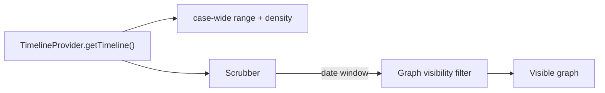

---

### View 10 — Leads List

1. **Purpose:** surface the lines of inquiry derived from analysis as **non-SaaS** lead cards.
2. **User goal:** see the strongest candidate leads, their support, and related context at a glance.
3. **Location:** Workspace tab (`Leads`).
4. **Layout:** vertical list of lead cards; filter bar (status, priority).
5. **Desktop:** single column of cards.
6. **Tablet/mobile:** cards stack, full width.
7. **Component tree:** `LeadsList` → filter bar → `LeadCard[]` → `LeadTitle` · `Confidence` · `StatusBadge` · `SupportCount` · `CounterEvidenceCount` · `RelatedEntity` · `RelatedGraphRegion`.
8. **Visual hierarchy (critical):** **lead statement first** → **confidence second** → **evidence context third**. Cards must not look like generic SaaS KPI cards.
9. **Typography:** title `font-sans text-sm text-surface-800`; confidence `font-mono text-xs`; context `text-[11px] text-surface-500`.
10. **Colors:** card `surface-50`; border `surface-200/60`; confidence `brand-500`; counter-evidence count uses neutral `surface-500` (not alarm red unless genuinely high-impact).
11. **Spacing:** card `p-5`, `gap-3` between rows.
12. **Primary interaction:** click card → **Lead Detail drawer**.
13. **Secondary:** filter by status/priority; mark status.
14. **Hover:** card warms (`surface-100`), thin border warms; no dramatic lift.
15. **Focus:** cards keyboard-activatable; focus-visible.
16. **Motion:** cards enter `animate-fade-in` staggered (≤400ms); active rewrite of a card on evidence arrival is a soft repaint, not a flash.
17. **Data consumed:** `Lead[]`, related `Entity`/`Observation`/`Evidence` counts, `CounterEvidenceReport` (for the against side).
18. **Provider:** `LeadProvider.getLeads()`.
19. **Demo fixture:** `leads.json` → 3–6 leads with for/against counts.
20. **Live backend:** `GET /leads` (future).
21. **Loading:** skeleton cards.
22. **Empty:** "No leads yet" with a note that leads emerge from analysis.
23. **Error:** panel ErrorDisplay.
24. **Recovery:** keep list; reconcile.
25. **Accessibility:** statement-first readable at ≥4.5:1; counts labelled (e.g. "7 supporting", "1 against"); focusable cards.
26. **Performance:** memoize rows; cap list.
27. **Acceptance criteria:** lead statement first, confidence second, evidence context third; not a KPI card; hover/focus/selected/loading/empty/error all handled.
28. **Do not:** render a big number prominently at top (that's a KPI); do not use neon confidence bars; avoid generic SaaS card grids.

---

### View 11 — Lead Detail (drawer)

**One of the most important screens.** Presents a structured, evidence-balanced view of a lead.

1. **Purpose:** fully explain a lead: its claim, confidence, evidence for, evidence against, alternative explanations, robustness, and human review state.
2. **User goal:** understand WHY this lead exists, how strong it is, and what would shake it — with equal scrutiny on for and against.
3. **Location:** Drawer.
4. **Layout:** right drawer; exact section order:
   ```
   CLAIM
   CONFIDENCE
   EVIDENCE FOR
   EVIDENCE AGAINST
   ALTERNATIVE EXPLANATIONS
   ROBUSTNESS
   HUMAN REVIEW
   ```
5. **Desktop / mobile:** right drawer; full-screen on mobile (§35).
6. **Component tree:** `LeadDrawer` → `LeadClaim` · `LeadConfidenceExplanation` · `EvidenceForPanel` (list) · `EvidenceAgainstPanel` (list) · `AlternativesPanel` · `RobustnessPanel` · `HumanReviewPanel`.
7. **Visual hierarchy:** CLAIM dominant; then FOR and AGAINST at **equal visual weight**.
8. **Typography:** claim `text-lg font-medium`; confidence `font-mono`; evidence rows `text-sm`.
9. **Colors:** two equal-width columns; FOR and AGAINST share identical structural treatment (`surface-100` panels), differing only by a small neutral label, not by size/emphasis.
10. **Spacing:** sections `divide-y`; FOR/AGAINST columns `gap-4`.
11. **Primary interaction:** toggle between FOR/AGAINST expand; navigate to source evidence.
12. **Secondary:** view robustness; open human review; mark counter-evidence reviewed.
13. **Hover:** evidence rows warm; sources link.
14. **Focus:** focus-visible; Escape close; drawer focus trap.
15. **Motion (lead reveal, §33):**
   - 1. graph dims (opacity down, `slow` ~900ms)
   - 2. lead surface rises (translateY + opacity, `normal`)
   - 3. supporting evidence appears (stagger, ~60ms)
   - 4. counter-evidence appears (stagger)
   - 5. alternatives settle
   - 6. confidence explanation appears (static, no fake animation)
   - **Do NOT animate confidence numbers like a casino dashboard.**
16. **Data consumed:** `Lead`, `Evidence`/`Observation` refs, `CounterEvidenceReport`, `RobustnessResult`, `ReviewTask`.
17. **Provider:** `LeadProvider.getLead(id)`, `EvidenceProvider` refs, `RobustnessProvider.getRobustness(lead)`, `ReviewProvider`.
18. **Demo fixture:** `leads.json` + `counter-evidence` + `robustness.json`.
19. **Live backend:** `GET /leads/:id`, `/leads/:id/counter-evidence`, `/leads/:id/robustness` (future).
20. **Loading:** skeleton sections.
21. **Empty:** empty panes ("No supporting evidence yet" etc.).
22. **Error:** drawer-local ErrorDisplay per panel.
23. **Recovery:** keep graph context + loaded sections.
24. **Accessibility:** FOR/AGAINST as true columns with equal tab order; source links keyboard-focusable; confidence explained in text (not only a number).
25. **Performance:** animate only drawer content, not the graph re-render each frame.
26. **Acceptance criteria:** FOR and AGAINST equal visual weight; alternatives visible; no fake confidence animation; evidence provenance visible; drawer preserves graph context.
27. **Do not:** animate confidence numbers; make FOR larger/brighter than AGAINST; hide the AGAINST side.
28. *(numbered out of order for consistency)*

---

### View 12 — Graph-Hole / Gaps List

1. **Purpose:** surface structural holes (graph holes) and their classified investigative gaps.
2. **User goal:** see what is missing and why it matters.
3. **Location:** Workspace tab (`Gaps`).
4. **Layout:** list of gap cards, each showing hole type, missing relationship, confidence (impact), affected entities, impact, status.
5. **Desktop / mobile:** single column; cards stack.
6. **Component tree:** `GapsList` → `GapCard[]` → `HoleType` · `MissingRelation` · `Impact` · `AffectedEntities` · `Status`.
7. **Visual hierarchy:** the missing relationship ("what is missing") first; hole type + impact secondary.
8. **Typography:** `font-sans` description; `font-mono` for ids/impact.
9. **Colors:** neutral `surface-50`; impact uses `warning` (muted amber) where high; no flashing red.
10. **Spacing:** card `p-5`.
11. **Primary interaction:** click → **Gap Detail drawer**.
12. **Secondary:** filter by hole type/status.
13. **Hover:** warm.
14. **Focus:** focus-visible.
15. **Motion:** no bombastic entrance; restrained fade-in stagger.
16. **Data consumed:** `GraphHole[]`, `InvestigativeGap[]`, entity refs.
17. **Provider:** `GapProvider.getHoles()`, `GapProvider.getGaps()`.
18. **Demo fixture:** `gaps.json` + graph holes.
19. **Live backend:** `GET /graph-holes`, `GET /gaps` (future).
20. **Loading:** skeleton rows.
21. **Empty:** "No gaps detected" with note.
22. **Error:** panel ErrorDisplay.
23. **Recovery:** preserve loaded list.
24. **Accessibility:** readable rows; labels clear.
25. **Performance:** memoize rows.
26. **Acceptance criteria:** hole type, missing relationship, confidence, affected entities, impact, status all visible; click → Gap Detail.
27. **Do not:** show red flashing alerts; do not blur the distinction between GraphHole (structural) and InvestigativeGap (domain) (§ contract separation).
28. **(numbered consistently)**

---

### View 13 — Gap Detail (drawer)

1. **Purpose:** answer, for a given hole/gap:
   ```
   WHAT IS MISSING?
   WHY COULD IT BE MISSING?
   ALTERNATIVE EXPLANATIONS
   WHAT EVIDENCE WOULD RESOLVE IT?
   ```
2. **User goal:** understand the hole, its plausible explanations (never a single assumption), and the evidence that would resolve it (→ Evidence Request).
3. **Location:** Drawer.
4. **Layout:** right drawer with the four labelled sections in order; supporting graph context preserved.
5. **Desktop / mobile:** drawer; full-screen on mobile.
6. **Component tree:** `GapDrawer` → `MissingStatement` · `ExplanationsList` · `AlternativesList` · `ResolutionEvidenceList` · `EvidenceRequestAction`.
7. **Visual hierarchy:** the missing statement first; explanations and alternatives equal.
8. **Typography:** `font-sans` statements; mono for ids.
9. **Colors:** neutral surfaces; no alarm.
10. **Spacing:** sections `divide-y`.
11. **Primary interaction:** propose/create an Evidence Request for the resolution evidence.
12. **Secondary:** view related evidence request; view graph-hole context.
13. **Hover:** items warm.
14. **Focus:** focus-visible; Escape close.
15. **Motion (graph-hole animation, §33):**
   - 1. graph subtly dims
   - 2. candidate hole region receives a **restrained pulse** (slow opacity `slow-pulse`-like on the region, `brand-500` low opacity)
   - 3. candidate explanations enter (stagger)
   - 4. recommended evidence appears
   - **no flashing red alert**.
16. **Data consumed:** `InvestigativeGap`, `GraphHole`, related entities, `EvidenceRequest` candidates.
17. **Provider:** `GapProvider.getGap(id)`, `GapProvider.getEvidenceRequestCandidates(id)`.
18. **Demo fixture:** `gaps.json` + `evidence-requests.json` links.
19. **Live backend:** `GET /gaps/:id`, `POST /evidence-requests` (future).
20. **Loading:** skeleton drawer.
21. **Empty:** labelled empty sections.
22. **Error:** drawer ErrorDisplay.
23. **Recovery:** keep graph context.
24. **Accessibility:** sections labelled; Escape close; focus trap.
25. **Performance:** pulse limited to the hole region.
26. **Acceptance criteria:** four questions answered; restrained pulse (no red); evidence requests appear; graph context preserved.
27. **Do not:** flash red; assume one explanation; auto-create requests without review.

---

### View 14 — Evidence Request Queue

1. **Purpose:** justify every evidence request — **why are we asking for this?**
2. **User goal:** review, approve, or reject evidence requests driven by gaps, with utility made legible.
3. **Location:** Workspace tab (`Evidence Requests`).
4. **Layout:** list of request cards; each shows requested evidence, reason, source, utility, expected information gain, related gap/lead, priority, review/approve action.
5. **Desktop / mobile:** single column; stack.
6. **Component tree:** `EvidenceRequestQueue` → `ErqCard[]` → `RequestedEvidence` · `Reason` · `Source` · `UtilitySummary` · `InformationGain` · `RelatedGap` · `RelatedLead` · `Priority` · `ReviewApproveActions`.
7. **Visual hierarchy:** "what + why" first; utility/secondary; actions last.
8. **Typography:** `font-sans`; mono for ids.
9. **Colors:** neutral; high `ExpectedInformationGain` via `brand-500`; no fake neon scores.
10. **Spacing:** card `p-5`.
11. **Primary interaction:** Approve / Reject (equal weight).
12. **Secondary:** expand rationale; view related gap/lead.
13. **Hover:** warm.
14. **Focus:** focus-visible.
15. **Motion:** restrained; approval → request state transitions to `AUTHORIZED` with a soft repaint.
16. **Data consumed:** `EvidenceRequest[]`, `EvidenceUtility` (canonical: `expectedInformationGain`, `relevance`, `feasibility`, `cost`, `score`), linked `gapId`/`hypothesisIds`.
17. **Provider:** `GapProvider.getEvidenceRequests()`, `ReviewProvider.approveEvidenceRequest(id)`.
18. **Demo fixture:** `evidence-requests.json`.
19. **Live backend:** `GET /evidence-requests`, `POST /evidence-requests/:id/approve` (future).
20. **Loading:** skeleton.
21. **Empty:** "No open evidence requests."
22. **Error:** panel ErrorDisplay.
23. **Recovery:** keep state; reconcile.
24. **Accessibility:** approve/reject keyboard-accessible; rationale expandable.
25. **Performance:** memoize rows.
26. **Acceptance criteria:** every request visually answers "Why are we asking for this?"; no arbitrary fake scores; uses canonical `EvidenceUtility` fields where available; approve/reject equal weight.
27. **Do not:** invent non-canonical score fields; auto-approve.
28. **(consistent numbering)**

---

### View 15 — Cross-Case Signals

1. **Purpose:** show shared entities/patterns linking Case A and Case B via a connecting thread.
2. **User goal:** see that a signal in one case connects to another.
3. **Location:** Workspace tab (`Cross-Case`).
4. **Layout:** two graphs (Case A top, Case B bottom) with a **connecting thread** drawn between them.
5. **Visual concept:**
   ```
   Case A graph
        |
        |
   ============ thread ============
        |
   Case B graph
   ```
6. **Desktop / mobile:** stacked graphs; thread vertical; graphs shrink on mobile.
7. **Component tree:** `CrossCaseSignals` → `CaseGraphA` · `CaseGraphB` · `ConnectingThreadSVG` · `SharedEntityPulse` · `SignalLegend`.
8. **Visual hierarchy:** the shared entity/relationship emphasis + thread are primary.
9. **Typography:** mono case identifiers.
10. **Colors:** **graph dimming** except shared region (rest of each graph at low opacity); shared entity emphasizes `brand-500`; thread `brand-500`.
11. **Spacing:** graphs `h-48` each; thread `h-6`.
12. **Primary interaction:** click a shared entity → Entity Detail drawer.
13. **Secondary:** view source references; confidence display.
14. **Hover:** shared entity warms.
15. **Focus:** focus-visible.
16. **Motion (cross-case, §33):**
   - 1. Case A active (full opacity)
   - 2. Case B active (full opacity)
   - 3. connecting path draws — SVG `stroke-dasharray` + `stroke-dashoffset` animated to 0 (GSAP only if part of a larger choreographed sequence; CSS+Svg default)
   - 4. shared entity pulses (`slow-pulse`-like restrained)
   - 5. settle.
17. **Data consumed:** `CrossCaseMatch[]` (source/target case + entity ids, matchScore, sharedEntityCount, confidence), graph refs.
18. **Provider:** `LeadProvider`/dedicated cross-case provider via the bundle `getCrossCaseSignals()`.
19. **Demo fixture:** `cross-case.json`.
20. **Live backend:** `GET /cross-case` (future platform dependency).
21. **Loading:** skeleton graphs.
22. **Empty:** "No cross-case signals found."
23. **Error:** panel ErrorDisplay.
24. **Recovery:** preserve loaded graphs.
25. **Accessibility:** graphs paired with an accessible signal list; keyboard navigation to shared entities.
26. **Performance:** cap nodes; thread animation lightweight.
27. **Acceptance criteria:** graph dimming, shared emphasis, thread draw animation, source references, confidence, case identifiers, click behavior all present.
28. **Do not:** animate hundreds of nodes; no neon glow.

---

### View 16 — Reasoning Ledger

1. **Purpose:** an investigative record of how INDAGO reached its current conclusions — **a record, not an admin log**.
2. **User goal:** trace the reasoning chain: what changed, when, from what, toward what conclusion, and its review status.
3. **Location:** Workspace tab (`Ledger`).
4. **Layout:** film-credits-inspired **vertical rhythm** — mono timestamps leading, serif/event titles where appropriate, then source/action context; expandable reasoning rows.
5. **Desktop / mobile:** single scroll column; rows expand.
6. **Component tree:** `ReasoningLedger` → filter bar (event type, time, source, review status) → `LedgerRow[]` → `LedgerTimestamp` (mono) · `EventTitle` · `SourceContext` · `ExpandableReasoning` · `EvidenceReferences` · `ReviewStatus`.
7. **Visual hierarchy:** event title + timestamp primary; reasoning text secondary.
8. **Typography:** timestamps `font-mono text-[11px] text-surface-500`; event titles `font-sans text-sm font-medium` (optional `serif` for a select high-moment title, §17); reasoning `text-[13px] text-surface-600`.
9. **Colors:** hairline `divide-y`; review-status via muted semantic tokens; no neon.
10. **Spacing:** row `py-3`; film-credit spacing between major beats.
11. **Primary interaction:** expand a row to reveal reasoning + evidence references.
12. **Secondary:** filter; jump to a referenced evidence/lead.
13. **Hover:** warm row.
14. **Focus:** focus-visible; expandable via keyboard.
15. **Motion:** staggered reveal on entry but **restrained** (each row `animate-fade-in`, stagger ≤40ms, capped); no dramatic cascade.
16. **Data consumed:** ledger events (derived from `InvestigationEvent[]`, graph/lead/gap/evidence changes).
17. **Provider:** `ReviewProvider.getLedger()` / `RealtimeProvider` event accumulation.
18. **Demo fixture:** `events.json` (canonical `InvestigationEvent` sequence).
19. **Live backend:** `GET /ledger` (future) — in week 1, derive from normalized realtime events.
20. **Loading:** skeleton rows.
21. **Empty:** "No ledger entries yet."
22. **Error:** panel ErrorDisplay.
23. **Recovery:** preserve loaded entries; append reconciled.
24. **Accessibility:** timestamps meaningful in text; expandable rows keyboard-accessible; contrast ≥4.5:1.
25. **Performance:** cap list (recent only); memoize rows (`React.memo`); virtualize if large.
26. **Acceptance criteria:** feels like an investigative record (mono timestamps, serif/event titles, source context, expandable reasoning, evidence references); filtered by event type/time/source/review status; restrained staggered entry.
27. **Do not:** style it like a generic admin audit log; do not animate every row simultaneously.

---

### View 17 — Discovery Mode (interaction mode)

1. **Purpose:** an **interaction mode** that lets the investigator focus the agent on a region and surface candidate signals → discovered lead.
2. **User goal:** focus the investigation on a graph region, see agent reasoning, candidate signals, and a discovered lead.
3. **Location:** Workspace interaction mode (overlay toggled on the Graph panel).
4. **Layout:** graph remains; an overlay panel shows **focus region**, **agent reasoning**, **candidate signals**, **discovered lead**.
5. **Desktop / mobile:** overlay becomes full-screen on mobile.
6. **Component tree:** `DiscoveryModeOverlay` → `FocusRegionPicker` (on graph) · `AgentReasoningPanel` · `SignalList` · `DiscoveredLeadCard`.
7. **Visual hierarchy:** discovered lead first within overlay; signals secondary.
8. **Typography:** `font-sans`; mono for signals.
9. **Colors:** **graph softens outside the active region** (region at full opacity, rest dim to `~40%`); lead `brand-500`.
10. **Spacing:** overlay panel `w-80` on desktop.
11. **Primary interaction:** pick a focus region → run/reveal candidate signals → promote a discovered lead.
12. **Secondary:** dismiss overlay; clear region.
13. **Hover:** region highlight warms.
14. **Focus:** focus-visible; Escape closes.
15. **Motion:** graph softening is a gentle opacity transition; candidate signals stagger in; discovered lead `animate-fade-in`.
16. **Data consumed:** graph subgraph, candidate lead signals.
17. **Provider:** demo provider simulates the sequence — **the frontend does NOT contain an autonomous intelligence engine**. `DemoDiscoveryProvider` emits a scripted event sequence.
18. **Demo fixture:** discovery sequence in `events.json`.
19. **Live backend:** future `POST /discovery` (P1). Demo-only this sprint.
20. **Loading:** overlay shows "reasoning" progress states (calm).
21. **Empty:** "No candidate signals found for this region."
22. **Error:** overlay ErrorDisplay.
23. **Recovery:** preserve loaded graph.
24. **Accessibility:** region picker keyboard/semantic; overlay focusable; Escape close.
25. **Performance:** dimming is CSS opacity on layers, no re-render storm.
26. **Acceptance criteria:** focus region → agent reasoning → candidate signals → discovered lead; graph softens outside region; **no fake autonomous intelligence** (demo provider simulates the sequence).
27. **Do not:** pretend autonomous intelligence exists in the frontend; do not claim real-time reasoning.

---

### View 18 — Boundary Expansion

1. **Purpose:** propose candidate context that could be pulled into the investigation, and let the investigator decide.
2. **User goal:** see what sits at the boundary, distinguish **observed / inferred / candidate**, and expand selected context into the case.
3. **Location:** Workspace interaction mode (overlay on Graph).
4. **Layout:** graph with boundary candidates highlighted; **dim surrounding context**; an expand action for selected candidates.
5. **Desktop / mobile:** overlay; full-screen mobile.
6. **Component tree:** `BoundaryExpansionOverlay` → `BoundaryCandidates` (list + graph) · `CandidateClassBadge` (observed/inferred/candidate) · `ExpandAction`.
7. **Visual hierarchy:** the candidate distinction (observed/inferred/candidate) is primary — **do not blur certainty**.
8. **Typography:** mono for candidate ids; class labels clear.
9. **Colors:** observed `success/15`; inferred `warning/15`; candidate `surface-400` — each distinct but muted.
10. **Spacing:** list `gap-2`.
11. **Primary interaction:** select a candidate → **Expand** (adds to active investigation).
12. **Secondary:** dismiss; inspect candidate provenance.
13. **Hover:** candidate row warms; dim context stays dim.
14. **Focus:** focus-visible; Escape close.
15. **Motion:** expand action → candidate edge pulls into graph (restrained fade/slide); dimming subtle.
16. **Data consumed:** graph + candidate relations.
17. **Provider:** demo provider simulates boundary candidates (`DEMO`); expansion is a demo event (P1 platform feature in V7).
18. **Demo fixture:** boundary expansion sequence in events/fixtures.
19. **Live backend:** future `POST /boundary-expansion/approve` (V7 P1). Demo-only this sprint.
20. **Loading:** skeleton candidates.
21. **Empty:** "No boundary candidates."
22. **Error:** overlay ErrorDisplay.
23. **Recovery:** keep graph.
24. **Accessibility:** candidate class also conveyed in text (not color-only); keyboard.
25. **Performance:** limited nodes.
26. **Acceptance criteria:** clear observed/inferred/candidate distinction; dim surrounding context; expand adds selected context; **no certainty blurring**.
27. **Do not:** blur certainty; do not auto-add candidates to the active case without approval.

---

### View 19 — Trust & Robustness Report

1. **Purpose:** a measured, restrained, **auditable** report of how trustworthy the conclusions are — not a marketing dashboard.
2. **User goal:** see quantified robustness/quality metrics and understand their exact meaning.
3. **Location:** Workspace tab (`Trust / Robustness`).
4. **Layout:** report layout: metric cards (top) + detail rows + explanation + evidence links + methodology drawer.
5. **Desktop / mobile:** grid of metric cards; detail rows; stripes on mobile.
6. **Component tree:** `RobustnessReport` → `MetricCardGrid[]` → `MetricDetailRows[]` · `ExplanationText` · `EvidenceLinks` · `MethodologyDrawer`.
7. **Visual hierarchy:** metrics first, but **measured and auditable** — numbers are secondary to their explanation.
8. **Typography:** metric values `font-mono text-2xl`; labels `text-[11px] uppercase`; explanation `text-sm`.
9. **Colors:** restrained semantic tokens; robustness uses `success/warning/danger` muted; no neon.
10. **Spacing:** metric cards `p-6`; detail rows `divide-y`.
11. **Primary interaction:** open methodology drawer; navigate to evidence links.
12. **Secondary:** toggle metric detail.
13. **Hover:** rows warm.
14. **Focus:** focus-visible.
15. **Motion:** restrained fade-in; **no animated-counting numbers** (explicitly avoid casino-style counting).
16. **Data consumed:** `RobustnessResult` (robustnessScore, stableUnstableIterations, sensitiveObservations), optional ER/eval metrics (ER precision/recall, false merge/split, graph-hole precision, ERR@K, lead robustness) — **only those that are canonical or demo-fixture documented**.
17. **Provider:** `RobustnessProvider.getRobustness()`.
18. **Demo fixture:** `robustness.json`.
19. **Live backend:** `GET /robustness/:hypothesisId` (future); ER metrics live behind benchmark (V7 §12) — demo-only/future here.
20. **Loading:** skeleton cards.
21. **Empty:** "No robustness results yet."
22. **Error:** panel ErrorDisplay.
23. **Recovery:** keep loaded report.
24. **Accessibility:** metric meaning in text (not only number); methodology drawer keyboard; contrast.
25. **Performance:** few cards; memoized.
26. **Acceptance criteria:** metric card + detail rows + explanation + evidence links + methodology drawer; measured/restrained/auditable, not marketing; **no animated numbers**.
27. **Do not:** treat `RobustnessScore` as truth probability; do not animate-count numbers; do not make it a marketing dashboard.

---

### View 20 — Unified Review & Approval Center

1. **Purpose:** aggregate entity decisions, evidence requests, high-impact leads, and other review tasks into one queue.
2. **User goal:** triage, review, approve/reject, and audit all human decisions.
3. **Location:** Workspace tab (`Review`).
4. **Layout:** queue hierarchy with queue tabs (Entity decisions / Evidence requests / High-impact leads / Other), priority sort, filter, assignment, action controls, audit trace.
5. **Desktop / mobile:** table/list on desktop; stacked cards on mobile.
6. **Component tree:** `ReviewCenter` → `QueueTabs` · `PrioritySort` · `FilterBar` · `ReviewTaskList[]` → `ReviewTaskActions` (approve/reject/escalate) · `AuditTrace`.
7. **Visual hierarchy:** pending items first by priority; actions clear.
8. **Typography:** `font-sans` list; mono ids.
9. **Colors:** status tokens muted; priority accent via `brand-500`.
10. **Spacing:** table rows `px-4 py-3`.
11. **Primary interaction:** approve/reject/escalate a review task.
12. **Secondary:** assign; filter; view audit trace.
13. **Hover:** rows warm.
14. **Focus:** focus-visible.
15. **Motion:** restrained; status change = soft repaint.
16. **Data consumed:** `ReviewTask[]`, entity/evidence-request/lead refs, `AuditEvent`.
17. **Provider:** `ReviewProvider.getReviewTasks()`, `ReviewProvider.approve/reject/task`.
18. **Demo fixture:** `review.json`.
19. **Live backend:** `GET /review-tasks`, approval endpoints (future); review escalation exists partially via SSE ALERT only.
20. **Loading:** skeleton rows.
21. **Empty:** "No pending review tasks."
22. **Error:** panel ErrorDisplay.
23. **Recovery:** preserve queue.
24. **Accessibility:** table semantics or list with clear action buttons; keyboard.
25. **Performance:** cap/memoize list.
26. **Acceptance criteria:** aggregates entity decisions, evidence requests, high-impact leads, other tasks; queue hierarchy, priority, filter, assignment, actions, audit trace all present.
27. **Do not:** over-style; keep it a functional review surface.

---

### View 21 — Admin / RBAC Settings

1. **Purpose:** an admin surface for roles, permissions, and system health. **Admin may look like an admin surface** — do not force cinematic styling.
2. **User goal:** manage roles/permissions, view system health, basic controls.
3. **Route:** `/admin/*` (admin route group).
4. **Layout:** classic table/list admin layout: nav of admin sections; tables for roles/permissions; health status panel; basic controls.
5. **Desktop / mobile:** tables collapse to cards on mobile.
6. **Component tree:** `AdminLayout` → `AdminNav` · `RolesTable` · `PermissionsTable` · `SystemHealthPanel` · `BasicControls`.
7. **Visual hierarchy:** functional; tables dominate.
8. **Typography:** standard `font-sans`; mono for ids.
9. **Colors:** existing tokens; status via `success/warning/danger`.
10. **Spacing:** `p-6`; `gap-3`.
11. **Primary interaction:** edit a role/permission; trigger a basic control.
12. **Secondary:** refresh health.
13. **Hover:** standard warm rows.
14. **Focus:** focus-visible.
15. **Motion:** minimal; no signature animation required.
16. **Data consumed:** roles/permissions (`@indago/contracts` `authorization`, `access-context`, `sensitivity`), health.
17. **Provider:** `AdminProvider` (or ReviewProvider extension) — may be thin/domain wrapper.
18. **Demo fixture:** minimal admin fixture.
19. **Live backend:** auth/RBAC (V7 Phase 9) — future. **Mark P2 / cut-if-time.**
20. **Loading:** skeleton tables.
21. **Empty:** "No roles configured."
22. **Error:** panel ErrorDisplay.
23. **Recovery:** keep state.
24. **Accessibility:** real table semantics, labels, keyboard.
25. **Performance:** simple.
26. **Acceptance criteria:** table/list, roles, permissions, system health, basic controls present; **P2, cut if time slips**.
27. **Do not:** add cinematic styling; do not spend time here before the core story.
28. **(consistent numbering)**

---

### View 22 — Judge Mode

1. **Purpose:** a **full-screen, no-chrome, deterministic** presentation of the demo story to a judge.
2. **User goal:** advance through scripted signature moments reliably, by keyboard, and restart at will.
3. **Route:** `/investigations/[id]/judge/*` (new route group).
4. **Layout:** full-screen; no navigation chrome; one seeded demo case; progress indicator; keyboard advance; optional click advance; restart.
5. **Desktop / mobile:** full-screen both; remains usable on mobile.
6. **Component tree:** `JudgeMode` (route) → `JudgeStage` (renders the active signature moment using the **same UI components**) → `JudgeControls` (advance/restart/progress) · `JudgeProgressIndicator`.
7. **Visual hierarchy:** the moment dominates; progress tiny.
8. **Typography:** as per the underlying component; Judge narration text `font-sans`.
9. **Colors:** existing tokens; deterministic, calm.
10. **Spacing:** generous; moment-centric.
11. **Primary interaction:** keyboard advance (e.g. `Space`/`→`); optional click advance.
12. **Secondary:** restart; jump to moment; progress.
13. **Hover:** minimal (advance button).
14. **Focus:** focus-visible; keyboard is primary.
15. **Motion:** GSAP choreography coordinating the signature moments (§32/§33) — only where the spike approves; deterministic.
16. **Data consumed:** seeded demo case + script (fixtures); **backend-independent in mock mode**.
17. **Provider:** DemoProvider (deterministic), `DemoProvider.reset()`.
18. **Demo fixture:** the full scripted sequence in `events.json`.
19. **Live backend:** Judge Mode is self-contained in mock mode; backend latency irrelevant there.
20. **Loading:** calm per-moment loading (fast, deterministic).
21. **Empty:** n/a (scripted).
22. **Error:** if a moment fails, show error + restart, don't dead-end.
23. **Recovery:** restart/reset restores initial snapshot.
24. **Accessibility:** **keyboard Judge Mode**; clear focus; reduced-motion honored.
25. **Performance:** precompute moments; no re-fetch per advance in mock.
26. **Acceptance criteria:** deterministic; restart works; keyboard works; **same components as normal UI** (not a second fake frontend); backend latency irrelevant in mock mode.
27. **Do not:** create a second fake frontend; do not over-generalize Judge Mode beyond the demo case.

**Judge Mode sequence (from View §28):**

1. messy case
2. observations
3. entity resolution
4. graph
5. temporal signal
6. lead
7. graph hole
8. next evidence
9. counter-evidence
10. robustness
11. evidence arrival
12. graph update
13. reassessment
14. reasoning ledger

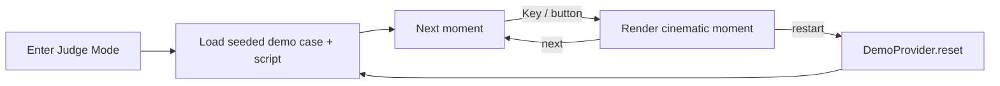

---

## 16. Design System Implementation

**EXTEND THE EXISTING DESIGN SYSTEM. DO NOT CREATE A SECOND ONE.**

- Extend the Tailwind v4 `@theme` block in `src/app/globals.css` (the authoritative theme).
- Keep existing brand/surface/status tokens and grain.
- Add any new tokens (accents, motion durations/easings) **inside the same `@theme`** or as CSS custom properties in the same file using the existing `--color-*`, `--font-*`, and new `--duration-*` / `--ease-*` families.

**Aesthetic direction:** hazy, warm-dark, intimate, unhurried, restrained, cinematic. "Cigarettes After Sex"-inspired **mood** — not literal branding, not copying artwork. Avoid pure black, neon, high-saturation gradients, and the generic purple "AI dashboard."

**Concrete token additions (documented, not a second theme):**

```
--color-accent-rose:  muted dusty rose      /* restrained accent */
--color-accent-amber: de-saturated amber    /* secondary accent */

--duration-fast:    200ms
--duration-normal:  400ms
--duration-slow:    1200ms        /* range 900-1400ms */

--ease-restrained: cubic-bezier(0.22, 1, 0.36, 1)   /* smooth deceleration, no bounce */
```

Warm charcoal, dark elevated surfaces, dusty rose, desaturated amber, soft gray text hierarchy — all expressed with the existing token ramps (brand ramp provides the warm neutrals; surface ramp provides elevated panels and text hierarchy).

---

## 17. Typography

| Property | Choice |
|---|---|
| Sans | Inter (existing) — wire through `next/font` if practical |
| Mono | JetBrains Mono (existing) — `font-mono` for IDs, timestamps, data, labels |
| Display (optional) | ONE serif font considered for select major headings only (ledger event titles, high-moment titles) |
| Font budget | do not load five fonts; ≤3 total |

Wire existing Inter + JetBrains Mono through `next/font` in `layout.tsx` (currently declared via `@theme` but not loaded). Extend `--font-*` variables. Text hierarchy uses the existing gray/surface ramp for soft hierarchy.

---

## 18. Color System

Extend the existing `@theme` (keep warm charcoal base, elevated surfaces, muted semantic states, soft gray hierarchy, subtle borders). Concrete additions:

```
--color-accent-rose:  a muted dusty rose        /* restrained accent */
--color-accent-amber: a de-saturated amber      /* secondary accent */
--color-*: existing brand / surface / success / warning / danger / info tokens
```

**KPP / fragmentation-impact warning (§15 of the brief):** node size tied to a KPP/fragmentation-impact score is **not** a canonical contract field. Treat it as a clearly documented **DEMO PRESENTATION FIELD** (fixture-only, `graph.json`), plus a **future contract addition** note. Do not invent a permanent frontend model.

---

## 19. Film Grain

**Reuse the existing SVG `feTurbulence` grain (`.grain::after`). Do NOT add a new grain engine.**

| What | How | Where | Why |
|---|---|---|---|
| Film grain | root `::after` pseudo-element, SVG `feTurbulence` data URI, `pointer-events:none`, low opacity, existing `mix-blend-mode: overlay`, 8s `steps(10)` animation, `z-index:9999` | `globals.css` `.grain` / `body.grain` in `layout.tsx` | atmosphere/texture, already present |
| Reduced motion | gate the `grain` keyframe animation under `prefers-reduced-motion` (stop the 8s steps loop; keep the static texture) | `globals.css` `@media (prefers-reduced-motion)` | accessibility |

Keep grain lightweight (it is already a fixed full-viewport layer). Verify it does not interfere with focus or panels; if `z-index:9999` overlays modal focus, lower it so it never sits above interactive chrome (see a11y note §36).

---

## 20. Motion System

Do not animate everything. Philosophy:

```
Mostly still -> important event -> deliberate cinematic motion -> settle -> stillness
```

### Durations (tokens)

| Token | Value | Use |
|---|---|---|
| fast | ~200ms (`--duration-fast`) | button/panel hovers, small transitions |
| normal | ~400ms (`--duration-normal`) | drawer open, tab fade, list transitions |
| slow | ~900–1400ms (`--duration-slow`) | lead reveal, graph bloom, evidence arrival |

### Easing

`--ease-restrained` = smooth deceleration (no bounce). **No** bounce, elastic UI, constant movement, or neon glow.

### Principles

- Mostly still (resting surfaces are calm).
- Important event → deliberate motion → settle → stillness.
- Active/realtime filaments and recovery rings are subtle, not constant attention-grabbers.
- **Reduced-motion must be respected** globally (`prefers-reduced-motion`).

---

## 21. GSAP Strategy

GSAP is **OPTIONAL**. It is not installed today.

- **CSS + SVG** baseline for ordinary UI transitions and simple signature effects.
- **GSAP only** for complex coordinated cinematic sequences — pending the Day-2 graph/animation spike (§22).

Candidate GSAP uses (complex sequences only):
- graph bloom
- entity-resolution convergence
- lead reveal
- cross-case thread
- evidence arrival
- Judge Mode choreography

**Do NOT use GSAP for:** every button hover, simple fade, loading dots, basic cards, list entrances.

**If the spike says CSS/SVG is sufficient: do not add GSAP.**

**If GSAP is approved,** centralize timeline creation and cleanup:
- create timelines in `useEffect`/`useLayoutEffect` scoped to mounted components;
- keep refs; `gsap.killTweensOf` / `timeline.kill()` on unmount and on dependency change;
- guard under `prefers-reduced-motion` (skip or jump-to-end);
- centralize in a small `lib/motion/` helper (e.g. `createTimeline(refs)`) rather than scattering GSAP calls.

---

## 22. Graph Architecture

**Highest technical risk.** No graph library exists in `packages/web`. The old vis-network shell in `packages/platform/public/index.html` is **NOT reusable** by the Next.js graph.

### 22.1 Day-2 spike (required)

Evaluate minimum-viable options against:
- seeded demo **10–30 nodes**
- interactive (click/hover)
- edges confidence-aware
- bridge visual
- communities
- timeline filtering
- cinematic motion
- demo performance
- no unnecessary WebGL complexity

**Layout spike:** evaluate
- **A. deterministic positions** (precomputed/hashed layout — fully repeatable) vs
- **B. lightweight force settling** (starts deterministic seed, settles).

Measure: beauty, interaction, performance, **repeatability**, implementation complexity. **The chosen layout must support deterministic Judge Mode** (Judge Mode must render identically run-to-run).

**Preferred direction to evaluate first:** SVG-based renderer + lightweight deterministic layout (or force layout) + GSAP/CSS animation. **Do NOT automatically install Three.js/WebGL** — only if the spike demonstrates a concrete requirement.

### 22.2 Data rule

The graph is **provider-driven**. **No hardcoded graph data inside Graph components.** Graph components consume `GraphProvider.getGraph()` (canonical `GraphNode` / `GraphEdge`). Graph consumption via `GraphProvider.getGraph()`.

### 22.3 Graph visual semantics (PRESENTATION rules)

| Element | Presentation | Status |
|---|---|---|
| node size | fragmentation-impact / KPP | **demo presentation field only** (§18) |
| edge thickness | relation / support confidence | presentation scaling of canonical `support` / `structuralImportance` |
| low-confidence edge | dashed + more transparent | presentation |
| bridge candidate | subtle halo (`brand-500/15`) | presentation |
| communities | soft background washes / fog-like regions | presentation |
| node click | Entity Detail drawer, graph context preserved | interaction |

Document these as presentation rules, not backend semantics, unless canonical contracts support them.

### 22.4 Graph performance guardrails

- node/edge cap for demo (~30 nodes),
- pause force simulation once settled,
- avoid full-screen backdrop-filter,
- sparse SVG blur,
- keep grain lightweight,
- do not animate hundreds of nodes simultaneously.

### 22.5 Graph architecture

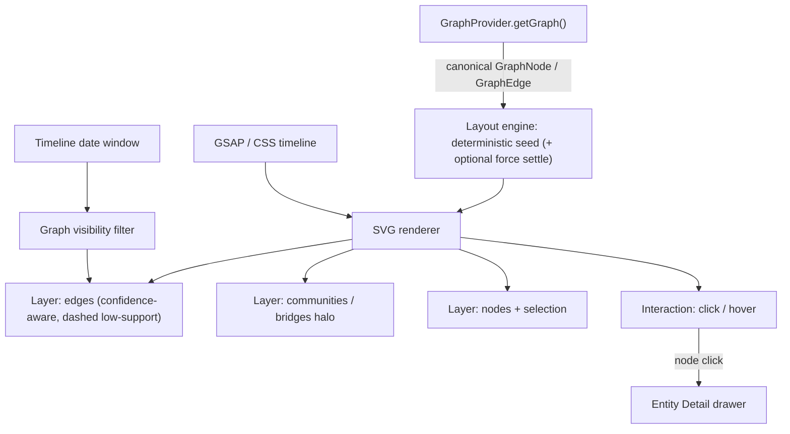

ASCII fallback:

```
GraphProvider.getGraph() -> [Layout engine] -> SVG renderer
  layers: edges -> communities/bridges -> nodes+selection
  Timeline window -> visibility filter -> layers
  node click -> Entity Detail drawer
  GSAP/CSS timeline animates SVG (optional)
```

---

## 23. Timeline

A timeline **coupled to graph state** — graph and timeline behave as one instrument (§ View 09).

Requirements:
- case-wide date range
- density strip
- scrubber + active range + current date
- event markers
- **timeline range → graph visibility filter**
- timeline data from provider (no hardcoded temporal behavior)

Timeline consumes `TimelineProvider.getTimeline()` — same provider data in live and demo.

---

## 24. Signature Animations (concrete mechanisms)

Translate every design "moment" into an implementable mechanism. Reference: §20 tokens, §21 GSAP policy, §22, §33.

| Moment | Mechanism |
|---|---|
| Document pile (New Case) | real tile transforms: `translateY + rotate(-2deg) -> 0` stagger ~60ms + negative-margin overlap settle |
| Graph bloom | §22/§33 sequence (opacity + node stagger + edge dash-draw + bridge halo, settle, pause sim) |
| Traveling processing filament | thin 1px light segment animating across the top shell (`translateX`), low opacity, `slow-pulse`-like loop, gated by processing state |
| Recovery ring | calm SVG loop pulse (stroke-dash + opacity), shown only while reconnecting |
| Cross-case thread | SVG path `stroke-dasharray` + `stroke-dashoffset` animated to 0 (CSS; GSAP only in a larger sequence) |
| Lead reveal (drawer) | graph dim (opacity), surface `translateY`, evidence stagger, counter-evidence stagger, alternatives settle, static confidence explanation |
| Graph-hole | graph dim + restrained region pulse + candidate explanations enter + recommended evidence appears (no red flash) |
| Reasoning ledger | staggered row entrance (≤40ms stagger, capped), restrained |
| Grain | existing `feTurbulence` implementation, reduced-motion gated |
| Judge Mode choreography | fullscreen overlay, keyboard advance, GSAP timeline only if spike approves; deterministic |
| Entity-resolution convergence | candidates translate toward center, evidence chips highlight, settle; equal-weight Merge/Separate buttons |

**Key rule (Part 10 of the brief):** these must be **actual UI behaviors**, not fake video sequences — and the same component must work with DemoProvider AND LiveProvider.

---

## 25. Loading / Empty / Error / Recovery

Reuse existing `LoadingSpinner`, `EmptyState`, `ErrorDisplay`. Every page spec (§15) includes all four states. Global rules:

**Loading:**
- calm, localized, skeleton-per-panel where valuable;
- do not block the entire app unnecessarily;
- avoid loading-dot animations everywhere;
- graph uses skeleton nodes/edges, not a full-screen spinner.

**Empty:**
- communicate meaning — not simply "No data."
- e.g. "No observations extracted yet — they appear as evidence processes."
- surface-scoped.

**Error:**
- **panel-specific** where possible — a single intelligence endpoint failure never takes down the whole investigation UI;
- workspace shows a **lower-right parser/backend error card** (§ View 04) for backend/parser issues, non-blocking;
- `ErrorDisplay` for structural failures.

**Recovery:**
- keep loaded state;
- show calm reconnect/recovery ring;
- SSE failure: reconnect with backoff, activity history remains, recovery indicator appears (§36).

---

## 26. Accessibility

Minimum baseline (reasonable for a one-week sprint, not overbuilt):

- keyboard focus + `:focus-visible` (already global)
- `prefers-reduced-motion` handling (grain, animations, convergence, bloom, thread, Judge Mode)
- text contrast ≥ 4.5:1 for body
- icon-only buttons have `aria-label`
- `Escape` closes drawers / modals
- keyboard-accessible Judge Mode
- semantic headings & buttons
- graph has a non-mouse representation / accessible node list where practical
- PII revealed only on explicit user toggle (§ View 07)
- grain should not sit above interactive chrome (adjust its z-index if it interferes with focus)

---

## 27. Performance

Concrete guardrails:

- graph node/edge cap for demo (~30 nodes)
- pause force simulation once settled
- avoid full-screen backdrop-filter
- sparse SVG blur
- lightweight grain
- cap the activity/ledger feed (recent events only)
- memoize event rows and ledger rows (`React.memo` / `useMemo`)
- throttle refresh (no per-event full REST refresh)
- avoid unnecessary re-renders (domain-local state)
- provider-level caching is allowed, but no stale authority (§8.3)
- do not animate hundreds of elements simultaneously
- lazy-load inactive workspace tab surfaces; shell persists across tabs (§ View 04)
- no full REST refresh on every realtime event (§12)

The graph is the biggest technical performance risk → guard it first.

---

## 28. Demo Narrative

The frontend must support the exact main-V7 story — **do not invent a different one**:

```
MESSY CASE PACK
  > OBSERVATIONS
    > ENTITY / RELATION RESOLUTION
      > TEMPORAL GRAPH
        > CROSS-CASE SIGNAL
          > INVESTIGATIVE LEAD
            > GRAPH HOLE
              > GAP CLASSIFICATION
                > BEST NEXT EVIDENCE
                  > COUNTER-EVIDENCE
                    > ROBUSTNESS
                      > VERIFIED EVIDENCE ARRIVES
                        > GRAPH UPDATES
                          > LEAD REASSESSMENT
                            > REASONING LEDGER
```

Source: `docs/roadmap/development-plan.md` §16 Demo Sequence. The demo provider emits these as a scripted realtime sequence (§12).

---

## 29. Judge Mode

A **first-class frontend feature** (`/investigations/[id]/judge/*` route group). Full spec in §15 View 22, sequence in §15/24.

Requirements:
- uses the exact seeded demo case
- predetermined sequence (§28)
- no navigation chrome
- keyboard advancement
- deterministic
- restart/reset support
- individual signature moments can be rehearsed alone
- independent of backend latency in mock mode
- **uses the SAME UI components as the normal workspace** — it must NOT become a second fake frontend

**Do not over-generalize Judge Mode** — it is specialized to the demo case.

The Judge Mode entry sequence is diagrammed in §15 View 22.

---

## 30. PR Plan (F-PR1 … F-PR7)

Preserve the core PR structure. Each PR lists: Goal, Scope, Files, Owner, Reviewer, Dependencies, Implementation sequence, Page specs included, Tests, Acceptance, Demo checkpoint, Rollback/safety note, Risks.

### F-PR1 — Foundation + Design System

- **Goal:** design baseline + workspace shell foundation.
- **Scope:** token extension, typography, motion constants, primitives polish, shell, routes.
- **Files:** `packages/web/src/app/globals.css`, `packages/web/src/app/layout.tsx`, `packages/web/src/components/layout/*`, new `components/layout/workspace.tsx` (shell) + `workspace-nav.tsx`, route scaffolds (`/`, `/investigations/new`, `/investigations/[id]`).
- **Primary owner:** Mayur (design) / Gurashish (shell). **Reviewer:** the other.
- **Dependencies:** none.
- **Implementation sequence:** extend `@theme` tokens → wire fonts → grain reduced-motion gating → build shell + nav → scaffold routes.
- **Page specs included:** View 04 skeleton; View 02 foundations.
- **Tests:** design-token smoke, shell render.
- **Acceptance:** workspace shell renders using provider abstraction.
- **Demo checkpoint:** shell only.
- **Rollback/safety:** additive tokens only; no second theme.
- **Risks:** scope creep into visual polish — guard to tokens + shell.

### F-PR2 — Provider Seam + Demo Case

- **Goal:** provider interfaces/factory + contract-valid demo fixtures.
- **Scope:** `lib/providers/*`, `DataMode.ts`, `demo-fixtures/*.json`.
- **Files:** new `lib/providers/**`, `demo-fixtures/**`, `lib/realtime/normalize.ts` (draft).
- **Primary owner:** Gurashish (seam) / Mayur (fixtures). **Reviewer:** other.
- **Dependencies:** F-PR1.
- **Implementation sequence:** domain interfaces → `DataMode.ts` → factory/tree → fixtures → validate.
- **Page specs included:** all (data foundation).
- **Tests:** DemoProvider fixture validation, DataMode resolution, parity scaffolding.
- **Acceptance:** DemoProvider returns a contract-valid coherent case; non-demo → live invariant holds.
- **Demo checkpoint:** one coherent case.
- **Rollback/safety:** no UI depends on demo internals.
- **Risks:** fixture completeness/canonical gaps.

### F-PR3 — Core Workspace + Case / Evidence

- **Goal:** case list, intake, workspace provider integration, evidence flow.
- **Scope:** surfaces + refactor current `investigation-detail`.
- **Files:** `app/page.tsx`, `investigations/new/*`, `investigations/[id]/*`, `investigation-detail.tsx`, `components/evidence/*`, `components/upload/file-upload.tsx`, new workspace providers wiring.
- **Primary owner:** Gurashish. **Reviewer:** Mayur (semantics).
- **Dependencies:** F-PR1, F-PR2.
- **Implementation sequence:** case list from provider → intake (drop-zone + tiles) → workspace shell hooks → evidence flow.
- **Page specs included:** View 02, 03, 04.
- **Tests:** evidence flow via provider; live/mock parity for evidence; intake gate (disabled until valid source).
- **Acceptance:** case → evidence → provider → visible observations.
- **Demo checkpoint:** intake → evidence → observations.
- **Rollback/safety:** refactor is behind provider interfaces; old direct fetches removed carefully.
- **Risks:** refactor churn on existing detail page.

### F-PR4 — Graph + Timeline

- **Goal:** graph implementation + timeline; node interaction + entity drawer.
- **Files:** new `components/graph/*` (GraphCanvas + layers), `components/timeline/*`, node→Entity drawer integration.
- **Primary owner:** Gurashish. **Reviewer:** Mayur (semantics).
- **Dependencies:** F-PR2, F-PR3.
- **Implementation sequence:** graph spike (Day 2) → SVG canvas → layout → nodes → edges → communities → bridges → selection → entity drawer → timeline linkage → graph animation.
- **Page specs included:** View 08, 09, 07.
- **Tests:** graph rendering/purity (no hardcoded data), timeline filtering, node selection.
- **Acceptance:** graph/timeline work against provider only.
- **Demo checkpoint:** temporal graph + entity drawer.
- **Rollback/safety:** SVG-first, deterministic; pause simulation when settled.
- **Risks:** graph is the highest technical risk; spike gated at Day 2.

### F-PR5 — Intelligence Surfaces

- **Goal:** observations, entity, leads, gaps presentation.
- **Files:** new `components/intel/*`, `components/status/*`, `components/ui/*`.
- **Primary owner:** Mayur (content) / Gurashish (surfaces). **Reviewer:** other.
- **Dependencies:** F-PR3.
- **Implementation sequence:** observations → entity resolution → leads list → lead detail → gaps → gap detail → evidence requests.
- **Page specs included:** View 05, 06, 10, 11, 12, 13, 14.
- **Tests:** provider-driven rendering, empty/loading states, FOR/AGAINST parity.
- **Acceptance:** lead/entity/observation/gap presentation works.
- **Demo checkpoint:** leads + gaps lists/details.
- **Rollback/safety:** semantic wording gated by Mayur; canonical types only.
- **Risks:** wording/semantics drift from canonical meaning.

### F-PR6 — Signature Motion + Realtime

- **Goal:** signature animations + realtime shell.
- **Files:** `lib/realtime/normalize.ts`, `components/feedback/*`, `components/graph/*` (motion), workspace realtime wiring.
- **Primary owner:** Gurashish. **Reviewer:** Mayur.
- **Dependencies:** F-PR2, F-PR4.
- **Implementation sequence:** realtime normalizer → dedupe → mock realtime → signature animations (bloom, lead reveal, graph-hole, evidence arrival, thread, ledger).
- **Page specs included:** View 15, 16, 17, 18, plus motion in 08/11/13.
- **Tests:** realtime normalization, event dedupe, SSE failure recovery.
- **Acceptance:** realtime + signature moments work.
- **Demo checkpoint:** Lead → Gap → Next Evidence story.
- **Rollback/safety:** reuse SSE client/proxy; no new transport.
- **Risks:** animation performance; SSE dedupe.

### F-PR7 — Judge Mode + Polish

- **Goal:** Judge Mode + parity + accessibility + reset + freeze.
- **Files:** new `app/investigations/[id]/judge/*`, reset wiring, a11y pass.
- **Owners:** Both. **Reviewer:** both.
- **Dependencies:** all prior.
- **Implementation sequence:** Judge shell → scripted moments (reusing UI components) → keyboard/restart/progress → reset → a11y/perf pass → rehearsal.
- **Page specs included:** View 22 (+ capture of all).
- **Tests:** Judge Mode sequence, demo reset, failure states, parity.
- **Acceptance:** two clean timed rehearsal runs.
- **Demo checkpoint:** complete guided demo.
- **Rollback/safety:** Judge uses same components; deterministic.
- **Risks:** scope; protect core story.

### 30.1 PR dependency graph

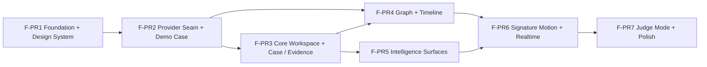

ASCII fallback:

```
FPR1 -> FPR2 -> FPR3 -> FPR6 -> FPR7
              \-> FPR4 ----/^
               \-> FPR5 ---/^
   (FPR4 also needs FPR2,FPR3; FPR5 needs FPR3)
```

---

## 31. Seven-Day Development Plan

Every day ends with a **runnable demo checkpoint**.

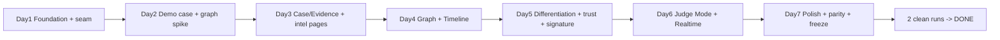

### Day 1 — Foundation + provider seam + design baseline

- **Mayur:** design tokens (color/typography/motion constants), visual primitives polish, semantic naming, demo case data model.
- **Gurashish:** workspace shell, route structure, provider interfaces/factory, DataMode skeleton.
- **Shared:** token + shell sync.
- **Gate:** bare workspace renders using the provider abstraction.
- **Runnable checkpoint:** empty workspace shell on `/investigations/[id]`.

### Day 2 — Demo case + graph spike

- **Mayur:** assemble coherent demo fixtures, canonical schema validation, intelligence semantics.
- **Gurashish:** graph renderer spike + tech decision, realtime normalizer.
- **Shared:** spike gating (CSS+SVG vs GSAP).
- **Gate:** one contract-valid demo case + graph spike.
- **Cut if blocked:** simplify fixture coverage; use deterministic layout if force layout fragile.
- **Checkpoint:** one coherent contract-valid case + a rendered deterministic mini-graph.

### Day 3 — Case/Evidence + static intelligence pages

- **Mayur:** Observations, Entity, Leads, Gaps semantic content.
- **Gurashish:** Case List, Intake, Workspace provider integration, evidence flow refactor.
- **Shared:** intake drop-zone behavior.
- **Gate:** case → evidence → provider → visible observations.
- **Cut if blocked:** defer cross-case; table detail for lead/gap until Day 5.
- **Checkpoint:** intake → evidence → observations visible.

### Day 4 — Graph + Timeline

- **Gurashish:** graph implementation, timeline, node interaction, entity drawer.
- **Mayur:** graph semantic validation, timeline semantics, presentation copy.
- **Shared:** no hardcoded graph data.
- **Gate:** graph/timeline work against provider only.
- **Cut if blocked:** defer community fog; keep node+edge+selection.
- **Checkpoint:** temporal graph + entity drawer.

### Day 5 — Differentiation + trust + signature animation

- **Mayur:** lead/gap/evidence/counter-evidence/robustness semantics.
- **Gurashish:** signature animations, graph-hole visualization, evidence-arrival visualization, realtime shell.
- **Shared:** lead-reveal + graph-hole choreography.
- **Gate:** Lead → Gap → Next Evidence narrative.
- **Cut if blocked:** defer cross-case + discovery in favor of core narrative.
- **Checkpoint:** Lead → Gap → Next Evidence story runs.

### Day 6 — Judge Mode + Realtime

- **Both:** Judge Mode (same components).
- **Gurashish:** realtime/error/recovery/performance.
- **Mayur:** demo narration, semantic QA.
- **Shared:** Judge choreography.
- **Gate:** complete guided demo.
- **Cut if blocked:** reduce to 8 signature moments.
- **Checkpoint:** complete guided Judge demo (keyboard-advance).

### Day 7 — Polish + parity + freeze

- **Mayur:** fixture determinism, semantic audit, demo content.
- **Gurashish:** final integration, accessibility, performance, mock/live routing, demo reset.
- **Both:** two clean timed rehearsals.
- **Gate:** two clean runs → DONE.
- **Cut if blocked:** any P2/admin/discovery; protect the core story.
- **Checkpoint:** two clean rehearsals (full demo + Judge).

---

## 32. Mayur / Gurashish Ownership

**Overarching rule (V7):** Mayur = WHAT INDAGO KNOWS; Gurashish = HOW INDAGO RUNS.

**Within this frontend sprint (track-local, one week):**

**Mayur:**
- aesthetic token details
- visual copy / semantic content / fixture content / demo narrative
- intelligence presentation
- confidence wording (uses canonical score semantics)
- lead/gap/evidence interpretation
- Judge narration

**Gurashish:**
- shell
- routing
- provider plumbing
- DataMode
- graph
- timeline
- realtime
- SSE
- performance
- integration

**Both:**
- signature animations
- Judge Mode
- final integration
- final demo rehearsal

Every page spec in §15 identifies its primary implementation owner:
- Graph, Timeline, Workspace, DataMode/Providers, Realtime, Responsive, Performance → **Gurashish**.
- Observations content, Entity/Lead/Gap/Evidence semantics, Robustness interpretation, Demo narrative, Judge narration → **Mayur** (surfaces hosted by Gurashish).
- Case List, Intake, Ledger, Review, Admin, Judge Mode → joint (shell by Gurashish, content by Mayur).

---

## 33. Testing

Reuse **Vitest + Testing Library** (`npm test` / `vitest run`).

Create tests for:
- provider interface parity (Live vs Demo: same methods, same canonical schemas, same required fields, same IDs, same enums, same errors)
- DataMode safety (non-demo → live invariant; no silent fallback)
- fixture validation (fixture → `schema.parse()` → provider)
- DemoProvider (deterministic, latency-aware, event-aware)
- LiveProvider wrappers (typed "not available" for missing domains)
- realtime normalization + event deduplication
- timeline filtering (range → graph filter)
- graph purity (no hardcoded data in components)
- Judge Mode (sequence, advance, restart, reset)
- loading/empty/error/recovery states per §25
- intake gate (Begin Ingestion disabled until valid source)

Pipeline: `fixture → canonical schema.parse() → provider → component`.

**Provider acceptance (parity):** same interface, same canonical schema, same required fields, same IDs, same enums, same errors. **Do NOT duplicate contract schemas** (contracts package already has its own tests in `packages/contracts/tests`).

---

## 34. Failure Safety

Rules:
- **Demo case:** explicitly mock or live.
- **Non-demo:** live only.
- **Development:** `auto` allowed (demo→mock) only in dev/rehearsal (env-gated).
- **Demo day:** NO silent fallback (manual mock/live choice).

Failure behaviors:
- **Live API down:** show actual error state, manual retry. User may manually switch a demo case to mock if appropriate — never automatic.
- **SSE failure:** reconnect with backoff, calm recovery ring, do not destroy already-loaded state.
- **Graph API failure:** graph-specific degraded state; other workspace panels remain available.
- **One intelligence endpoint fails:** panel-specific error; do not take down the whole investigation UI.

---

## 35. Reset Strategy

No reset mechanism currently exists. Document a deterministic mock reset:

```
reset()
  -> restore initial fixture snapshot
  -> clear provider runtime state
  -> clear scripted realtime timeline
  -> restore initial workspace state
```

- Judge Mode has **Restart**.
- **Live mode reset must never mutate arbitrary real cases.** For live, "reset" means route/provider refresh or a freshly created demo run only.

---

## 36. Platform Dependencies

Documented platform items that affect the frontend. **Separate FRONTEND RESPONSIBILITY vs PLATFORM RESPONSIBILITY.** Do not instruct frontend engineers to silently modify platform code.

| # | Platform item (verified) | FRONTEND action | PLATFORM responsibility |
|---|---|---|---|
| 1 | `POST /start` auto-enqueues `investigation-pipeline`; mock worker self-requeues `CREATED → INGESTING → NORMALIZING → ANALYZING` (terminates at DISCOVERING / WAITING_FOR_EVIDENCE) | Do NOT depend on the auto-pipeline for demo UX; drive state from provider/events | Gurashish's platform lane — real worker lifecycle |
| 2 | SSE duplicate emission: `transitionState` emits one event + `audit/logger.ts` emits full `AuditEvent` to same emitter (two different shapes); `GRAPH_READY` emitted separately | Normalize + dedupe in `normalize.ts`; update local state, avoid per-event full refresh | Gurashish's platform lane — event stream cleanup |
| 3 | Ad-hoc SSE event objects (no named SSE `event:` field; `{investigationId,state/type,message,timestamp}`) | Thin normalizer → canonical `InvestigationEvent` | Gurashish's platform lane — canonical payloads |
| 4 | Missing intelligence endpoints (Graph query, Timeline, Lead, Gap, Observation, Entity, Robustness, Cross-case, Review, Evidence-request) | Demo fixtures + DemoProvider; Live provider returns typed "not available in live mode"; mark **future backend dependency** | Mayur (intelligence) + Gurashish (services) per V7 |
| 5 | Review escalation exists only as SSE ALERT, no REST review-task API | ReviewProvider over demo; typed "not available" live | Gurashish's platform/services lane |

**Rule:** the frontend never silently modifies platform code. Discrepancies are documented dependencies owned by the platform lane.

---

## 37. Implementation Order

Dependency order:

```
Foundation
  -> Provider seam
    -> Demo case
      -> Workspace
        -> Evidence
          -> Graph
            -> Timeline
              -> Entity
                -> Leads
                  -> Gaps
                    -> Evidence Requests
                      -> Cross-Case
                        -> Robustness
                          -> Ledger
                            -> Realtime
                              -> Judge Mode
                                -> Polish
```

**Can run in parallel:**
- Fixtures/content (Mayur) vs Provider seam/factory (Gurashish) after the demo case skeleton is agreed.
- Graph spike (Day 2) vs Realtime normalizer.
- Observations/Entity content (Mayur) vs Graph/Timeline (Gurashish) after F-PR3.
- Cross-Case, Discovery, Boundary (dedicated owners) after core F-PR4/F-PR5.
- Admin (P2) fully parallel and cut-if-time.

**Page dependency graph:**

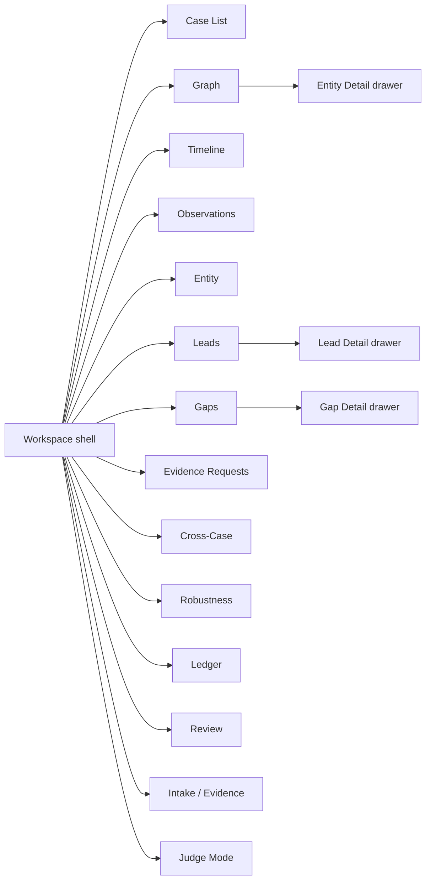

ASCII fallback:

```
               Workspace shell
      ______/____|____\____________\___
     /    /   /   \   \      \        \
 Case Graph TL  Obs  Ent  Leads  Gaps  Judge
       /            \     \      \
  Entity Detail    Lead Detail   Gap Detail
  (request queue, cross-case, robustness, ledger, review are tabs)
```

---

## 38. Risks

| ID | Risk | Prob | Impact | Mitigation | Owner |
|---|---|---|---|---|---|
| R1 | Graph implementation | High | High | Day-2 spike; SVG-first; cut secondary visuals before graph; provider-driven | Gurashish |
| R2 | Demo case completeness | Med | High | assemble from existing fixtures early (Day 2); validate via contracts | Mayur |
| R3 | Realtime event normalization | Med | Med | thin normalizer + canonical events; dedupe | Gurashish |
| R4 | Platform auto-pipeline | High | Low | document as dependency; demo UX does not depend on it | Gurashish |
| R5 | SSE duplicate emission | Med | Med | dedupe + smart refresh; document, don't silently fix | Gurashish |
| R6 | KPP / contract naming gaps | Med | Med | fixture-only presentation fields; future contract note | Mayur |
| R7 | Seven-day scope | High | High | priority MUST/SHOULD/CUT; protect core story | Both |
| R8 | Animation performance | Med | Med | CSS+SVG default; guardrails; no hundreds of nodes | Gurashish |
| R9 | Mock/live leakage | Med | High | central `resolveDataMode`; non-demo → live invariant | Gurashish |
| R10 | Backend replacement parity | Med | High | parity acceptance test per provider; same method signatures | Gurashish |

---

## 39. Stop Rules

1. Do not build a second design system.
2. Do not introduce multiple competing state-management systems.
3. Do not implement real intelligence inside the frontend (demo provider simulates sequences; no fake intelligence engine).
4. Do not invent intelligence semantics or scoring systems.
5. Do not make mock fallback global (no "if API fails then use mock").
6. Do not use mock on arbitrary real cases.
7. Do not make DemoProvider a special rendering path.
8. Do not build RecordedProvider in week 1.
9. Do not over-generalize Judge Mode.
10. Do not spend time on Admin before the core story (P2).
11. If graph slips, cut secondary visual features before compromising the graph.
12. Do not silently modify platform SSE/worker behavior in this frontend track.
13. Do not introduce WebGL/Three.js without a demonstrated requirement.
14. Do not sacrifice the core demo narrative for page-count completion.
15. Do not duplicate contract schemas.
16. Do not duplicate SSE infrastructure.

---

## 40. Definition of Done

The frontend-first track is **DONE** only when:

- core Investigator UI exists
- demo case is coherent
- fixtures are contract-valid
- providers exist (parity)
- mock/live modes exist
- non-demo cases cannot silently receive mock
- graph exists (provider-driven, deterministic)
- timeline exists (graph-coupled)
- lead/gap/evidence story exists (FOR/AGAINST equal weight)
- realtime works (normalized + deduped)
- signature animations exist (§24/§33)
- Judge Mode works (same components, keyboard, deterministic, restart)
- loading/empty/error/recovery states exist (§25)
- accessibility baseline passes (§26)
- demo reset works (§35)
- two clean timed rehearsals pass
- live provider can replace demo provider without rewriting UI components

---

## 41. Final Application Architecture

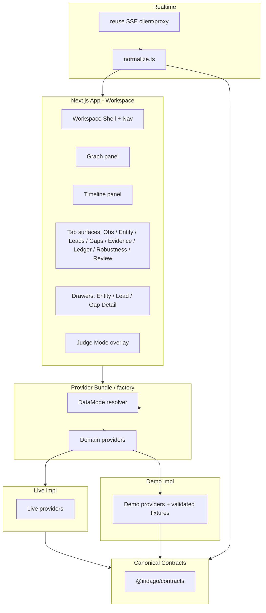

**Demo event flow:**

```mermaid
flowchart LR
  RAW["Messy case pack"] -->|"intake"| SUB["Evidence submission"]
  SUB -->|"DemoProvider event"| PROC["Processing state"]
  PROC --> OBS["Observations"]
  OBS --> ER["Entity / Relation resolution"]
  ER --> GRAPH["Graph update"]
  GRAPH --> TEMP["Temporal signal"]
  TEMP --> LEAD["Lead"]
  LEAD --> HOLE["Graph hole"]
  HOLE --> GAP["Gap classification"]
  GAP --> REQ["Evidence request"]
  REQ --> CE["Counter-evidence"]
  CE --> ROB["Robustness"]
  ROB --> ARR["Verified evidence arrives"]
  ARR --> GUI["Graph updates"]
  GUI --> REAS["Lead reassessment"]
  REAS --> LEDG["Reasoning ledger"]
```

### 41.1 Reuse vs Build

| Artifact | Status | Note |
|---|---|---|
| `globals.css` tokens/grain | **Reuse** | extend, don't duplicate |
| `layout.tsx` shell + Sidebar + pl-60 | **Reuse** | add workspace nav alongside |
| `Sidebar` | **Reuse** | |
| UI primitives (`Button`, `Card`, `Badge`, `EmptyState`, `ErrorDisplay`, `LoadingSpinner`, `Input`…) | **Reuse** | |
| Evidence wizard (`evidence/*`) | **Reuse / refactor** | consume via provider |
| UploadThing (`upload/*`) | **Reuse** | |
| `platformFetch` + Server Actions | **Reuse** | wrap in Live providers |
| SSE client (`sse-client.ts`) | **Reuse** | |
| SSE proxy route | **Reuse** | |
| contracts validation | **Reuse** | canonical schemas |
| contract fixtures | **Reuse** | fragments for "Operation Financial Shadow" |
| `USE_MOCK_INGESTION` env | **Backend-only** | NOT a frontend dependency |
| platform vis-network shell | **NOT reusable** | not the Next.js graph |
| RecordedProvider | Phase 2 | do not build in week 1 |

---

## 42. Screen-by-Screen Summary

| View | Structure | Primary Components | Data Provider | Main Interaction | Signature Motion | Priority |
|---|---|---|---|---|---|---|
| 01 Login | centered card | LoginCard, Input, Button | Auth (optional) | submit | fade-in | P2 |
| 02 Case List | vertical cards | CaseCard, Thumbnail, Badge | Investigation | open case | stagger fade | MUST |
| 03 New Case | step flow | DropZone, Tile, Metadata | Evidence/Investigation | drop + Begin Ingest | tile pile settle | MUST |
| 04 Workspace | shell + panels | WorkspaceShell, Nav, GraphPanel, Timeline | bundle | tab nav / select | traveling filament, recovery ring | MUST |
| 05 Observations | text feed | ObservationRow, Filter | Observation | open provenance | fade-in | MUST |
| 06 Entity Resolution | queue + detail | ErQueue, Candidate, Merge/Separate | Entity | merge / keep separate | convergence | MUST |
| 07 Entity Detail | drawer | EntityDrawer, Alias, MiniGraph, PII | Entity / Graph | PII reveal, close | slide-in | MUST |
| 08 Graph | SVG canvas | GraphCanvas (6 layers), Controls | Graph | node click | graph bloom | MUST |
| 09 Timeline | horizontal track | Timeline, Density, Scrubber | Timeline | scrub → filter graph | fade / re-filter | MUST |
| 10 Leads | list | LeadCard | Lead | open drawer | stagger fade | MUST |
| 11 Lead Detail | drawer | LeadDrawer, For/Against | Lead / CounterEvidence | compare FOR/AGAINST | lead reveal | MUST |
| 12 Gaps | list | GapCard | Gap | open drawer | fade-in | MUST |
| 13 Gap Detail | drawer | GapDrawer, Explanations | Gap | request evidence | graph-hole pulse | MUST |
| 14 Evid. Requests | list | ErqCard, Utility | Gap / Review | approve / reject | repaint | MUST |
| 15 Cross-Case | two graphs + thread | CaseGraphA/B, ThreadSVG | cross-case | shared-entity click | thread draw | SHOULD |
| 16 Ledger | vertical rows | LedgerRow, Filter | Review / Realtime | expand reasoning | staggered entry | MUST |
| 17 Discovery | graph overlay | DiscoveryOverlay | demo | focus region → lead | region soften | SHOULD |
| 18 Boundary | graph overlay | BoundaryOverlay, ClassBadge | demo | expand context | pull-in | SHOULD |
| 19 Robustness | report | MetricCard, DetailRows, MethodDrawer | Robustness | open methodology | fade-in (no count) | MUST |
| 20 Review Center | queue | ReviewTaskList, Actions | Review | approve/reject/escalate | repaint | SHOULD |
| 21 Admin | tables | RolesTable, HealthPanel | Admin | edit role | minimal | P2 |
| 22 Judge Mode | full-screen | JudgeStage (reuses UI), Controls | Demo | keyboard advance / restart | GSAP choreography | MUST |

---

## 43. Appendix: File Map

**Existing files to modify** (documented — this documentation effort modifies nothing):
- `packages/web/src/app/globals.css` (extend tokens, motion, grain reduced-motion)
- `packages/web/src/app/layout.tsx` (fonts, grain, workspace shell)
- `packages/web/src/app/page.tsx` (Case List)
- `packages/web/src/app/investigations/new/page.tsx` (New Case Intake)
- `packages/web/src/app/investigations/[id]/*` + `investigation-detail.tsx` (Workspace + realtime refactor)
- `packages/web/src/components/evidence/*`, `components/upload/file-upload.tsx` (evidence flow via provider)
- `packages/web/src/components/ui/*` (token polish only)
- `packages/web/src/lib/contracts/types.ts` (label maps extension if needed)

**New files to create** (documented — not created by this effort):
- `packages/web/src/lib/providers/**` (interfaces, factory, `DataMode.ts`, `live/*`, `demo/*`, `demo-fixtures/*.json`)
- `packages/web/src/lib/providers/demo/demo-fixtures/*.json` (15 fixture files, §10.1)
- `packages/web/src/lib/realtime/normalize.ts`
- `packages/web/src/components/layout/workspace.tsx`, `components/layout/workspace-nav.tsx`
- `packages/web/src/components/graph/*` (GraphCanvas + layers + controls)
- `packages/web/src/components/timeline/*`
- `packages/web/src/components/intel/*` (observations, entity, leads, gaps, evidence-requests, cross-case, ledger, robustness, review)
- `packages/web/src/components/feedback/*` (signature animation building blocks, recovery ring, filament)
- `packages/web/src/components/drawers/*` (Entity/Lead/Gap detail)
- `packages/web/src/app/investigations/[id]/judge/*`
- `packages/web/src/app/admin/*` (P2)
- `packages/web/src/lib/motion/*` (optional; only if GSAP approved)

**Platform dependencies** (not built here): real intelligence/query endpoints per §36.

*This document is documentation-only. No source code, package.json, lockfiles, Prisma schema, contracts, routes, components, or configuration were modified.*

---

