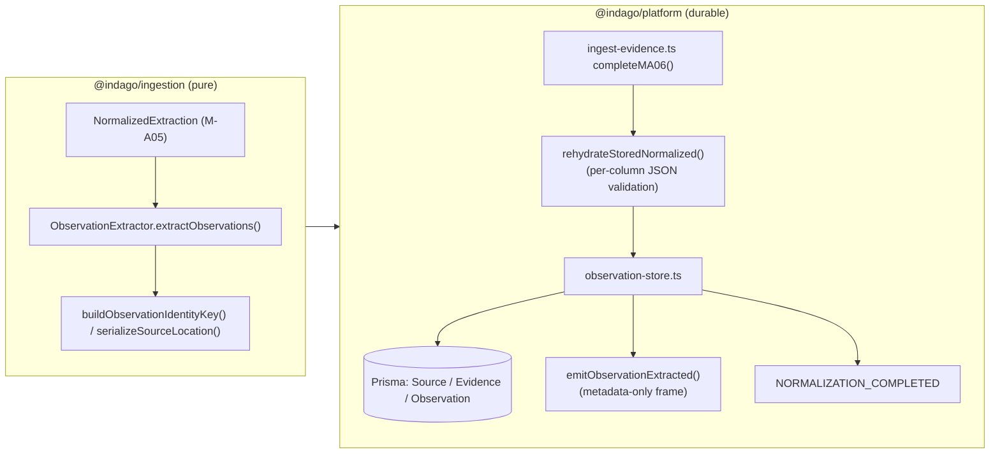
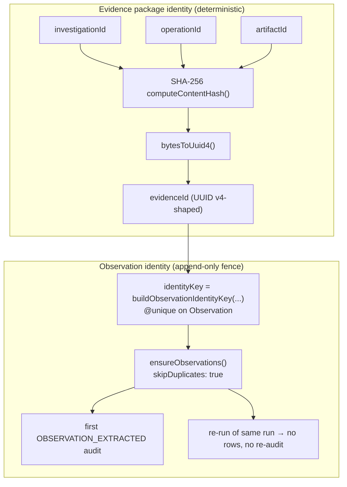
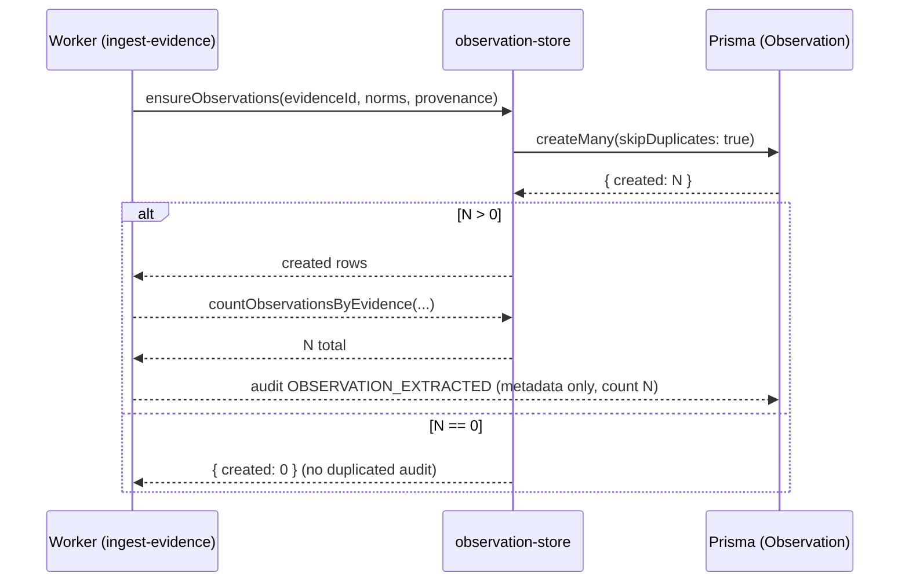
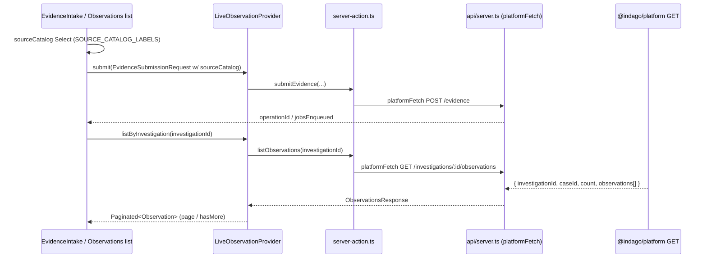

# M-A06: Observation Extraction

## Overview

M-A06 extracts **discrete assertions** (`Observation[]`) from a persisted
`NormalizedExtraction` (M-A05). Where M-A05 answers *"what is this material,
canonically?"*, M-A06 answers:

> "WHAT CLAIMS CAN WE TRUTHFULLY EXTRACT FROM THIS MATERIAL?"

Each observation is a domain assertion with canonical provenance back to the
evidence package (`evidenceId`), the source system (`sourceId`), real-world
timing (`observedAt`), and extraction method (`extractor`) — ready for
corroboration and downstream entity resolution (MA07) via `candidateMentions`.

The extraction engine is a **pure, deterministic module** in `@indago/ingestion`
(the extractor stays free of Prisma/BullMQ/Redis/LLM). The platform persists
observations **append-only and idempotently**: re-running an ingestion never
duplicates rows.

## Architecture

## Identity & Dedup

## Frontend live path

## Key Design Decisions

1. **Evidence IDs are SHA-256 UUIDs over the immutable identity triple.**
   `investigationId:operationId:artifactId` hashed via `computeContentHash` +
   `bytesToUuid4` (both exported from `@indago/ingestion`) yields the same
   `Evidence.id` on every attempt and every process — so idempotent upserts and
   cross-run joins never collide.

2. **`sourceCatalog` is canonical and required in the queue payload.**
   `SourceCatalogSchema` (`FIR | CDR | FINANCIAL | SURVEILLANCE | SOCIAL | INTEL |
   MANUAL`) is the single source of truth (`contracts/src/domain/source.ts`).
   The web submission keeps it a loose `z.string().max(50)` client contract;
   `routes.ts` strictly resolves it server-side with `SourceCatalogSchema.safeParse`
   and falls back to `MANUAL` — never trusted raw. The verbatim client string is
   preserved as `declaredSourceCatalog` for audit + review.

3. **Rehydration re-validates JSON content columns only.** Re-entering an
   already-stored normalization parses `config`, `canonicalFields`, `quality`,
   `lexicalStatistics` against their content schemas, while identity/version
   columns pass through. A tampered JSON body fails permanently;
   `NORMALIZATION_FAILED` → run FAILED. No identity string is ever re-validated
   (fixture attemptIds like `attempt-1` round-trip; real UUIDs stay stable).

4. **Observations dedup by a pipeline-supplied identity key.** The store gates
   the single `OBSERVATION_EXTRACTED` audit with `identityKey @unique` +
   `createMany(skipDuplicates)`. A re-run that produced zero rows yields
   `{ created: 0 }` and emits NO re-audit. The extraction engine supplies the key
   (`buildObservationIdentityKey`) — never the store.

5. **`OBSERVATION_EXTRACTED` is metadata-only.** The SSE frame carries
   `evidenceId`, `count`, and catalog information — never content or rendered
   `candidateMentions` — keeping the realtime seam small and scoped.

6. **Observations list is case-scoped server-side.** `GET
   /investigations/:id/observations` derives `caseId` from the persisted latest
   run (never client-supplied) and enforces `verifyCaseAccess` → 403 on boundary
   violation, 404 when the investigation does not exist.

7. **Live provider never fabricates.** `LiveObservationProvider.listByEntity`
   stays `UNSUPPORTED` (no platform endpoint) rather than client-filtering.
   Errors map through `toLiveProviderError` (403→AUTHORIZATION, 404→NOT_FOUND,
   TypeError→NETWORK).

## Files

### `@indago/contracts` (annotated schemas)

| File | Purpose |
|------|---------|
| `src/domain/source.ts` | `SourceCatalogSchema`, `DEFAULT_SOURCE_CATALOG = "MANUAL"` |
| `src/domain/observation.ts` | `ObservationSchema` (`.strict()`): `candidateMentions`, `strength`, `provenance`, `observedAt` |
| `src/domain/evidence.ts` | `EvidenceSchema`; `locationRef` optional/global, exact locations live on `Observation.provenance` |
| `src/intelligence/ingestion-job-payload.ts` | `IngestionJobPayloadSchema` — `sourceCatalog` REQUIRED |
| `src/intelligence/evidence-submission.ts` | `EvidenceSubmissionRequestSchema` — `sourceCatalog` optional (loose, ≤50) |

### `@indago/ingestion` (pure observation engine)

| File | Purpose |
|------|---------|
| `src/observation/observation-id.ts` | `buildObservationIdentityKey`, `serializeSourceLocation` |
| `src/observation/observation-extractor.ts` | `extractObservations`, `finalizeObservation` (deterministic, pure) |
| `src/observation/observation-rules.ts` | `candidateMentions` spans + strength baselines |
| `src/observation/index.ts` | Barrel exports + `computeContentHash` / `bytesToUuid4` |

### `@indago/platform` (durable wiring)

| File | Purpose |
|------|---------|
| `src/queue/ingest-evidence.ts` | `completeMA06` + per-column `rehydrateStoredNormalized` |
| `src/persistence/observation-store.ts` | `deterministicEvidenceId`, `upsertSource`, `upsertEvidence`, `ensureObservations`, `countObservationsByEvidence`, `listObservations`, `listEvidenceByInvestigation` → `EvidenceProjection` |
| `src/realtime/sse.ts` | `ObservationExtractedFrame` + `emitObservationExtracted` |
| `src/api/routes.ts` | GET `/investigations/:id/observations` + GET `/investigations/:id/evidence` (`EvidenceProjection` envelope, case-scoped) + producer `resolvedSourceCatalog`/`declaredSourceCatalog` |
| `prisma/schema.prisma` | `Source`, `Evidence`, `Observation` models (`identityKey @unique`) |
| `tests/integration/observation-store.test.ts` | 8 tests — idempotency, dedup, scoping, evidence-list projection, corrupt-row rejection |

### Web (F-PR2 provider seam)

| File | Purpose |
|------|---------|
| `src/lib/contracts/types.ts` | `SOURCE_CATALOG_LABELS` + re-exports (`SourceCatalogSchema`, `DEFAULT_SOURCE_CATALOG`, `SourceCatalog`) |
| `src/components/evidence/evidence-metadata-form.tsx` | `sourceCatalog` select (default MANUAL) |
| `src/components/evidence/evidence-intake.tsx` | maps `metadata.sourceCatalog` → submission |
| `src/components/evidence/evidence-review.tsx` | catalog row via `SOURCE_CATALOG_LABELS` |
| `src/lib/api/types.ts`, `src/lib/api/server.ts`, `src/lib/api/server-action.ts` | `listObservations` + `listEvidence` (`EvidenceListItem`/`EvidenceListResponse`) client + server actions |
| `src/lib/providers/live/providers.ts` | `LiveObservationProvider` → `Paginated<Observation>`; `LiveEvidenceProvider.listByInvestigation` → `Paginated<EvidenceListItem>` (no fabricated strength) |
| `src/lib/providers/demo/providers.ts`, `src/components/evidence/evidence-item.tsx` / `evidence-list.tsx` | demo `toListItem` canonical→projection mapping; Evidence tab renders the list in live mode |
| `tests/live-providers.test.ts` | live observation + evidence-list suites (success/paging, 403/404/network, CANCELLED, unsupported `listByEntity`/`evidence.get`) |

## Verification

| Layer | Result |
|-------|--------|
| `@indago/contracts` typecheck + tests | 159/159 |
| `@indago/ingestion` typecheck + tests | 385/385 |
| `@indago/platform` typecheck + tests (real Neon Postgres + Upstash Redis + BullMQ + SSE) | 132/132 |
| `@indago/web` typecheck + tests | 259/259 |

Debugging note: `packages/platform/vitest.config.ts` runs files serially
(`fileParallelism: false`) — required because Upstash lock-renewal stalls under
parallel load caused duplicate BullMQ attempts (`attemptNumber: 2`).