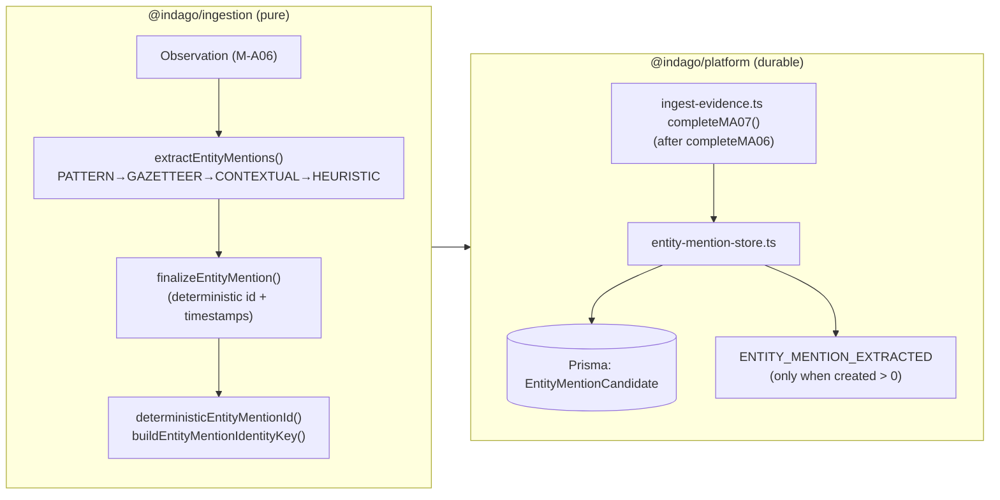
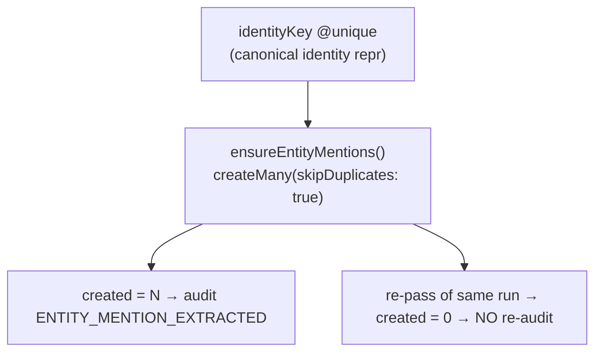

# M-A07: Entity Mention Candidate Generator

> [!warning] STATUS: FUTURE / NOT IMPLEMENTED
> M-A07 generates **entity-like mention candidates only**. It does **NOT**
> resolve, merge, de-duplicate, or link mentions to canonical entities — that
> is Entity Resolution (future). No canonical `Entity` records are created, no
> `EntityId` / `ResolutionScore` is assigned, and no LLM/ML is used anywhere in
> this module.

## Overview

M-A07 is a **pre-resolution entity mention generator**. It answers:

> "WHAT ENTITY-LIKE MENTIONS OCCUR IN THESE SOURCE-SUPPORTED
> OBSERVATIONS, AND WHAT TYPE MIGHT EACH REPRESENT?"

M-A07 turns durable observations (M-A06) into typed or untyped mention
candidates — each grounded to the Observation → Evidence → Artifact provenance
chain, with a deterministic, observation-scoped identity. It is a pure,
deterministic, infrastructure-free module in `@indago/ingestion` (no network,
storage, random, clock, LLM, or ML). The platform persists candidates
**append-only and idempotently**: re-running an ingestion never duplicates rows.

### Explicit M-A07 boundary (enforced)

- Extracts **mentions** only; NEVER creates canonical `Entity` records.
- NEVER assigns `EntityId` / `ResolutionScore`.
- NEVER merges candidates across observations (same name in two observations
  yields two separate candidates).
- NEVER uses LLM / ML / semantic deduplication.
- Deterministic: identical observation ⇒ identical output.

## EntityType v1

`PERSON | ORGANIZATION | LOCATION | PHONE | EMAIL | ACCOUNT | DEVICE | VEHICLE | ADDRESS | OTHER`
(single `EntityTypeSchema` in `@indago/contracts`).

- `entityType` is **nullable** on the durable row. When a mention is
  genuinely uncertain (heuristic fallback), `entityType` is `NULL` — it is
  **never coerced to `OTHER`** (explicit uncertainty, never a false positive).

## ExtractionMethod v1

`PATTERN_MATCH | GAZETTEER_MATCH | CONTEXTUAL_RULE | HEURISTIC_FALLBACK`
(single `ExtractionMethodSchema` in `@indago/contracts`).

## Locked pipeline order

```
PATTERN_MATCH → GAZETTEER_MATCH → CONTEXTUAL_RULE → HEURISTIC_FALLBACK
```

First match wins, document order guaranteed. Only the first 100 drafts are kept
(bounded, deterministic truncation via `ENTITY_MENTION_BOUNDS.maxMentions`);

- **PATTERN_MATCH** — high-precision lexical shapes (e.g. `+91-98765-43210`
  phone, `a@b` email, account/device/vehicle shapes).
- **GAZETTEER_MATCH** — case-folded whole-token lookup. The gazetteer is
  **injected data** (`GazetteerEntry[]` via `EntityMentionExtractorConfig`),
  never hardcoded. Default is the empty gazetteer.
- **CONTEXTUAL_RULE** — nearby category-label context (e.g. a token following
  "Address:" / "Name:" / "A/C").
- **HEURISTIC_FALLBACK** — untyped capitalized token (explicit uncertainty,
  `entityType` left undefined).

## Architecture



## Identity & Dedup

Identity is **observation-scoped and deterministic** over the tuple:

```
(observationId, start, end, entityType, canonicalMatchValue)
```

- `buildEntityMentionIdentityKey(...)` produces the versioned canonical
  identity representation
  (`["indago:entity-mention-candidate", "v1", observationId, start, end, entityType|null, canonicalMatchValue|null]`).
- `deterministicEntityMentionId(...)` = SHA-256 of that key → UUID v4-shaped
  `EntityMentionCandidateId` (satisfies `EntityMentionCandidateIdSchema`).
- The **same tuple always yields the same id** — deterministic across machines,
  retries, and workers. Distinct spans within one observation yield distinct
  ids; the same name in two observations yields two separate candidates.

### Idempotent append-only write



`ENTITY_MENTION_EXTRACTED` (added to `AuditActionSchema`) is audited **only when
`created > 0`** — the append-only audit stays single-value on a successful retry.

## Key Design Decisions

1. **Deterministic, observation-scoped identity.** `EntityMentionCandidateId`
   is a SHA-256 UUID over `(observationId, start, end, entityType,
   canonicalMatchValue)`. This makes MA07 retry-safe and race-safe while
   keeping candidates strictly observation-local (M-A07 never resolves).
2. **`identityKey @unique` gates dedup, not the id.** `createMany(...,
   skipDuplicates: true)` makes a concurrent/retried pass a safe no-op that
   returns `created: 0` — no P2002 handling needed in the store.
3. **`entityType` is nullable, never coerced to `OTHER`.** Explicit uncertainty
   (heuristic fallback) is preserved as `NULL`, so downstream never mislabels
   a guess as a confident `OTHER`.
4. **`canonicalMatchValue` is distinct from surface `text`.** Surface `text`
   is source-faithful; `canonicalMatchValue` is the normalized
   (trimmed/lowercased/single-spaced) string used for future matching — the
   code never rewrites the source mention.
5. **Provenance is inherited verbatim from the Observation.** A mention is a
   span of that same source content — nothing is fabricated.
6. **Pure extractor, clock supplied at persist.** The engine is deterministic
   (no clock); `finalizeEntityMention` receives `nowIso` from the worker,
   mirroring M-A06 `finalizeObservation`.
7. **The gazetteer is injected data.** `createGazetteer(entries)` is pure
   lookup over caller-supplied `GazetteerEntry[]`; the engine hardcodes only
   the empty gazetteer. No gazetteer entries live in algorithm code.
8. **The store never derives identity.** `ensureEntityMentions` persists the
   `identityKey` supplied by the pipeline (built via
   `buildEntityMentionIdentityKey`) — single source of canonical identity.
9. **Candidates are grounded to durable observations.** `observationId` has an
   ON DELETE CASCADE FK to `Observation`; a candidate cannot exist without its
   parent observation (M-A07 grounding rule).
10. **Reads are case-scoped server-side.** `listByObservationIds` filters by
    `investigationId` + `caseId` (resolved server-side by the caller routes);
    an invalid row surfaces loudly (`EntityMentionCandidateSchema.parse`)
    rather than being silently dropped.

## Files

### `@indago/contracts`

| File | Purpose |
|------|---------|
| `src/domain/ids.ts` | `EntityMentionCandidateIdSchema` |
| `src/domain/entity-mention-candidate.ts` | `EntityMentionCandidateSchema` (`.strict()`), `EntityTypeSchema`, `ExtractionMethodSchema` |
| `src/domain/audit-event.ts` | `EntityMentionCandidate`-safe `AuditActionSchema` + `ENTITY_MENTION_EXTRACTED` |

### `@indago/ingestion` (pure mention engine)

| File | Purpose |
|------|---------|
| `src/entity-mention/types.ts` | `EntityMentionDraft`, `EntityMentionExtractionResult`, `ENTITY_MENTION_BOUNDS` |
| `src/entity-mention/entity-mention-id.ts` | `buildEntityMentionIdentityKey`, `deterministicEntityMentionId` |
| `src/entity-mention/pattern-rules.ts` | `matchTypedPatterns`, `CAPITALIZED_NAME_RE` (PATTERN_MATCH stage) |
| `src/entity-mention/gazetteer.ts` | `createGazetteer`, `Gazetteer`, `GazetteerEntry`, `EMPTY_GAZETTEER` (injected-data lookup) |
| `src/entity-mention/contextual-rules.ts` | `classifyByContext` (CONTEXTUAL_RULE stage) |
| `src/entity-mention/heuristic-fallback.ts` | `isPlausibleEntityToken` (HEURISTIC_FALLBACK stage) |
| `src/entity-mention/entity-mention-extractor.ts` | `extractEntityMentions`, `finalizeEntityMention`, `ENTITY_MENTION_IDENTITY_DERIVATION` |
| `src/entity-mention/index.ts` | Barrel exports |

### `@indago/platform` (durable wiring)

| File | Purpose |
|------|---------|
| `src/queue/ingest-evidence.ts` | `completeMA07` runs after `completeMA06`; idempotent (`skipDuplicates` + "extract only when zero durable" slot); audits `ENTITY_MENTION_EXTRACTED` when `created > 0` |
| `src/persistence/entity-mention-store.ts` | `EntityMentionStore`: `ensureEntityMentions`, `countByObservationIds`, `listByObservationIds` |
| `prisma/schema.prisma` | `EntityMentionCandidate` model (`identityKey @unique`, nullable `entityType`, `provenance Json`, FK → `Observation`) |
| `tests/integration/entity-mention-store.test.ts` | 6 tests — dedup second pass, no-merge, scoping, read reassembly, corrupt-row rejection |

> [!warning] STATUS: FUTURE / NOT IMPLEMENTED
> No canonical entity resolution, no `EntityId`/`ResolutionScore`, no candidate
> merging, and no LLM/ML anywhere in this module. Downstream Entity Resolution
> is a separate future work item (M-A08+).

## Verification

| Layer | Result |
|-------|--------|
| `@indago/contracts` typecheck + build | clean |
| `@indago/ingestion` typecheck + build + tests (incl. `tests/entity-mention/entity-mention-extractor.test.ts`, 30 tests) | 435/435 |
| `@indago/platform` typecheck + build + tests (real Neon Postgres + BullMQ + SSE; incl. `tests/integration/entity-mention-store.test.ts`, 7 tests + E2E) | 146/146 |
| DB schema (`db:push`) | pushed to `TEST_DATABASE_URL` (the `EntityMentionCandidate` table now exists) |

Debugging note: `packages/platform/.env` contains two different Neon hosts —
`DATABASE_URL` (used by `db:push`/Prisma CLI) points to one project while
`TEST_DATABASE_URL` points to another. Schema changes for tests must be pushed
with `DATABASE_URL` overridden to the `TEST_DATABASE_URL` value, otherwise the
new table lands in the wrong database and tests fail with a missing-table /
foreign-key error.

---

## Known limitations (accepted for M-A07 freeze)

These are **documented, accepted limitations** of the current implementation.
They are intentionally NOT fixed in M-A07 because none of them change the
contract, data shape, identity scheme, or API. Each is tracked so downstream
milestones (starting with Entity Resolution, M-A08+) can address it.

### L-1: Production worker runs with the empty gazetteer (no injection wiring yet)

`completeMA07` calls the pure extractor with **no gazetteer config**:

```ts
extractEntityMentions(observation); // config omitted → EMPTY_GAZETTEER
```

`IngestionJobPayloadSchema` does **not** yet define an
`entityMentionGazetteer` field, so in production every mention is classified by
**PATTERN / CONTEXTUAL / HEURISTIC** only — **never by gazetteer data**.

- **Impact:** gazetteer typing is dormant in production; the `GAZETTEER_MATCH`
  method is fully implemented, pure, and test-covered, but no platform-supplied
  gazetteer data reaches the worker yet.
- **Why deferred:** the gazetteer is intentionally injected (never hardcoded);
  wiring it requires a data source + payload/repository fields, which is a
  separate data-provisioning milestone, not an M-A07 defect.
- **Resolution path (M-A08+):** add an `entityMentionGazetteer` source/field to
  `IngestionJobPayloadSchema` and pass the resolved entries into
  `extractEntityMentions`'s config. No algorithm change required.

### L-2: Idempotency gate is all-or-nothing per evidence batch (partial-failure risk)

`completeMA07` gates re-extraction on `countByObservationIds(observationIds)`
for the **entire** evidence batch: if **any** candidate is already durable for
that evidence, the whole observation set is skipped.

- **Impact:** under a **partial write failure** (observation A's candidates
  persisted, observation B's insert failed before the batch committed), a
  retry observes `count > 0` and **skips the entire batch — including B**.
  B's candidates would be permanently unproduced.
- **Probability/severity:** low probability (requires a mid-batch partial
  failure), but real. The `createMany(skipDuplicates)` write itself is safe
  (idempotent); only the *gate* is coarse-grained.
- **Resolution path (M-A08+):** bucket the gate per-observation (check each
  observation's durable count independently) rather than once per evidence, or
  derive the "extractable" set from the idempotent write result. Pure worker
  change — no contract/API/data-shape change.

### L-3: `ENTITY_MENTION_EXTRACTED` audit uses `targetType: OBSERVATION` with an artifact id

`completeMA07` audits `ENTITY_MENTION_EXTRACTED` with:

```ts
action: 'ENTITY_MENTION_EXTRACTED',
targetType: 'OBSERVATION',
targetId: artifactId, // ← an artifact id, not an observation id
```

`artifactId` is an **artifact** id, but the `AuditActionSchema` `targetType`
enum currently has no `ARTIFACT` value, so `OBSERVATION` is the closest
available mapping. The description text is artifact-scoped and correct.

- **Impact:** the target type/id pair is semantically inconsistent in the
  audit log (type says observation, id is an artifact). Audit metadata only —
  no effect on extraction or durability.
- **Why deferred:** adds an `ARTIFACT` membership to the `targetType` enum, a
  contract change that M-A07 deliberately avoids; safe to carry without
  breaking the freeze.
- **Resolution path (M-A08+):** add `ARTIFACT` to the audit `targetType` enum
  and set `targetType: 'ARTIFACT', targetId: artifactId` here.

### L-4: No automated test for the `completeMA07` worker path or the L-2 scenario

The extractor is covered by 30 unit tests and the store by 7 integration tests
(including the real extractor → finalize → store → Postgres E2E). However there
is **no** integration test that drives the actual `completeMA07` worker
function end-to-end, and no test exercises the L-2 partial-failure gate.

- **Impact:** the worker's orchestration (read → gate → extract → write →
  audit) is verified by typecheck and inspection, and its extraction + storage
  seams are each covered, but not the assembled worker under a failure.
- **Resolution path (M-A08+):** add a worker-level integration test that seeds
  real observations, runs the MA07 sequence, and asserts the audit + durable
  rows, plus a test that a partial durable set still produces the missing
  observations' candidates (post L-2 fix).

---

## Freeze statement

As audited (§42), M-A07 is **FROZEN WITH DOCUMENTED LIMITATIONS**. The above
four items (L-1…L-4) are accepted and require **no code change** to proceed.
M-A07 may move forward to **Entity Resolution (M-A08+)**.

> [!warning] STATUS: FUTURE / NOT IMPLEMENTED
> These limitations do not expand the M-A07 boundary — the module still never
> creates canonical `Entity` records, assigns `EntityId`/`ResolutionScore`, or
> resolves/merges mentions. They are documentation-grade caveats only.
