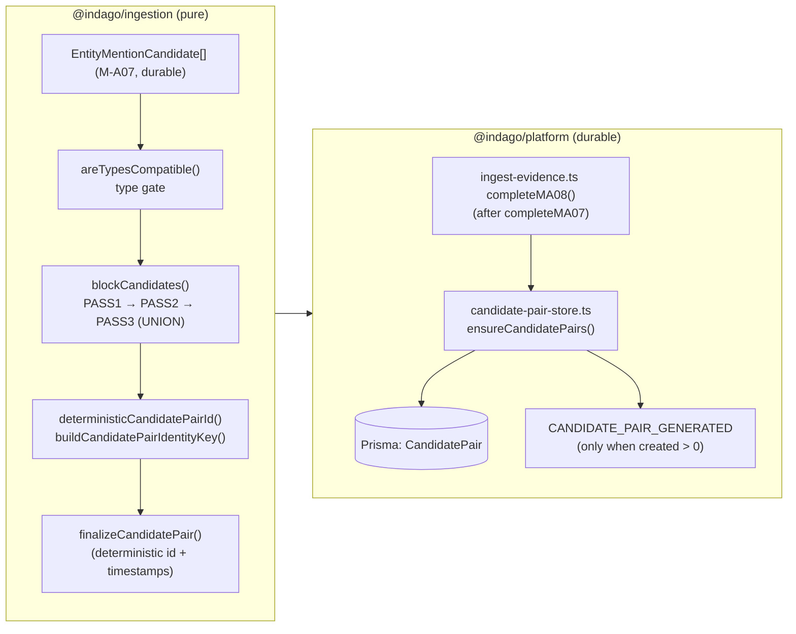
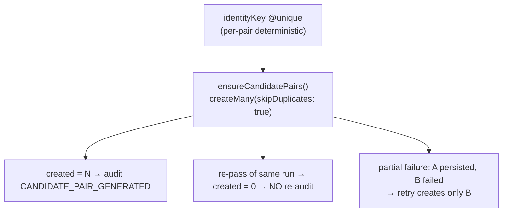

# M-A08: Multi-pass Blocking / Candidate Pair Generation

> [!warning] STATUS: FUTURE / NOT IMPLEMENTED
> M-A08 generates **candidate pairs worth comparing** only. It does **NOT**
> resolve, merge, de-duplicate, or link candidates to canonical entities — that
> is Entity Resolution (M-A09, future). No canonical `Entity` records are
> created, no `EntityId` / `ResolutionScore` is assigned, no
> `EntityHypothesis` is formed, no LLM/ML/fuzzy similarity is used anywhere in
> this module. **M-A09 resolution behavior is NOT implemented.**

## Overview

M-A08 is a **deterministic, same-case-only blocking layer** (PR 1 of 2 of
combined M-A08+M-A09). It consumes M-A07's durable
`EntityMentionCandidate[]` and answers:

> "WHICH CANDIDATES ARE WORTH COMPARING?"

It produces a bounded, deduplicated **comparison universe** — `CandidatePair[]`
— via multiple blocking passes that are **unioned** (not cascaded). It **never**
answers "are these the same entity?" — that is exclusively M-A09.

> **Worth comparing ≠ same entity.** A pair asserts: *given an identical
> strong identifier, or a shared canonical value, or a shared surname initial,
> these two candidates warrant an M-A09 comparison.* It is a positive
> precedence/recall signal, never a match verdict.

## Explicit M-A08 boundary (enforced)

- Pair scope is **v1 `EntityMentionCandidate ↔ EntityMentionCandidate`**
  **only** (same case). No candidate ↔ canonical-Entity path.
- Case scope is **SAME-CASE ONLY**. No cross-case blocking.
  `CrossCaseMatchSchema` is explicitly FUTURE.
- Case sensitivity is **SAME-CASE ONLY** — blocking operates on
  already-normalized, case-folded canonical values. No fuzzy / approximate /
  case-insensitive matching inside blocking.
- **Never** assigns `EntityId` / `ResolutionScore`.
- **Never** creates canonical `Entity` records or `EntityHypothesis`.
- **Never** accepts/rejects a match, merges/splits entities, or builds
  relations/graph/leads.
- **Never** uses ML / LLM / embeddings / fuzzy similarity / semantic
  corroboration.
- Worker consumes **only durable `EntityMentionCandidate` rows** — never re-runs
  MA07, never reads raw `Observation.candidateMentions`.
- Pairs are **unordered**; canonical ordering is deterministic
  `min(a,b)`/`max(a,b)` by candidate id.

## BlockingPass v1

Exactly three discovery passes (`BlockingPassSchema`, verified by test):

| Pass | Key | Semantics |
|------|-----|-----------|
| `EXACT_STRONG_IDENTIFIER` | `strongIdentifierKey` | Identical strong identifier (email/phone canonical value) |
| `EXACT_CANONICAL_VALUE` | `canonicalValueKey` | Identical normalized canonical value |
| `NAME_INITIAL_BLOCK` | `nameInitialKey` | Shared surname initial-derived name block (coarse recall pass) |

### Type compatibility (`areTypesCompatible`)

- same non-null type → compatible
- both `NULL` → compatible
- one typed & one `NULL`, or `OTHER` vs a different type → **incompatible**
- `NULL` / `OTHER` are **never universal matchers**; they only pair where a
  deterministic block key also exists.

### NULL candidates

A `NULL`-typed candidate participates **only** where a deterministic block key is
present (e.g. a `canonicalMatchValue`), keyed `untyped:<value>` so it blocks
**apart** from typed candidates of the same value.

## Architecture



## Identity & Dedup

Pair identity is **deterministic and order-independent** over the unordered,
canonically-ordered candidate-id tuple:

```
(min(leftCandidateId, rightCandidateId), max(leftCandidateId, rightCandidateId), caseId)
```

- `canonicalizePairIds(a, b)` → canonical `{ leftId, rightId }` via deterministic
  lexical ordering (`min`/`max`).
- `buildCandidatePairIdentityKey(...)` produces the versioned canonical identity
  representation
  (`["indago:candidate-pair", "v1", caseId, leftCandidateId, rightCandidateId]`).
- `deterministicCandidatePairId(...)` = SHA-256 of that key → UUID v4-shaped
  `CandidatePairId` (satisfies `CandidatePairIdSchema`).
- **NO `randomUUID`, timestamp, attemptId, or worker execution id** enters the
  identity. Identical (caseId, left, right) always yields the same id —
  deterministic across machines, retries, and workers.
- The **same unordered pair via multiple passes** surfaces as **ONE**
  `CandidatePair` whose `blockingPasses[]` lists **all** passes in
  deterministic order (union, not cascade).

### Idempotent append-only write — per-pair (not whole-batch)



Unlike M-A07's L-2 whole-batch gate, M-A08 has **no batch-level existence gate**.
Dedup is enforced **per-pair** on the `identityKey @unique` column via
`createMany(skipDuplicates: true)`. A partial write therefore self-heals on
retry: if pair A persisted but pair B failed mid-batch, the retry creates only
B — **fixing M-A07's L-2 partial-failure lesson**. A worker-level regression
test covers this exact scenario.

## Block size bound (N² guard)

- `CANDIDATE_PAIR_BOUNDS.maxBlockSize = 50`.
- Any block with **≥ 2 members** enters the pairwise stage and is counted in
  `blocksGenerated`. A block **exceeding** `maxBlockSize` is counted in BOTH
  `blocksGenerated` and `blocksSkippedOversized`, and is **SKIPPED** for that
  pass — never expanded to N² pairs.
- This keeps worst-case work bounded and deterministic regardless of block
  cardinality.

## Same-observation policy

Two candidates from the **same `Observation`** are excluded by default — a
repeated identical mention within one observation is not a meaningful
comparison (no self-corroboration pair). This is controlled by
`BlockingConfig.allowSameObservationPairs` (default `false`).

## Quality metrics

`blockCandidates` returns a `BlockingMetrics` with:

| Metric | Meaning |
|--------|---------|
| `candidatesConsidered` | candidates that entered the blocking pass gate |
| `blocksGenerated` | blocks with ≥ 2 members that entered pairwise stage |
| `blocksSkippedOversized` | blocks skipped because they exceeded `maxBlockSize` (also counted in `blocksGenerated`) |
| `pairsPerPass` | per-pass pair counts (`EXACT_STRONG_IDENTIFIER`, `EXACT_CANONICAL_VALUE`, `NAME_INITIAL_BLOCK`) |
| `uniquePairsAfterUnion` | distinct pairs after multi-pass UNION + exact dedup |
| `rejectedSameObservation` | candidate pairs discarded by the same-observation policy |

## Key Design Decisions

1. **Multi-pass UNION, not cascade.** Same pair reached by more than one pass
   collapses to **one** `CandidatePair` preserving **all** passes in
   deterministic order — richer M-A09 input without duplicate rows.
2. **Deterministic, order-independent id.** SHA-256 over the canonical
   (min/max) candidate-id tuple. Unordered pair semantics with zero chance of
   (A,B) vs (B,A) divergence; retry-safe and race-safe.
3. **`identityKey @unique` gates dedup per-pair.** `skipDuplicates: true` makes
   retries safe no-ops; a partial batch self-heals (fixes M-A07 L-2).
4. **No resolution, ever.** Blocking maximizes recall into a bounded comparison
   universe; M-A09 alone decides identity.
5. **NULL/OTHER are not universal matchers.** Type gate + keyed
   `untyped:<value>` keeps typed and untyped candidates isolated in their own
   blocks.
6. **Oversized blocks are skipped, documented.** Bounding prevents N² explosion;
   skipping is a deliberate, observable recall trade-off surfaced in metrics.
7. **Same-case, same-case-only.** Cross-case and cross-case-insensitivity are
   explicit FUTURE work — the schema/contract leaves room but the engine does
   not stray.
8. **Pure blocking engine, clock supplied at persist.** `blockCandidates` is
   deterministic (no clock, no IO, no Prisma/BullMQ/Redis/network imports);
   `finalizeCandidatePair` receives `nowIso` from the worker.
9. **Audit is single-value on success.** `CANDIDATE_PAIR_GENERATED` (targetType
   `CANDIDATE_PAIR`, added to `AuditActionSchema`) is audited only when
   `created > 0` — matching M-A07's IDEMPOTENT audit discipline.
10. **Worker reads durable candidates only.** `completeMA08` consumes
    `entityMentionStore.listByCase` (case-wide) — the MA07 output, never a
    re-derivation.

## Files

### `@indago/contracts`

| File | Purpose |
|------|---------|
| `src/common/ids.ts` | `CandidatePairIdSchema` |
| `src/domain/candidate-pair.ts` | `BlockingPassSchema` (exactly 3 passes) + strict `CandidatePairSchema` (no score/EntityId/hypothesisId; `left ≠ right` refine) |
| `src/domain/audit-event.ts` | `CANDIDATE_PAIR_GENERATED` action + `CANDIDATE_PAIR` targetType |

### `@indago/ingestion` (pure blocking engine)

| File | Purpose |
|------|---------|
| `src/blocking/types.ts` | `BlockingCandidate`, `CandidatePairDraft`, `CANDIDATE_PAIR_BOUNDS`, `BlockingMetrics`, `BlockingConfig`, `BlockingResult` |
| `src/blocking/blocking-identity.ts` | `buildCandidatePairIdentityKey`, `deterministicCandidatePairId`, `canonicalizePairIds` |
| `src/blocking/blocking-passes.ts` | `areTypesCompatible`, `strongIdentifierKey`, `canonicalValueKey`, `nameInitialKey`, `deriveSurnameInitial` |
| `src/blocking/blocking-engine.ts` | `blockCandidates` — 3-pass UNION via deterministic block grouping; bounded (oversized blocks skipped) |
| `src/blocking/blocking-finalize.ts` | `finalizeCandidatePair` (deterministic id + timestamps supplied by caller) |
| `src/blocking/index.ts` | Barrel exports |

### `@indago/platform` (durable wiring)

| File | Purpose |
|------|---------|
| `src/queue/ingest-evidence.ts` | `completeMA08` runs after `completeMA07`; reads case-wide durable candidates, blocks, finalizes, writes idempotently; audits `CANDIDATE_PAIR_GENERATED` when `created > 0` |
| `src/persistence/candidate-pair-store.ts` | `CandidatePairStore`: `ensureCandidatePairs` (per-pair `skipDuplicates`), `countByCase`, `listByCase`, `rowToPair` |
| `src/persistence/entity-mention-store.ts` | added `listByCase` (case-wide universe read seam) |
| `prisma/schema.prisma` | `CandidatePair` model (`identityKey @unique`, `caseId`, `blockingPasses Json`, FKs → `EntityMentionCandidate`) |
| `tests/integration/candidate-pair-store.test.ts` | 6 tests — deterministic id, per-pair dedup, partial retry, concurrent write, case-scoped read, M-A08 boundary (no EntityId/ResolutionScore) |
| `tests/worker-stub.test.ts` | updated db mock to include `entityMentionCandidate` + `candidatePair`; M-A08 ingestion exports defaulted to no-op so MA05/06/07 completion tests are unchanged |

> [!warning] STATUS: FUTURE / NOT IMPLEMENTED
> No resolution, no canonical `Entity`, no `EntityId` / `ResolutionScore`, no
> `EntityHypothesis`, no fuzzy similarity / LLM / ML anywhere in this module.

## M-A09 handoff

`CandidatePair` is the **comparison universe input** to M-A09. To land M-A09
(PR 2), downstream adds: identity resolution over `CandidatePair.blockingPasses`
voting, `ResolutionScore`, `EntityId` assignment, `EntityHypothesis` creation,
merge/split, and the `EntityResolutionRequest`/`EntityResolutionResult` flows.
M-A08 stops strictly at the pair set. `blockingPasses` is preserved on each pair
so M-A09 can prioritize/preference by discovery pass without re-blocking.

## Verification

| Layer | Result |
|-------|--------|
| `@indago/contracts` typecheck + build + tests (incl. `tests/candidate-pair.test.ts`, 12 tests) | 171/171 (10 files) |
| `@indago/ingestion` typecheck + build + tests (incl. `tests/blocking/blocking-engine.test.ts`, 24 tests) | 459/459 (33 files) |
| `@indago/platform` typecheck + build + tests (real Neon Postgres + BullMQ + SSE; incl. `tests/integration/candidate-pair-store.test.ts`, 6 tests + worker-stub 27) | 152/152 (13 files) |
| `@indago/web` typecheck | clean |
| Static audit | zero `as any` / `@ts-ignore` / `@ts-expect-error` / `console.*`; no `randomUUID` in identity; pure blocking engine has no Prisma / BullMQ / Redis / network imports |

> [!warning] SIDE EFFECT — production schema pushed
> The first `prisma db push` for the M-A08 schema accidentally targeted the
> **production `DATABASE_URL`** (`ep-shy-meadow…ap-southeast-1`) because the
> Prisma CLI auto-loads `.env`. The corrected push targeted the **TEST DB**
> (`ep-sweet-morning…`). The change is additive and non-destructive, but the
> production database now contains the `CandidatePair` table.
> `TEST_DATABASE_URL` must be used for schema changes intended for tests.

---

## M-A08 completion

M-A08 implementation complete. No M-A09 resolution behavior was added.
