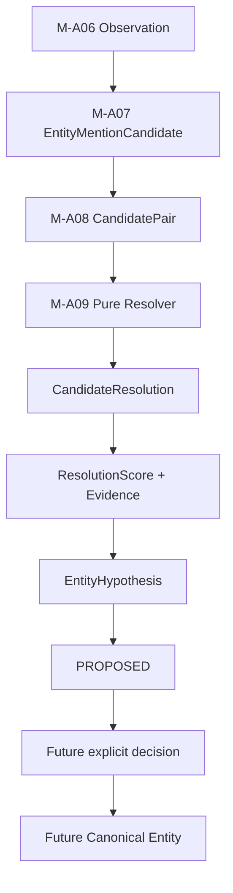
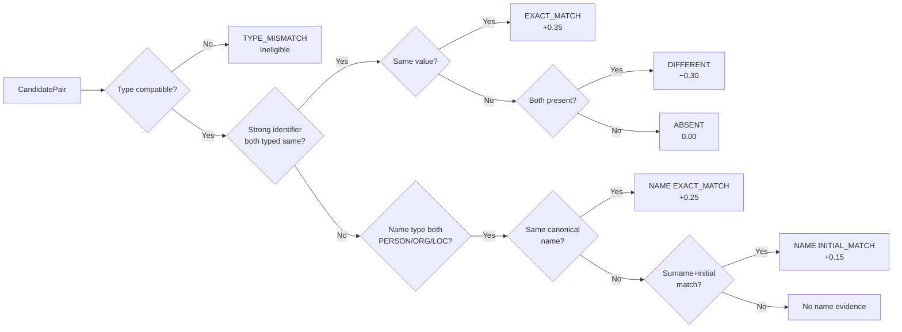
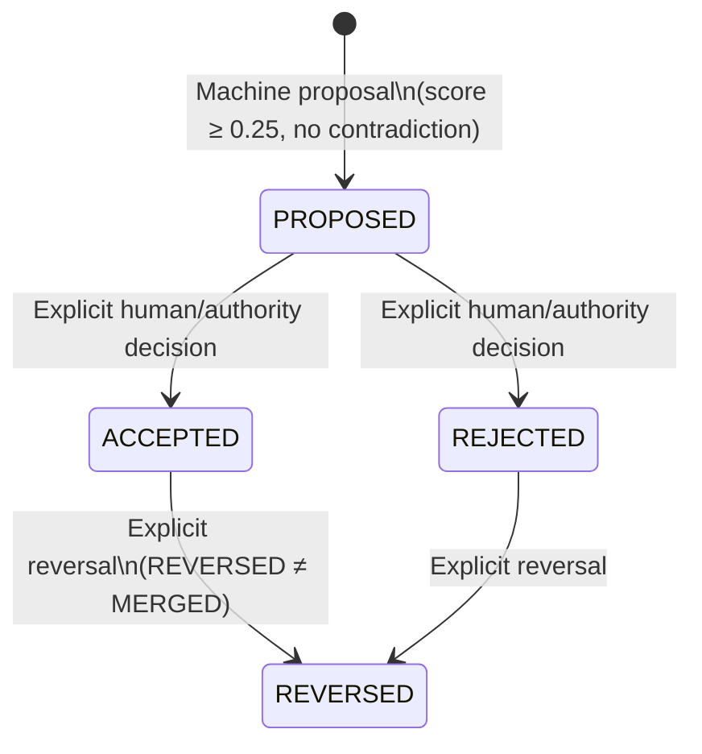

# M-A09: Deterministic Identity-Match Hypothesis Generation

> **Status:** Complete (PR 2/2)
> **Boundary:** CandidatePair → CandidateResolution → EntityHypothesis (PROPOSED)
> **Does NOT:** Create canonical Entity, merge/split, use ML/LLM, resolve across cases

---

## 1. Overview

M-A09 is the deterministic identity-match hypothesis generation stage in the INDAGO evidence pipeline. It consumes durable CandidatePairs (M-A08) and EntityMentionCandidates (M-A07) to produce **reversible, auditable EntityHypotheses** — not irreversible canonical merges.

M-A09 answers: *"How strongly does the available evidence support these candidates representing the same identity, and what reversible hypothesis should be recorded?"*

**Correct terminology:** "deterministic identity-match hypothesis generation" — NOT "automatic entity resolution". The system currently produces PROPOSED hypotheses; it does not make irreversible canonical merge decisions.

---

## 2. Full Resolution Pipeline



**M-A09 stops at G/H.** The future explicit decision (accept/reject/reverse) and canonical entity creation are separate stages.

---

## 3. Input Contract

M-A09 reads only durable rows:

| Source | Table | Identity |
|--------|-------|----------|
| M-A07 EntityMentionCandidate | `EntityMentionCandidate` | deterministic UUID (observationId, span, type, value) |
| M-A08 CandidatePair | `CandidatePair` | deterministic UUID (caseId, leftCandidate, rightCandidate) |

M-A09 does NOT:
- Recreate M-A07 candidates
- Recreate M-A08 pairs
- Parse artifacts
- Call OCR
- Normalize raw data

---

## 4. Comparison and Scoring

### 4.1 Comparison Evidence

The pure resolver (`compareCandidates`) builds a deterministic evidence set from two EntityMentionCandidates:

| Feature | Relation | Weight | Semantics |
|---------|----------|--------|-----------|
| Strong identifier (PHONE/EMAIL/ACCOUNT/DEVICE/VEHICLE/ADDRESS) | EXACT_MATCH | +0.35 | Same normalized identifier on both candidates |
| Canonical name (PERSON/ORG/LOCATION) | EXACT_MATCH | +0.25 | Identical normalized canonical name |
| Name (PERSON only) | INITIAL_MATCH | +0.15 | Surname + first-initial agreement |
| Type | TYPE_COMPATIBLE | 0.00 | Eligibility, not identity evidence |
| Strong identifier | DIFFERENT | −0.30 | Both present with different values — hard contradiction |
| Strong identifier | ABSENT (LEFT/RIGHT/BOTH) | 0.00 | Missing data is NOT contradiction |



### 4.2 Scoring Model v1

**Model version:** `indago:resolution-score:v1`

```
raw = baseline(0) + Σ positive weights − Σ contradiction weights
score = clamp(raw, 0, 1)
```

| Weight | Value | Justification |
|--------|-------|---------------|
| baseline | 0 | Surviving blocking is eligibility, not identity evidence |
| strongIdentifierExactMatch | +0.35 | Normalized high-quality identifier being identical is the strongest signal |
| canonicalNameExactMatch | +0.25 | Identical normalized name is strong but less unique than an identifier |
| nameInitialAgreement | +0.15 | Surname + first-initial agreement is moderate evidence |
| typeCompatibility | 0.00 | Being type-compatible proves nothing about identity |
| hardContradiction | −0.30 | Mutually exclusive strong identifiers argue against identity |

**Score semantics:** ResolutionScore is a **ranking/support signal**, NOT a calibrated probability. A high score creates PROPOSED, never auto-ACCEPTED.

### 4.3 Comparison Status

| comparisonStatus | When |
|-----------------|------|
| COMPARED_AND_UNRESOLVED | Default — compared, but no canonical identity decision made |
| RESOLVED_NON_MATCH | Hard contradiction present (both sides carry different strong identifiers) |

### 4.4 Hypothesis Status

| status | When |
|--------|------|
| PROPOSED | Score ≥ 0.25 AND no hard contradiction — positive identity proposition |
| UNRESOLVED | Score < 0.25 — low evidence, no positive proposition manufactured |
| CONTRADICTED | Hard contradiction present — deterministic negative determination |

**Critical invariant:** Score NEVER auto-accepts. High score → PROPOSED at most.

---

## 5. Hypothesis Model

### 5.1 Contract (EntityHypothesisSchema)

```
EntityHypothesis {
  id                    UUID (deterministic)
  caseId                UUID (case scope)
  investigationId       UUID? (optional investigation scope)
  candidatePairId       UUID (FK → CandidatePair)
  entityId              UUID? (future Entity↔Entity flow, NULL in v1)
  resolvedEntityId      UUID? (future canonical Entity link, NULL in v1)
  supportingCandidateIds  EntityMentionCandidateId[] (positive identity evidence)
  comparisonStatus      EntityComparisonStatus
  score                 ResolutionScore [0,1]
  scoreModelVersion     string (e.g. "indago:resolution-score:v1")
  status                EntityResolutionStatus (lifecycle)
  supportingObservationIds     ObservationId[] (positive evidence)
  contradictingObservationIds  ObservationId[] (contradiction evidence)
  provenance            ProvenanceSchema
  createdAt             ObservedTime
  updatedAt             ObservedTime
  metadata              MetadataSchema?
}
```

### 5.2 Hypothesis Identity

Deterministic — same pair + same model version = one logical hypothesis:

```
candidatePairId + scoreModelVersion
    → canonical JSON serialization
    → SHA-256
    → deterministic UUID v4
```

Different score model version (future v2) → different hypothesis ID (new version, not silent overwrite).

### 5.3 Prisma Model

```prisma
model EntityHypothesis {
  id                          String   @id        // deterministic UUID
  identityKey                 String   @unique    // exact-dedup guard
  caseId                      String
  investigationId             String?
  candidatePairId             String              // FK → CandidatePair
  entityId                    String?             // NULL in v1
  resolvedEntityId            String?             // NULL in v1
  status                      String              // lifecycle
  comparisonStatus            String              // comparison result
  score                       Float               // [0,1]
  scoreModelVersion           String
  supportingCandidateIds      Json                // EntityMentionCandidate IDs
  supportingObservationIds    Json                // positive evidence observations
  contradictingObservationIds Json                // contradiction observations
  provenance                  Json
  metadata                    Json?
  createdAt                   DateTime @default(now())
  updatedAt                   DateTime @updatedAt

  candidatePair CandidatePair @relation(fields: [candidatePairId], references: [id], onDelete: Cascade)

  @@index([caseId])
  @@index([investigationId, caseId])
  @@index([candidatePairId])
  @@index([status])
}
```

---

## 6. Hypothesis Lifecycle



**Reversibility:** REVERSED changes status and records audit history. It does NOT delete the hypothesis row. REVERSED ≠ MERGED (MERGED is future canonical-entity merge semantics).

**Machine vs Human state:**
- `score` and `comparisonStatus` come from the pure resolver
- `status` represents hypothesis lifecycle/authority
- Machine produces only PROPOSED; ACCEPTED/REJECTED/REVERSED are authority states

---

## 7. Supporting and Contradicting Observations

### Supporting Observations
Only genuine **positive identity evidence**:
- EXACT_MATCH on strong identifier → both candidate observations are supporting
- EXACT_MATCH on canonical name → both candidate observations are supporting
- INITIAL_MATCH on name → both candidate observations are supporting

### Contradicting Observations
Only **explicit mutually-exclusive identity evidence**:
- DIFFERENT strong identifier (both present, different values) → both candidate observations are contradicting

### Non-Overlap Invariant
`intersection(supportingObservationIds, contradictingObservationIds)` is **empty** by construction. A genuinely positive comparison has an empty contradicting set; a hard contradiction has an empty supporting set.

### ABSENT ≠ DIFFERENT
- ABSENT (one or both sides lack a feature) → 0 weight, never contradiction
- DIFFERENT (both carry different values for same strong identifier) → −0.30 contradiction

---

## 8. Persistence

### 8.1 EntityHypothesisStore

Location: `packages/platform/src/persistence/entity-hypothesis-store.ts`

| Method | Purpose |
|--------|---------|
| `upsertHypothesis()` | Idempotent, lifecycle-preserving write |
| `findById()` | Case-scoped read by deterministic ID |
| `findByCandidatePair()` | Case-scoped read by CandidatePair + optional scoreModelVersion |
| `listByCase()` | List all hypotheses within case boundaries |
| `countByCaseAndStatus()` | Metrics/audit count |

### 8.2 Idempotency

`identityKey @unique` ensures same candidatePairId + scoreModelVersion maps to exactly ONE row. A retried MA09 pass converges to the existing row — never a duplicate.

### 8.3 Lifecycle Preservation

If an existing hypothesis has status ACCEPTED / REJECTED / REVERSED:
- A reprocessing pass does NOT reset it to PROPOSED
- Only machine fields (score, comparisonStatus, evidence, updatedAt) are refreshed
- Authority/lifecycle state is preserved verbatim

If status is PROPOSED / UNRESOLVED / CONTRADICTED:
- The row is refreshed to reflect the recomputed machine result

### 8.4 No CandidateResolution Table

CandidateResolution is a **pure intermediate engine result** and is NOT persisted. Only CandidatePair (source) and EntityHypothesis (output) are durable.

---

## 9. Worker Integration

### 9.1 Pipeline Sequence

```
completeMA06() → observations
completeMA07() → EntityMentionCandidates
completeMA08() → CandidatePairs
completeMA09() → EntityHypotheses
```

### 9.2 completeMA09() Behavior

1. Load all durable CandidatePairs for the case
2. For each pair, load left + right EntityMentionCandidate
3. Verify consistency (same case, both exist, not self-pair)
4. Call `compareCandidates()` (pure engine)
5. If PROPOSED: persist EntityHypothesis, then audit
6. If UNRESOLVED/CONTRADICTED: skip (no durable proposition)

### 9.3 Per-Pair Idempotency

**Critical:** No whole-batch skip gate. Each pair is processed independently:
- Pair A with existing hypothesis → skip only A
- Pair B without hypothesis → process B
- Retry after partial failure recovers only missing hypotheses

### 9.4 Partial Failure

Pair A succeeds, Pair B fails → retry → A remains one hypothesis, B gets processed. No contamination.

### 9.5 Durable-State-First Audit

```
compute CandidateResolution
    ↓
persist EntityHypothesis
    ↓
emit audit event (actual EntityHypothesis.id as target)
```

Never emit audit before the row exists.

---

## 10. Audit Events

| Event | When | Target |
|-------|------|--------|
| ENTITY_RESOLUTION_PROPOSED | Fresh hypothesis created | EntityHypothesis.id |

On a preserved authority state (ACCEPTED/REJECTED/REVERSED), no duplicate proposal event is emitted.

---

## 11. Case Isolation

- `left.caseId === right.caseId === pair.caseId === hypothesis.caseId`
- Investigation IDs must remain consistent
- Cross-case resolution: NOT IMPLEMENTED (future scope)

---

## 12. Provenance

```
EntityHypothesis
    ↓
CandidatePair
    ↓
EntityMentionCandidate A / B
    ↓
Observation A / B
    ↓
Evidence
    ↓
Artifact
```

Provenance on the hypothesis is inherited from the in-pair candidates — never fabricated.

---

## 13. Known Limitations

1. **v1 resolves Candidate↔Candidate only.** Canonical Entity persistence is not an active resolution target.
2. **No cross-case resolution.** CrossCaseMatch is future scope.
3. **No ML/LLM.** No embeddings, no fuzzy matching, no neural networks.
4. **No semantic contextual enrichment.** A separate PHONE candidate does not enrich a PERSON candidate's resolution.
5. **Deterministic heuristic score is not calibrated probability.** ResolutionScore is a ranking signal.
6. **Source type is not an implicit scoring multiplier.** FIR/CDR/FINANCIAL source types do not affect score.
7. **No Candidate↔Entity resolution.** entityId and resolvedEntityId remain NULL in v1.

---

## 14. Future Paths

| Path | Description |
|------|-------------|
| Candidate↔Entity resolution | High-scoring hypotheses may eventually link candidates to canonical Entities |
| ML/LLM scoring | Future score model versions (v2, v3) may use learned models |
| Cross-case resolution | Future CrossCaseMatch for investigations sharing entities |
| Human decision endpoints | ACCEPT/REJECT/REVERSE mutation API for hypothesis lifecycle |
| Canonical Entity merge | MERGED status is future scope, separate from REVERSED |
