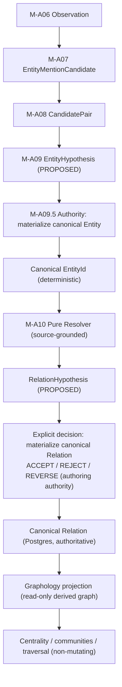
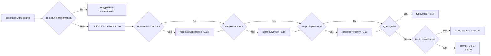
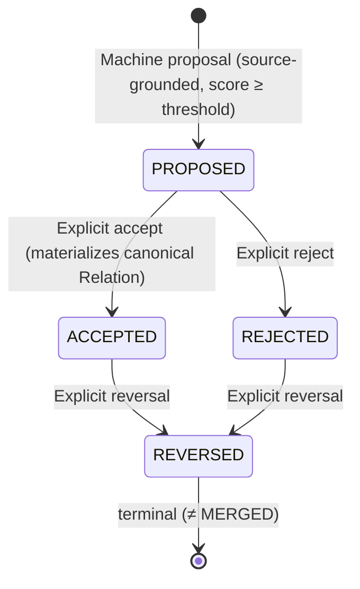
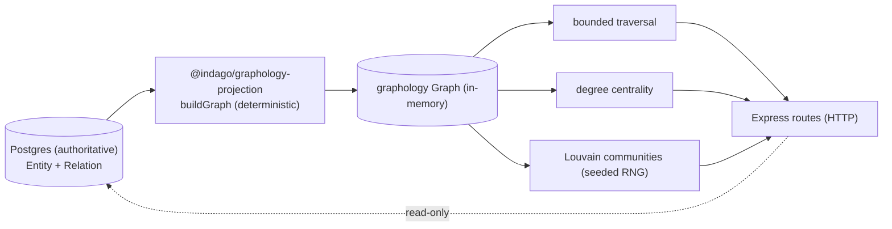

# M-A10: Deterministic Source-Grounded Relation Resolution (RelationHypothesis)

> **Status:** Complete
> **Boundary:** canonical EntityIds → RelationHypothesis (PROPOSED) → canonical Relation (ACCEPTED/REJECTED/REVERSED — the explicit authoring authority)
> **Authority:** PostgreSQL is the single source of truth; Graphology is a read-only derived projection.
> **Does NOT:** generate blind/unsourced relations, auto-accept, use Neo4j/Cypher/Bolt, run ML/LLM/embeddings/vector/fuzzy/semantic similarity at runtime, treat mention/pair/hypothesis ids as EntityIds.

---

## 1. Overview

M-A10 is the source-grounded, deterministic, **reversible** relation-resolution stage. It consumes **canonical Entities** (materialized through the explicit M-A09.5 identity-decision boundary) and **durable Observations** to produce `RelationHypothesis` rows that are:

- **Source-grounded** — every relation hypothesis is backed by at least one real Observation basis; M-A10 never proposes a relation from blind pair generation or graph proximity alone.
- **Deterministic** — a RelationHypothesisId is a stable SHA-256-derived UUID from `sourceEntityId + targetEntityId + relationType + scoreModelVersion`, so re-runs converge to one logical row.
- **Reversible** — the lifecycle is `PROPOSED → ACCEPTED/REJECTED → REVERSED`; `REVERSED ≠ MERGED`. A re-run never resets an authority lifecycle state.
- **Explicitly authored** — an authority-boundary (route) materializes a `PROPOSED` hypothesis into a canonical `Relation` via accept/reject/reverse. The canonical `Relation` is the authoring source of truth; machine scores only ever produce `PROPOSED`.
- **Graph-projectable** — accepted relations are projected into a `graphology` graph derived **from** authoritative Postgres; analytics never mutate domain data.
- **Directionality-aware** — a `directed` flag (authoritative `RELATION_DIRECTION`) governs edge orientation and the analytics that run on the projection.

**Correct terminology:** this stage produces **relation hypotheses**, not assertions of ground truth. High scores create `PROPOSED` at most — never auto-`ACCEPTED`.

---

## 2. Resolution Pipeline



**M-A10 consumes only canonical `EntityId`s.** `EntityMentionCandidateId`, `CandidatePairId`, and other hypothesis ids are **never** accepted as an EntityId. The pure resolver operates strictly downstream of canonical-entity materialization.

---

## 3. Input Contract

M-A10 reads only durable rows:

| Input | Table | Identity |
|-------|-------|----------|
| Canonical Entity (source) | `Entity` | deterministic canonical `EntityId` |
| Canonical Entity (target) | `Entity` | deterministic canonical `EntityId` |
| Observation evidence | `Observation` | `ObservationId[]` (evidenceBasis / contradictions) |

M-A10 does NOT:
- Generate pairs blindly across the graph.
- Produce relations from graph proximity alone.
- Call ML/LLM/embeddings/vector/fuzzy/semantic similarity at runtime.
- Treat `EntityMentionCandidateId`, `CandidatePairId`, or any hypothesis id as an EntityId.

---

## 4. Source Grounding

Every proposed relation is grounded in real Observation evidence. The resolver indexes durable Observations by canonical entity and compares them:

- **Direct co-occurrence** — a source and target appear together in the same Observation (evidenceBasis).
- **Repeated appearance** — the same pair recurs across multiple Observations.
- **Source diversity** — evidence spans multiple distinct EvidenceSource rows.
- **Temporal proximity** — Observations are close in `observedAt`.

Contradiction is only recorded from **explicitly mutually-exclusive** evidence (e.g. incompatible values in the same source), not from a feature being absent.

**Contradiction flows end-to-end.** The worker (`completeMA10` in `packages/platform/src/queue/ingest-evidence.ts`) sources each hypothesis's durable `contradictions` and threads it as `RelationResolutionInput.explicitContradictions?: ReadonlySet<string>` through `resolveRelationsForCase` → `resolveRelationPair`. A `hardContradiction` applies `−0.25` (e.g. `0.50 → 0.25` on a single-source, no-timestamp co-occurrence) and the persisted `contradictions` array carries **precisely** the contradicting `ObservationId`s — never the whole `evidenceBasis`. A contradiction observation legitimately appears in `evidenceBasis` because it is both a co-occurrence **and** the flagged contradiction; precision is proven by `contradictions === [<contradicting obsId>]`.

**No blind generation:** a relation hypothesis is only proposed when there is a real evidenceBasis. Graph proximity alone is never a relation signal.

---

## 5. Scoring Model v1

**Model version:** `indago:relation-score:v1`

```
raw = baseline(0)
     + directCoOccurrence(+0.20)
     + repeatedAppearance(+0.15)
     + sourceDiversity(+0.10)
     + temporalProximity(+0.10)
     + typeSignal(+0.15)
     − hardContradiction(−0.25)
score = clamp(raw, 0, 1)
```

| Feature | Weight | Semantics |
|---------|--------|-----------|
| baseline | 0 | No evidence is no signal |
| directCoOccurrence | +0.20 | Source and target co-occur in an Observation |
| repeatedAppearance | +0.15 | Pair recurs across multiple Observations |
| sourceDiversity | +0.10 | Evidence spans multiple distinct sources |
| temporalProximity | +0.10 | Observations are temporally close |
| typeSignal | +0.15 | Entity types / observation type align with the relation type |
| hardContradiction | −0.25 | Explicitly mutually-exclusive evidence |

**Score semantics:** `support` is a **ranking signal**, not a calibrated probability. High score → `PROPOSED` at most.



---

## 6. Relation Type Classification

The relation type is drawn **only** from the `RelationTypeSchema` vocabulary:

`communication, financial, ownership, co-location, association, organizational, transport, family, vehicle, case-link, other`

- An **explicit** association signal (same organization, repeated co-occurrence with shared context) maps to the concrete type.
- A **generic co-occurrence** with no explicit association evidence maps to **`other`** — never an invented type.

---

## 7. Lifecycle



**Two layers of lifecycle.** The `RelationHypothesis` carries `PROPOSED` (machine proposal, always by score). The explicit decision boundary **materializes accepted/rejected `PROPOSED` hypotheses into a canonical `Relation`** whose own lifecycle is `ACCEPTED → REVERSED` / `REJECTED → REVERSED`:
- `RELATION_CREATED` fires once when a `PROPOSED` hypothesis is accepted into a durable canonical Relation.
- `RELATION_REVERSED` fires for reversal; `RELATION_RESOLUTION_PROPOSED` fires only for a fresh `PROPOSED` row (there is no separate accept/reject payload mutation — the authority action IS the lifecycle transition).

**Repeat / terminal authority decisions are refused.** A canonical Relation in `ACCEPTED`/`REJECTED`/`REVERSED` is never silently reset to `PROPOSED`, and `REVERSED` is terminal (not `MERGED`). `materializeCanonicalRelationFromAcceptedHypothesis` only accepts from `PROPOSED`. `preservedExisting:true` denotes a preserved authority state; a machine-refreshed `PROPOSED` row reports `reusedExisting:true, preservedExisting:false`.

**Reversibility:** REVERSED updates the status and records audit history; it does not delete the row. **REVERSED ≠ MERGED.**

**Lifecycle preservation on re-run:** a re-run of the same logical pair/version MUST NOT reset an existing `ACCEPTED`/`REJECTED`/`REVERSED` hypothesis back to `PROPOSED`. When a row already exists in an authority state, the store keeps the lifecycle status untouched and refreshes only the pure machine fields (score/evidence/metrics).

---

## 8. Deterministic Hypothesis Identity

```
sourceEntityId + targetEntityId + relationType + scoreModelVersion
    → canonical JSON serialization (lexicographically ordered source < target)
    → SHA-256
    → deterministic UUID v4
```

- Canonical ordering collapses the unordered pair to one identity.
- Same pair + type + model version across passes/retries/workers → the **same** `RelationHypothesisId`.
- Different score model version → different hypothesis id (a new version, not a silent overwrite).

---

## 9. Persistence Model

### 9.1 Contract (RelationHypothesisSchema)

```
RelationHypothesis {
  id                UUID (deterministic)
  caseId            UUID (case scope)
  investigationId   UUID? (optional investigation scope)
  sourceEntityId    UUID (canonical EntityId — NEVER a mention/pair id)
  targetEntityId    UUID (canonical EntityId — NEVER a mention/pair id)
  relationType      RelationTypeSchema value
  support           Float [0,1] (ranking signal, not probability)
  evidenceBasis     ObservationId[] (supporting observations)
  contradictions    ObservationId[] (may be empty)
  status            RelationStatus lifecycle value
  scoreModelVersion string
  evidenceCount     int
  evidenceStrength  Float
  sourceCoverage    Float
  temporalCoverage  Float
  directed          boolean
  provenance        ProvenanceSchema
  metadata          MetadataSchema?
  createdAt         DateTime
  updatedAt         DateTime
}
```

### 9.2 Prisma Model

```prisma
model RelationHypothesis {
  id                String   @id // deterministic UUID (SHA-256 of identityKey)
  identityKey       String   @unique // versioned canonical identity — exact-dedup guard
  caseId            String
  investigationId   String?
  sourceEntityId    String   // canonical Entity.id — NEVER a mention/pair ID
  targetEntityId    String   // canonical Entity.id — NEVER a mention/pair ID
  relationType      String   // RelationTypeSchema value
  support           Float    // [0,1] ranking signal, NOT probability
  evidenceBasis     Json     // ObservationId[]
  contradictions    Json     // ObservationId[] (may be [])
  status            String   // RelationStatus lifecycle value
  scoreModelVersion String
  evidenceCount     Int      @default(0)
  evidenceStrength  Float    @default(0)
  sourceCoverage    Float    @default(0)
  temporalCoverage  Float    @default(0)
  directed          Boolean  @default(true)
  provenance        Json
  metadata          Json?
  createdAt         DateTime @default(now())
  updatedAt         DateTime @updatedAt

  @@index([caseId])
  @@index([investigationId, caseId])
  @@index([sourceEntityId])
  @@index([targetEntityId])
  @@index([status])
}
```

### 9.3 RelationHypothesisStore

Location: `packages/platform/src/persistence/relation-hypothesis-store.ts`

| Method | Purpose |
|--------|---------|
| `upsertHypothesis()` | Idempotent, lifecycle-preserving write |
| `findById()` | Case-scoped read by deterministic ID |
| `listByCase()` | List within case boundaries |
| `listByCaseAndStatus()` | List by lifecycle status |
| `listByEntity()` | Hypotheses involving an entity (source or target) |
| `countByCaseAndStatus()` | Metrics/audit count |
| `updateStatus()` | Authority transitions (ACCEPT/REJECT/REVERSE) |

### 9.4 Idempotency

`identityKey @unique` maps the same logical pair/type/model to exactly one row. A retried MA10 pass converges to the existing row — never a duplicate.

---

## 10. Authority Boundary (M-A09.5)

The explicit entity decision boundary materializes a `PROPOSED` EntityHypothesis into a canonical Entity:

Location: `packages/platform/src/entities/entity-materialization.ts`

- Only a `PROPOSED` hypothesis in the current case may be accepted.
- A non-PROPOSED (already ACCEPTED/REJECTED/REVERSED) hypothesis is refused — never clobbered.
- The canonical `EntityId` is deterministic from `caseId + canonicalName + entityType`.
- Re-accepting the same logical entity converges (identityKey `@unique`) — no duplicate entities.

M-A10 consumes these real, persisted EntityIds downstream.

---

## 10b. Relation Decision Authority (accept / reject / reverse)

The explicit **relation** decision boundary materializes a `PROPOSED` RelationHypothesis into a canonical `Relation`:

Location: `packages/platform/src/relations/relation-store.ts`, `packages/platform/src/relations/relation-materialization.ts`

- **Accept** — only a `PROPOSED` hypothesis may become a canonical `Relation`; the canonical `relationKey` is derived from `sourceEntityId + targetEntityId + relationType + directed`, and re-accepting converges (identity `@unique`) — no duplicates.
- **Reject / Reverse** — reject moves `PROPOSED → REJECTED`; reverse moves `ACCEPTED/REJECTED → REVERSED`. Repeat and terminal transitions are refused (only `PROPOSED` may be materialized; `REVERSED` is terminal).
- **Lifecycle preservation on re-run** — a re-run of the same logical pair/version never resets an existing `ACCEPTED`/`REJECTED`/`REVERSED` canonical Relation or hypothesis back to `PROPOSED`; authority state is preserved and only the pure machine fields refresh.
- **Graphology reads these canonical `Relation` rows** — the graph runtime lists ACTIVE (`ACCEPTED`) relations; `REVERSED` and `PROPOSED` rows are excluded from the projection.

---

## 11. Audit Events

The following audit actions are persisted in `AuditActionSchema`:

| Action | When |
|--------|------|
| `RELATION_RESOLUTION_PROPOSED` | A fresh PROPOSED relation hypothesis row is proposed (no dedicated accept/reject payload action — transitions ARE the authority) |
| `RELATION_CREATED` | A PROPOSED hypothesis is accepted into a durable canonical Relation |
| `RELATION_REVERSED` | A canonical Relation is reversed (ACCEPTED/REJECTED → REVERSED, terminal) |
| `RELATION_CONTRADICTED` | A relation is contradicted |
| `ENTITY_HYPOTHESIS_ACCEPTED` | An entity hypothesis is accepted |
| `ENTITY_CREATED` | A canonical Entity is created |

**Discipline:** the audit target MUST be the actual `RelationHypothesis.id` / canonical `Relation.id`; persist the row first, then emit the audit event.

---

## 12. Graphology Projection (& Trade-Off Statement — §77)

This milestone **swaps** the graph runtime from Neo4j to an in-memory, deterministic projection over authoritative Postgres.

### §77 Tech-Swap Statement

> **Decision:** INDAGAO's M-A10 graph analytics no longer depend on Neo4j / Cypher / Bolt / AuraDB. The Graphology projection layer (`@indago/graphology-projection`) reads the authoritative `Postgres` `RelationHypothesis` + `Entity` rows and builds a read-only `graphology` graph at runtime. Analytics (bounded traversal, deterministic degree centrality, Louvain community detection with a seeded/LCG RNG) operate on that in-memory projection and **never mutate domain data**. PostgreSQL remains the single source of truth.

The swap removes external graph-database infrastructure, its operational burden, and its drift risk, while preserving the projection's determinism and reversibility. No Cypher, no Bolt driver, no Aura provisioning.

### 12.1 Projection Rules

- **Nodes** = canonical Entities (from `Entity`).
- **Edges** = **accepted** relations only (canonical `Relation.status = ACCEPTED`; `REVERSED`/`PROPOSED` excluded).
- **Direction** = `directed` flag on the relation (authoritative `RELATION_DIRECTION`). Directed types: `ownership, organizational, transport, family, vehicle`; undirected: `communication, financial, co-location, association, case-link, other`.
- **Bounds** — `GRAPH_PROJECTION_BOUNDS`: `maxNodes` 50,000, `maxEdges` 500,000.
- **Traversal** — `TRAVERSAL_BOUNDS`: `maxHops` 4, `maxPaths` 1,000, cycle-safe; respects `graph.isDirected`.
- **Determinism** — degree centrality is deterministic; community detection uses a seeded LCG RNG so re-runs yield stable partitions (Louvain runs on the undirected-collapsed derivative).
- **Read-only** — analytics never write back to Postgres domain tables.

### 12.2 Runtime Wiring (HTTP)

Location: `packages/platform/src/relations/graph-runtime.ts`, `packages/platform/src/api/routes.ts`

A DI-able `GraphRuntime({ entities, relations })` loads a case-scoped projection (`loadCaseProjection`) from the authoritative stores and exposes four bounded, read-only operations served over real HTTP routes (all case-isolated via `verifyCaseAccess`):

| Route | Operation | Query |
|-------|-----------|-------|
| `GET /investigations/:id/graph` | node + ACTIVE-edge projection | — |
| `GET /investigations/:id/graph/traversal` | bounded N-hop, cycle-safe traversal | `startEntityId`, `hops`, `maxPaths` |
| `GET /investigations/:id/graph/centrality` | deterministic degree centrality | `maxResults` |
| `GET /investigations/:id/graph/communities` | deterministic Louvain coverage | — (server derives caseId) |

The runtime is a **module singleton bound to the app `db`** for production routes; integration tests inject test-DB-backed stores into `GraphRuntime` directly so they never read the app database. 404 (nonexistent investigation) and 401/403 (missing/invalid auth header via `requireAuth`) guards are enforced on the routes.



---

## 13. Future Neo4j Seam — §82

The swap is **reversible by design**. M-A10 keeps a clean seam so that a future graph database (e.g. Neo4j) can be introduced without changing the M-A10 feature set or output contracts.

### §82 Future Neo4j Seam

> The `@indago/graphology-projection` package defines a narrow projector interface: ingest authoritative relation rows → emit a deterministic, bounded graph. If a future milestone reintroduces Neptune/Neo4j, only the projector's **backing store** changes (a new adapter maps the same deterministic relation rows onto the external graph), while: (1) the `RelationHypothesisSchema` output contract is unchanged, (2) Postgres remains the source of truth, (3) the same traversal/centrality/community results can be reproduced from Postgres for verification. The external graph, if ever added, is a **derived read-only projection**, never the authority, and domain data is never mutated through it.

---

## 14. Implementation Surface

| Package / File | Responsibility |
|----------------|----------------|
| `packages/intelligence/relation-resolution/` | Pure resolver, scoring (v1), classification, deterministic identity |
| `packages/intelligence/graphology-projection/` | Deterministic graph projection + analytics (traversal, centrality, Louvain) |
| `packages/intelligence/entity-resolution/src/canonical-entity-identity.ts` | Deterministic canonical EntityId / identityKey |
| `packages/platform/src/persistence/entity-hypothesis-store.ts` | `markAccepted` (binds canonical EntityId) |
| `packages/platform/src/persistence/entity-mention-store.ts` | `findByIds` read seam |
| `packages/platform/src/persistence/entity-store.ts` | Idempotent canonical Entity materialization |
| `packages/platform/src/persistence/relation-hypothesis-store.ts` | Durable RelationHypothesis reads/writes |
| `packages/platform/src/persistence/relation-store.ts` | Canonical Relation persistence (`listActiveByCase`, `markReversed`) |
| `packages/platform/src/relations/relation-materialization.ts` | M-A10 relation authority (accept/reject/reverse) |
| `packages/platform/src/relations/graph-runtime.ts` | DI-able `GraphRuntime` + `loadCaseProjection` loading canonical Entities/Relations |
| `packages/platform/src/entities/entity-materialization.ts` | M-A09.5 authority boundary |
| `packages/platform/src/queue/ingest-evidence.ts` | Worker `completeMA10` wiring + audit + `explicitContradictions` threading |
| `packages/platform/src/api/routes.ts` | Accept/reject/reverse relation routes + four Graphology HTTP endpoints |

---

## 15. Verification

- **Contracts** — 181/181 tests across 11 files (RelationTypeSchema, RelationHypothesisSchema, audit actions) + typecheck clean.
- **entity-resolution** — 32 tests (incl. deterministic canonical EntityId).
- **relation-resolution** — 37/37 tests (score combos, hard contradiction, deterministic id, directionality-aware identity) + typecheck clean.
- **graphology-projection** — 11/11 tests (node/edge projection, directed/undirected structure, bounds, traversal, centrality, Louvain determinism) + typecheck clean.
- **platform typecheck** — exit 0.
- **platform unit** — 100/100 (worker-stub durable ingest-evidence incl. M-A10 implication + recovery + upload + auth).
- **platform integration (real Postgres, `TEST_DATABASE_URL`)** — 28/28 across four suites:
  - **m-a10-relation (14)** — accept/reject/reverse authority, transition guards, repeat/terminal refusal, identity convergence, directionality-aware identity, lifecycle preservation.
  - **m-a10-contradiction (2)** — hardContradiction −0.25 (0.50 → 0.25), precise persisted `contradictions` provenance, single durable idempotent row (`reusedExisting:true`).
  - **m-a10-graph (6)** — node/edge counts, REVERSED/PROPOSED exclusion, bounded cycle-safe traversal, degree centrality, deterministic Louvain coverage, case isolation (via DI-able `GraphRuntime`).
  - **m-a10-graph-http (6)** — the four Graphology express routes over the real API (`graph`, `graph/traversal`, `graph/centrality`, `graph/communities`) + 404 nonexistent investigation + 401/403 auth guard.

Tests gated on an explicitly-set `TEST_DATABASE_URL`; they never target production `DATABASE_URL`.

---

## 16. Completion

M-A10 implementation complete. Canonical relation hypotheses are source-grounded, reversible, PostgreSQL-authoritative, and projected into Graphology without changing the original M-A10 feature set or output contracts. The four audit blockers — relation directionality, relation decision authority, contradiction flow through the worker, and Graphology runtime wiring — are resolved and evidenced end-to-end (real Postgres integration 28/28, contracts 181/181, unit 100/100, all typechecks clean).
