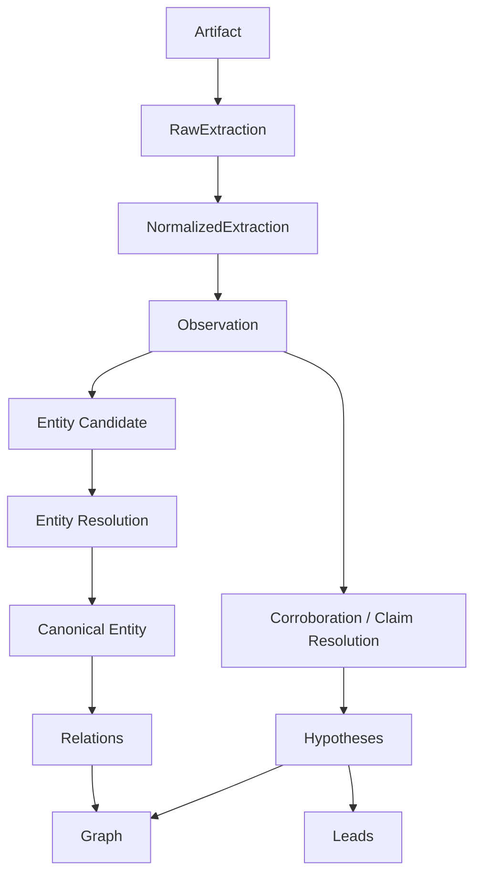
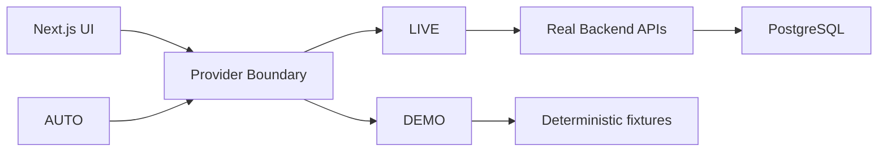

# INDAGO Future Capabilities Roadmap

> [!warning]
> **This index mixes IMPLEMENTED and PLANNED capabilities.**
>
> Each row carries a status from the vocabulary below. `IMPLEMENTED` means code
> exists and is exercised by tests. This document is a factual index of intent
> and current state; it is **not** the milestone source of truth (that is
> `phase-tracker.md`) and it does not change application behavior.

This is the authoritative index for INDAGO's future capabilities and
architectural extensions. It consolidates intent already present in the
repository — code comments, contracts, phase trackers, plans, and
implementation reports — into one factual roadmap.

Reconciled **12 Sep 2026** against `phase-tracker.md` (see the tracker's
"Tracker Reconciliation" section).

It does **not** change application behavior, and it does **not** invent
milestones, schemas, or algorithms that the repository does not define.

## Status vocabulary

| Status | Meaning |
| --- | --- |
| `IMPLEMENTED` | Code exists and is exercised by tests. |
| `PARTIALLY_IMPLEMENTED` | A real subset exists; the rest is documented intent or stub. |
| `EXPLICITLY_DEFERRED` | Referenced by docs and consciously pushed to a later phase. |
| `CONTRACT_ONLY` | A contract type exists; there are zero producers/consumers in code. |
| `DOCUMENTED_ONLY` | A document claims it; code does not implement it. |
| `NOT_FOUND` | No code or doc reference found. |
| `UNKNOWN` | Signal exists but intent is unresolved. |

Classification rule: if a document says a feature exists but code does not
implement it, it is `DOCUMENTED_ONLY` / `DOCUMENTED INTENT / NOT IMPLEMENTED`.
If code exists but docs are stale, it is `IMPLEMENTED / DOC STALE`. History
is never silently rewritten.

## Current Baseline

What exists today at `HEAD` (verified against `packages/contracts`,
`packages/intelligence`, `packages/platform`, `packages/web`, and the docs in
this `docs/` tree):

### Ingestion pipeline (platform + intelligence)
| Capability | Status | Evidence |
| --- | --- | --- |
| Artifact acquisition (M-PR1) | `IMPLEMENTED` | `packages/platform/src/ingest/acquisition-service.ts`, `fetcher/`, `hasher/`, `storage/`; contract `VerifiedArtifactSchema` |
| Classification / routing (M-PR2) | `IMPLEMENTED` | `packages/intelligence/ingestion/src/classify/route-artifact.ts`, content sniffing, deterministic routing |
| Raw extraction / OCR (M-PR3) | `IMPLEMENTED` (7 formats) | `packages/intelligence/ingestion/src/parser/` — TXT, CSV, JSON, XML, PDF (+ pdfjs OCR), DOCX, IMAGE; see `docs/platform/m-pr3-raw-extraction.md` |
| XLSX extraction | `DOCUMENTED_ONLY` (stub) | `parser/builtins/xlsx-parser.ts` returns `EXTRACTION_FAILED` / `XLSX_NOT_IMPLEMENTED`; explicitly deferred in `docs/platform/m-pr3-raw-extraction.md` §15 |
| Normalization (M-A05) | `IMPLEMENTED / FROZEN` | `normalize/` canonical fields, confidence, quality flags; `docs/platform/m-a05-normalization.md`; "no LLM/OCR reruns" rule |
| Observation extraction (M-A06) | `IMPLEMENTED` (deterministic) | `observation/observation-rules.ts`, `observation-extractor.ts`; provenance chain; `candidateMentions`; strength baselines; visual-line merge; `docs/platform/m-a06-observation-extraction.md` |

### Platform
| Capability | Status | Evidence |
| --- | --- | --- |
| Investigation lifecycle / state machine (G-A04) | `IMPLEMENTED` | `packages/platform/src/runs/`, `queue/ingest-evidence.ts`; states `CREATED…COMPLETED/FAILED/PAUSED/REVIEW_REQUIRED` |
| Queue + worker (BullMQ + Redis) | `IMPLEMENTED` | `queue/`, `worker/`; exactly-once job/attempt semantics |
| Checkpoint / resume / replay of stored rows (G-A05) | `IMPLEMENTED` (job-level) | `queue/ingest-evidence.ts` rehydrates stored rows; retry skips recompute |
| Evidence submission (hash-verified) | `IMPLEMENTED` | `api/routes.ts` `POST /investigations/:id/evidence`; `docs/reports/e2e-security-production.md` |
| Observation read API | `IMPLEMENTED` | `GET /investigations/:id/observations`; `observation-store.ts` |
| SSE realtime | `IMPLEMENTED` | `realtime/sse.ts` + `EventBus`; live frames incl. `OBSERVATION_EXTRACTED` (metadata only) |
| Case store + deletion | `IMPLEMENTED` | `case-store` (SQLite), `DELETE /investigations/:id` |
| Auth / RBAC / case-scope | `IMPLEMENTED` (auth + case-scope) · `PARTIALLY_IMPLEMENTED` (RBAC) | `api/auth.ts` `requireAuth` + `requireCaseAccess` (fail-closed allow-list) + `requireRole`; `demo-token` dev bypass (rejected in production); role gate never exercised by tests (tracker reconciliation); production JWT/OIDC is a documented migration path |
| Postgres persistence | `IMPLEMENTED` | Prisma schema, 20 models (incl. Artifact/Evidence/Observation/Entity/Relation/GraphVersion/TemporalStateChange), migrations via `prisma migrate deploy` (Postgres 16 CI; DB is schema-sourced) |

### Intelligence artifacts
| Capability | Status | Evidence |
| --- | --- | --- |
| Entity / candidate / hypothesis contracts | `IMPLEMENTED` | `packages/contracts/src/domain/entity.ts`, `intelligence/entity-resolution.ts`; M-A07 EntityMentionCandidate + M-A08 CandidatePair + M-A09 EntityHypothesis persisted stores |
| Entity resolution / canonical entities | `IMPLEMENTED` | M-A09 canonical Entity authority (identity key, reversible EntityHypothesis, worker, audit); backend-verified |
| Relations / hypotheses / graph | `IMPLEMENTED` | M-A10 relation resolution + canonical Relation (source-grounded scoring, reversal); M-A11 Graphology projection; M-A13 graph query APIs + second-pass hardening (canonical `ProjectedGraph` contract, truthful truncation metadata, P2-04 pure-read valid-at) — backend-verified |
| Hypothesis grouping (Phase 5A-PR3) | `IMPLEMENTED` (derived, read-only) | `@indago/hypothesis-context` groups authoritative `RelationHypothesis` + `EntityHypothesis` into atomic/grouped context (shared-canonical-entity overlap, WCC, frozen 25/50 bounds, byte-stable, contradictions preserved) — `docs/architecture/pr3-hypothesis-context.md`; boundaries: Candidate↔Candidate bridge `DEPENDENCY` (M-A09/M-A09.5), generic/lead adapters `DEFERRED`, 50-node cap `FORWARD-COMPATIBILITY` |
| Structured graph-hole analysis + deterministic validation (Phase 5A-PR7/PR8) | `IMPLEMENTED` (bounded-candidate path) | `@indago/graph-hole-analysis` builds a bounded `GraphHoleAnalysisContext`, canonical-serializes it, stamps `contextSha256` + identity, and produces a zod-validated `GraphHoleAnalysisV1` via a bounded LLM call (`docs/architecture/pr7-graph-hole-analysis.md`) · `@indago/graph-hole-validation` is a **pure, 0-LLM, closed-world validator** over `(result, context, serializedContext)`: 11 frozen finding codes, 15 checked categories, reference/identity/digest/binding/temporal/evidence-classification/provenance/relationship/contradiction/structural/epistemic/completeness checks; ERROR ⇒ invalid, WARNING retainable; **112 tests green** (`docs/architecture/pr8-graph-hole-validation.md`) |
| Temporal projection (M-A12) | `IMPLEMENTED` (PR1 + PR2 + PR3) | PR0 design locked; **PR1 implemented** (temporal fields, D5 validation, `TemporalStateChange` history store, event-time/source-context propagation); **PR2 implemented** (`GraphVersion` model+store, advisory-lock versioning, canonical-change coupling, internal current/historical projection service, deterministic replay); **PR3 implemented** (case-scoped temporal APIs: `current`, `versions`, `versions/:vid`; D7 checkpoint↔version coupling; `as-of` deferred 501); **hardening pass done** (amendments, ENTITY versioning, typed revision events, concurrency) — **real-Postgres integration verified green (43/43)** incl. HTTP security (7) — `docs/platform/m-a12-temporal-architecture.md` |
| Corroboration / semantic grouping | `NOT_FOUND` | not contracted; see `observation-corroboration.md`; cross-observation semantic intelligence deferred post-M-A12 |
| Leads / gaps / robustness | `CONTRACT_ONLY` (Leads/Gaps) · `IMPLEMENTED` (claim-grounding, tracker 6B) · `NOT_FOUND` (backend robustness 6A) | `LeadSchema`/`InvestigativeGapSchema`/`EvidenceRequestSchema`/`ReviewTaskSchema` exist (`packages/contracts/src/domain/*`, no store/model); claim-grounding in `packages/platform/src/security/grounding.ts` + `agent/grounding.ts` (tested); phases on the tracker |

### Frontend (`packages/web`)
| Capability | Status | Evidence |
| --- | --- | --- |
| Provider boundary (DEMO / LIVE / AUTO) | `IMPLEMENTED` | `src/lib/providers/*`; `docs/frontend/f-pr2-provider-architecture.md` |
| Case list, case detail, evidence, observations | `IMPLEMENTED` (UI) | realtime feed, status surfaces, evidence viewer |
| Graph / timeline / leads / gaps / review / robustness | `PARTIALLY_IMPLEMENTED` (scaffolds + demo) | GraphNode/GraphEdge demo fixtures, presentation rules; rendering deferred to F-PR4+ |
| Deterministic demo fixtures | `IMPLEMENTED` | `src/lib/providers/demo/*`, fixture builders pass schema validation |

## Core Intelligence Roadmap

The canonical pipeline ordering, per `docs/roadmap/phase-tracker.md`,
`docs/roadmap/development-plan.md`, and the M-A05/M-A06 reports:

### Per-component status (M-PR1 → Leads)

| # | Component | Status at HEAD | Next action |
| --- | --- | --- | --- |
| 1 | M-PR1 Artifact Acquisition | `IMPLEMENTED` | — |
| 2 | M-PR2 Classification / Routing | `IMPLEMENTED` | — |
| 3 | M-PR3 Raw Extraction / OCR | `IMPLEMENTED` (XLSX stub) | XLSX deferred, not needed current milestone |
| 4 | MA05 Normalization | `IMPLEMENTED / FROZEN` | version-migration is future, see §16 |
| 5 | MA06 Observation Extraction | `IMPLEMENTED` | semantic grouping is future, NOT M-A06 scope |
| 6 | MA07 Entity Candidate Generation | `IMPLEMENTED` | EntityMentionCandidate store; backend-verified |
| 7 | Entity Resolution | `IMPLEMENTED` | M-A09 canonical Entity + EntityHypothesis authority; reversal; backend-verified |
| 8 | Observation corroboration | `NOT_FOUND` (future design) | see `observation-corroboration.md` |
| 9 | Observation contradiction / validation | `NOT_FOUND` (future design) | same doc |
| 10 | Relation extraction / resolution | `IMPLEMENTED` | M-A10 relation resolution + canonical Relation (source-grounded scoring v1); backend-verified |
| 11 | Hypothesis generation | `PARTIALLY_IMPLEMENTED` | EntityHypothesis + RelationHypothesis lifecycle stores exist; full hypothesis UI surfacing deferred |
| 12 | Graph projection | `IMPLEMENTED` (backend) / `PARTIALLY_IMPLEMENTED` (UI) | M-A11 Graphology projection + M-A13 graph query APIs; broad live-mode UI surfacing still stub (`UnsupportedGraphProvider`) |
| 12b | Temporal projection (M-A12) | `IMPLEMENTED` (PR1 + PR2 + PR3 + hardening, unit + real-Postgres verified) | PR1 temporal history + intervals done; PR2 graph versions + internal historical projection done; PR3 case-scoped temporal APIs + D7 checkpoint coupling done; hardening pass (amendments, entity versioning, typed revision events, concurrency) done — real-Postgres integration **verified green 43/43** (incl. HTTP security 7) |
| 13 | Leads | `CONTRACT_ONLY` | `LeadSchema` etc. in `packages/contracts/src/domain/lead.ts`; no Lead store/model/runtime (tracker Phase 4) |
| 14 | Claim grounding | `IMPLEMENTED` | `packages/platform/src/security/grounding.ts` + `agent/grounding.ts` + `tests/recovery.test.ts` (tracker 6B complete) |
| 15 | Robustness / counter-evidence | `PARTIALLY_IMPLEMENTED` (tracker 6B complete; UI narrative) | tracker Phase 6 |

## Entity / Resolution Roadmap

See `docs/roadmap/entity-resolution.md` for the full record.

Decisions already made (from the M-A07 contract archaeology — `packages/contracts/src/domain/entity.ts`, `intelligence/entity-resolution.ts`):

- Candidate generation must be **deterministic**.
- `candidateMentions` (`string[]`, 0–50, 1–200 chars) is the only mention artifact today, produced by `extractCandidateMentions`.
- There is **no EntityType taxonomy**; scattered schemas exist (`GraphNodeTypeSchema`, `NormalizedValueTypeSchema`, `PIIPatternTypeSchema`, `RelationTypeSchema`) and are unused for candidate typing.
- A pre-resolution, mention-derived, typed entity candidate is **not currently defined** in any contract.
- No canonical `EntityId` creation. No resolution, relations, or hypotheses.
- ML/LLM extraction is future and optional (`entity-candidate-ml-layer.md`).

Future capabilities (each with separate scope):

- richer mention spans (offset, dialect, source-grounded text) — TBD
- entity-type taxonomy — TBD (Architecture decision required)
- gazetteer / aliases — TBD
- candidate comparison — TBD
- entity resolution → canonical Entity — TBD (`entity-resolution.md`)
- external/source identifiers — TBD
- identity merge/split — TBD

## Evidence / Provenance Roadmap

Current state:
- `Source` → `Evidence` → `Observation` is a real, persisted provenance chain
  (Evidence `sha256`, `artifactRef`, page/span refs; Observation `identityKey`,
  `sourceRef`, `pageRef`, `spanRef`).
- Normalization confidence ≠ Observation strength ≠ ResolutionScore (naming enforced by contract).

Future ideas (discussed, not contracted):
- richer Evidence model / evidence review / evidence-for / evidence-against
- source administration / source catalog
- source-aware scoring
- human evidence review

Explicitly distinguish: current minimal Source/Evidence implementation vs.
future richer workflows. No milestones are fixed for these.

## Graph / Hypothesis Roadmap

- Backend: graph projection, query, and analysis are **IMPLEMENTED** via M-A11 (Graphology projection: build-graph/centrality/communities) and M-A13 (typed graph service APIs + express routes `graph`, `graph/traversal`, `graph/centrality`, `graph/communities`). `GraphNode`/`GraphEdge`/`GraphVersion` contracts are `packages/contracts/src/graph/*`.
- Graphology is a **derived, disposable** projection; Postgres is the authoritative domain state. No Graphology-based historical/temporal history (temporal projection is M-A12; PR1 history/intervals implemented, graph-version history is PR2/PR3).
- Frontend: graph presentation scaffolds exist in demo fixtures; live-mode rendering is future UI phase (F-PR4+ per `docs/frontend/frontend-development-plan.md`); live providers are stub (`UnsupportedGraphProvider`).
- Temporal graph (current vs historical versions) is M-A12; **PR2 internal current/historical projection implemented** (unit + real-Postgres verified green 43/43); **PR3 public version/current/as-of query APIs implemented** (real-Postgres verified green 43/43; `as-of` deferred as 501).

## Frontend Capability Progression

- `DEMO` = deterministic fixtures (must remain deterministic even as backend grows).
- `LIVE` = real backend; as backend capabilities become real (M-A07+), Live providers can consume them.
- `AUTO` = provider resolver only, never a fidelity guarantee.
- Backend advancement must not destroy frontend Demo functionality.

Future UI concepts (distinct from existing provider seams):
entity candidate review · entity resolution UI · evidence review · graph UI ·
timeline · leads · hypotheses · gaps · contradiction views · source administration.

These are surfaced as demo scaffolds / deferred tracker items (e.g. observations tab deferred until F-PR5, graph renderer until F-PR4). The provider seam exists today; the future UI capabilities do not.

## Platform / Infrastructure Roadmap

| Capability | Status | Notes |
| --- | --- | --- |
| Production auth (JWT/OIDC) | `EXPLICITLY_DEFERRED` | behind `verifyToken` single-function swap; `docs/reports/e2e-security-production.md` §22 |
| Secrets management | `EXPLICITLY_DEFERRED` | documented migration: Redis `requirepass`, Postgres creds from secret store, UploadThing server-side only |
| Distributed object storage (S3) | `UNKNOWN` | repository uses local filesystem `ARTIFACT_STORAGE_DIR`; no S3 signal |
| Production DB migrations | `DOCUMENTED_ONLY` | Prisma schema is the source of truth; no `migrations/` dir found |
| Browser E2E / Playwright | `NOT_FOUND` | not present |
| Production observability | `NOT_FOUND` | none |
| Queue monitoring / worker scaling | `NOT_FOUND` | BullMQ exists; dashboards/autoscaling are not |
| ML model security (if introduced) | `FUTURE` | see `entity-candidate-ml-layer.md` |

Environment hardening is distinct from core product capability; both are
tracked separately here.

## Ingestion Roadmap

- XLSX parser: `EXPLICITLY_DEFERRED` — stub returns `XLSX_NOT_IMPLEMENTED`; "not needed in current milestone".
- Additional parsers / OCR improvements: no committed plan. Improving OCR (language models, layout) is an open enhancement, not a current requirement.
- Source replay, extraction replay, normalization replay: partially served by job-level rehydrate/resume; a first-class cross-run replay/canonical-rebuild pipeline does not exist.
- Parser version migration: not defined.

## Security Roadmap

Current controls (implemented): hash-verified evidence submission, case-scoped dev auth, artifact content sniffing, deterministic-only extraction (no LLM in the ingestion loop today, which minimizes prompt-injection surface), PII treated as opaque text.

Future hardening (documented ideas, `docs/reports/e2e-security-production.md`, tracker Phase 9):
production identity (OIDC, RBAC) · source data confidentiality · model data leakage ·
prompt injection (only relevant once ML/LLM is introduced) · external AI provider controls ·
SSRF/egress · audit hardening · PII masking.

None of the future items is implemented at `HEAD`.

## Future ML/LLM Roadmap

`FUTURE / NOT IMPLEMENTED`. Deterministic M-A07 is the baseline; an optional
ML/LLM candidate extractor shares the same `EntityMentionCandidate` contract;
Entity Resolution consumes candidates. Model output is never an identity
authority. Full design: `docs/roadmap/entity-candidate-ml-layer.md`.

## Backlog by Priority

Priorities are derived from the repository's own phase ordering and documented
dependencies, not from feature preference.

### P0 — required for core next milestones / correctness
- M-A12 Temporal projection (PR1 intervals/history **implemented**; PR2 graph versions **implemented**; PR3 APIs + checkpoints **implemented**; real-Postgres integration **verified green 43/43**) — **next foundation milestone**; PR0 design locked. M-A12 implementation + DB verification COMPLETE; remaining gate: G1–G8 entry-gate audits.
- Realtime replay endpoint decision (activity-feed replay vs PR open) — pending decision, potentially P0 for the frontend realtime story.

### P1 — important production/product capability
- Production auth (JWT/OIDC behind `verifyToken`).
- Production DB migration mechanism.
- Graph UI + entity-resolution review UI (live-mode providers are stub: `UnsupportedGraphProvider`/`UnsupportedEntityProvider`/`UnsupportedRelationProvider`).
- M-A12 temporal/graph version APIs (PR3) — **implemented** (unit + real-Postgres verified green 43/43).
- Production observability / queue monitoring / secrets management.

### P2 — later enhancement
- XLSX extraction.
- Observation corroboration / contradiction / claim grouping.
- Evidence review, source administration, source-aware scoring.
- Realtime event history / reconnect replay endpoint (if the pending decision chooses it).
- Cross-observation semantic retrieval, targeted reblocking, graph-hole intelligence (post-M-A12).
- Robustness / counter-evidence surfacing (backend), leads (backend).

### P3 — exploratory / future research
- ML/LLM candidate extraction.
- Semantic embeddings / similarity beyond deterministic rules.
- Browser E2E / Playwright harness.
- PII masking and advanced audit hardening.

## Dependency Diagram

Only nodes supported by repository roadmap or current architecture are included.

## Explicitly Deferred Ideas

- XLSX parsing (`XLSX_NOT_IMPLEMENTED` stub).
- Production identity (JWT/OIDC) — single-function swap ready, not implemented.
- Corroboration / claim grouping — future, must not replace evidence identity.
- Cross-observation semantic intelligence, targeted reblocking, graph-hole intelligence — post-M-A12 (Phase 4/5).
- Temporal runtime (M-A12-PR1 + PR2 + PR3 implemented, real-Postgres integration **verified green 43/43**) — PR1 history/intervals done; PR2 graph versions + internal historical projection done; PR3 case-scoped temporal APIs + D7 checkpoint coupling done; `as-of` deferred (501).
- Frontend graph/timeline/leads/gaps/review renderers — deferred tracker phases.

## Unknown / Needs Decision

1. ~~M-A07 candidate contract~~ **Resolved:** `EntityMentionCandidate` store implemented; pre-resolution candidates are distinct from canonical entities (`candidateId` never becomes `EntityId`).
2. ~~Should `Observation.entityIds` / `candidateEntityHypothesisIds` be populated by M-A07?~~ **Resolved:** `Observation.entityIds` is always `[]` at M-A06 (no entity linking there); candidate linkage handled by M-A07/M-A08.
3. **Realtime replay**: build an event-history endpoint (`GET /investigations/:id/events`) and hydrate on reconnect, or leave SSE as fire-and-forget notification? (Pending decision from the M-A06 wrap-up.)
4. Entity-type taxonomy owner and scope (analyze, then decide). `Architecture decision required`.
5. ~~Entity identity model: digest-based vs. sequence-based~~ **Resolved:** deterministic SHA-256→UUID identity keys (`identityKey @unique`) for canonical rows.
6. Migration strategy: Prisma `db push` vs. versioned migration files.
7. Storage backend for production artifacts (local FS vs S3).
8. ~~Whether M-A08–A10 belong in the same milestone as M-A07~~ **Resolved:** implemented as sequential milestones M-A07 → M-A08 → M-A09 → M-A10.

## Companion documents

- `docs/roadmap/entity-candidate-ml-layer.md` — future ML/LLM candidate generation.
- `docs/roadmap/entity-resolution.md` — entity resolution roadmap.
- `docs/roadmap/observation-corroboration.md` — corroboration vs. deduplication.
- `docs/roadmap/phase-tracker.md` — phase-by-phase progress (source of truth for milestones).
- `docs/roadmap/development-plan.md` — original architecture plan (M-A12 PR0: §23.11).
- `docs/platform/m-a12-temporal-architecture.md` — M-A12 temporal architecture & design lock (authoritative).

"Future-scope consolidation complete. The roadmap distinguishes current
implementation from planned and exploratory capabilities without changing
application behavior."