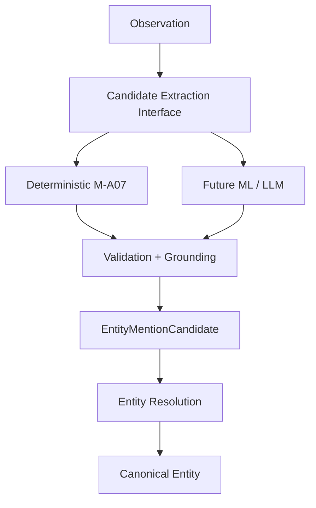

# Entity Candidate ML/LLM Layer (FUTURE)

> [!warning]
> **STATUS: FUTURE / NOT IMPLEMENTED**
>
> This document describes planned or exploratory architecture. It is not
> evidence that the capability currently exists in the repository.

## Purpose

Consolidate the already-discussed future direction for candidate generation:

```
deterministic M-A07 baseline
        ↓
future ML/LLM candidate extractor
        ↓
same EntityMentionCandidate contract
        ↓
Entity Resolution
```

This document only restates intent that has been discussed in the M-A07
archaeology, the roadmap, and the phase tracker. Nothing here is implemented
at `HEAD`. Deterministic M-A07 itself is not yet implemented.

## Core invariants

- ML/LLM is **candidate generation**, never an identity authority.
- **Source grounding is mandatory** — every candidate must point back to the
  Observation → Evidence → Artifact provenance chain.
- Model output must pass **schema validation** before it can be persisted or
  consumed.
- The model **cannot create a canonical EntityId**.
- The model **cannot merge entities**.
- The model **cannot create relations**.
- Model **metadata/version must be traceable** on the candidate.
- The **deterministic extractor remains the fallback** whenever the model
  path is unavailable, rejected, or fails validation.

## Interfaces

The `EntityMentionCandidate` contract this future layer targets is **not yet
defined in any package**. The closest existing artifacts are:

- `packages/contracts/src/domain/entity.ts` — `EntityCandidateSchema`
  (resolution-output record bound to a canonical EntityId; not mention-derived).
- `packages/contracts/src/intelligence/entity-resolution.ts` —
  `EntityResolutionCandidateSchema` (near-duplicate).
- `candidateMentions: string[]` on `ObservationSchema` — the only mention
  artifact today, produced by `extractCandidateMentions`
  (`packages/intelligence/ingestion/src/observation/observation-rules.ts`).

A pre-resolution, mention-derived, typed, source-grounded candidate schema is
required before this design can consume it. `Architecture decision required.`

## Architecture



- **Status of the ML/LLM path:** FUTURE / NOT IMPLEMENTED.
- **Status of the deterministic path:** DEFERRED / NEXT (this is M-A07).

## Deterministic baseline (M-A07)

Not a model. Uses the existing deterministic infrastructure:
regex-based mention extraction (`EMAIL_RE`, `URL_RE`, `PHONE_RE`,
`CURRENCY_RE`, `IDENTIFIER_RE`, `CAPITALIZED_RE` + stopword list),
observation fields (type, locationKey, pageText), and the provenance chain.

The ML/LLM path must produce the **same contract shape** as the baseline so
that Entity Resolution is agnostic to how a candidate was generated.

## Grounding and validation

- Every candidate must carry provenance refs from the model output back to the
  observation and source text span. Grounding without offsets is insufficient.
- Validation = contract-schema validation plus a grounding check (the claimed
  span must exist in the observed source text). Designed, not implemented.

## Model provenance

- Record model id/version, prompt template version, temperature/top-p and any
  configuration on the candidate, so downstream scoring can weight by
  generator quality. Traceability is a requirement; the exact fields are TBD.

## Security

Relevant only once a model is introduced (none exists today):

- **Prompt injection** — evidence text is untrusted input; output must be
  treated as data and validated; do not re-interpret model "instructions".
- **Data leakage** — case data leaving the environment must be an explicit,
  reviewable choice.
- **External AI provider controls** — egress, provider selection, key
  management, and per-request accounting are future hardening items (see
  roadmap §Security).

## Cost and latency

- Model extraction is more expensive and slower than regexes. The architecture
  must keep deterministic extraction as the default and gate model use behind
  explicit configuration.

## Fallback behavior

- If the model is unavailable, errors, or its output fails validation, the
  system falls back to the deterministic extractor for that observation. No
  partial model output may be persisted unvalidated.

## Evaluation

- Future. Candidates from the deterministic baseline and from a model path
  should be compared against a labeled set (precision / recall / grounding
  fidelity). The repository has no labeled evaluation set today; the demo
  fixtures are not a labeled eval set.

## Explicit non-goals (must not do)

- Create canonical `EntityId`s.
- Merge or split canonical entities.
- Author relations or hypotheses.
- Bypass schema validation.
- Replace `candidateMentions` determinism without an explicit decision.

## Status summary

| Concern | Status |
| --- | --- |
| Deterministic M-A07 baseline | DEFERRED / NEXT (design pending simple archaeology) |
| Example `EntityMentionCandidate` contract | NOT_FOUND — `Architecture decision required` |
| ML/LLM extractor | FUTURE / NOT IMPLEMENTED |
| Grounding + validation | FUTURE / NOT IMPLEMENTED |
| Model provenance | FUTURE / NOT IMPLEMENTED |
| Security controls for models | FUTURE / NOT IMPLEMENTED |
| Fallback to deterministic | Constraint, unscheduled |
| Evaluation harness | FUTURE / NOT IMPLEMENTED |

"Future-scope consolidation complete. The roadmap distinguishes current
implementation from planned and exploratory capabilities without changing
application behavior."